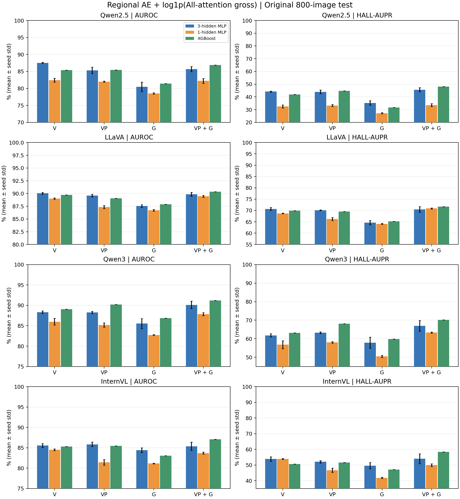
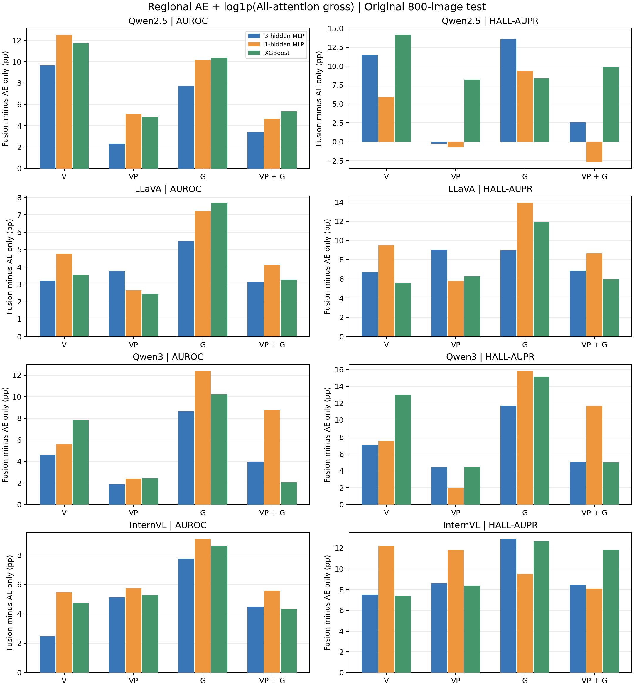

# 区域 AE＋All-attention gross：三隐藏层、单隐藏层 MLP 与 XGB

本轮四种预设拼接均已完成；每种另有对应的 AE-only 对照。以下均为原 800 图测试集、三 seed 指标均值，HALL-AUPR 以幻觉为正类。

## 特征的准确含义

每个目标、每层先在区域 R 内归一化 attention，并在同一区域内对 hpre 的目标 raw logit 做 Gaussian MAD gate：

\[AE_R=\sum_{j\in R}\frac{a_j}{\sum_{k\in R}a_k}\,\sigma\!\left(\frac{\ell_j-\operatorname{median}_{R}(\ell)}{1.4826\operatorname{MAD}_{R}(\ell)+\epsilon}\right).\]

这是原视觉 AE 的区域扩展。VP 在视觉与 prompt 的并集上重新计算，不能写成 AE_V+AE_P。prompt 含 BOS、模板和非视觉特殊 token；G 只含目标前已生成 token。空 G 的 AE 保存 NaN，检测矩阵置零，mentions 全部保留。非空区域 attention 总和≤EPS 时沿用旧实现的均匀权重回退。

\[e_j^{all}=\int_0^1 J_{\mathrm{FFN}\circ\mathrm{Norm}}(z-A_{all}+\alpha A_{all})a_j^{write}\,d\alpha,\qquad S_R^{all}=\sum_{j\in R}\|e_j^{all}\|_2.\]

gross 是逐 token 响应的范数之和，保留真实 Norm 的变化；复用已完成的 All-attention K32 特征。它与组响应求和后再取范数的 net 不同。

| 组 | 拼接内容，按每块全部层排列 | 维度 | AE-only 对照 |
|---|---|---:|---|
| V | `[AE_V, log1p(S_V_all)]` | 2L | `AE_V`，L |
| VP | `[AE_VP, log1p(S_V_all+S_P_all)]` | 2L | `AE_VP`，L |
| G | `[AE_G, log1p(S_G_all)]` | 2L | `AE_G`，L |
| VP+G | `[AE_VP, log1p(S_V_all+S_P_all), AE_G, log1p(S_G_all)]` | 4L | `[AE_VP,AE_G]`，2L |

只有非负 gross 取 log1p；VP 先相加，再取 log。L 分别为 Qwen2.5 28、LLaVA 32、Qwen3 36、InternVL 32。

## 分类器与固定评估协议

- 三隐藏层 MLP：`[128,64,32]`、BatchNorm、dropout 0.3、Adam、学习率 0.001、weight decay 1e-5、batch 256、最多100 epoch，沿用训练损失选 checkpoint/停止规则。
- 单隐藏层 MLP：sklearn，宽度64/128/256 × 学习率0.01/0.001 × adam/sgd，max_iter500，共12候选；其他参数为既有 builder 默认值。
- XGB：深度4/6/8 × 学习率0.1/0.05 × 100/200/500棵树，共18候选；复用既有 builder，n_jobs=2。
- 原4000图、3200/800固定划分，全部mentions。搜索只用训练内2560/640图（划分seed20260908），候选seed43；按验证AUROC、HALL-AUPR、候选编号依次选参，再全3200图重训seeds43/44/45。无额外标准化，无test选参。

单层与三层还存在优化器、BatchNorm/dropout、batch、正则和停止规则差异，因此这是两个实现的对照，不能把差异仅归因于层数。XGB 若三个 seed 的结果完全相同，std 为0只表示当前训练设置的确定性。

共8组×4模型×3分类器×3seed＝288个正式头；960个内部验证候选。误差棒为三seed总体标准差，不是置信区间。

## 全部融合结果

每格为 **AUROC / HALL-AUPR（%）**，两个指标分别显示均值±总体std。

| 模型 | 特征 | 三隐藏层 MLP | 单隐藏层 MLP | XGB |
|---|---|---:|---:|---:|
| Qwen2.5 | V | 87.54±0.19 / 44.20±0.38 | 82.41±0.58 / 32.53±1.17 | 85.38±0.00 / 41.83±0.00 |
| Qwen2.5 | VP | 85.29±0.95 / 43.96±1.43 | 82.01±0.13 / 33.28±0.71 | 85.47±0.00 / 44.71±0.00 |
| Qwen2.5 | G | 80.47±1.37 / 35.23±1.76 | 78.52±0.19 / 27.21±0.41 | 81.44±0.00 / 31.67±0.00 |
| Qwen2.5 | VP + G | 85.70±0.76 / 45.65±1.65 | 82.22±0.72 / 33.62±1.09 | 86.86±0.00 / 48.04±0.00 |
| LLaVA | V | 90.04±0.20 / 70.69±0.61 | 89.02±0.12 / 68.70±0.14 | 89.71±0.00 / 69.88±0.00 |
| LLaVA | VP | 89.59±0.24 / 70.13±0.12 | 87.33±0.30 / 66.24±0.64 | 89.04±0.00 / 69.57±0.00 |
| LLaVA | G | 87.55±0.25 / 64.63±0.97 | 86.70±0.15 / 64.11±0.26 | 87.90±0.00 / 65.21±0.00 |
| LLaVA | VP + G | 89.85±0.36 / 70.48±1.23 | 89.45±0.20 / 70.89±0.24 | 90.35±0.00 / 71.66±0.00 |
| Qwen3 | V | 88.32±0.33 / 61.80±0.84 | 85.97±0.80 / 56.77±2.12 | 89.05±0.00 / 63.14±0.00 |
| Qwen3 | VP | 88.26±0.25 / 63.26±0.42 | 85.19±0.53 / 58.06±0.40 | 90.20±0.00 / 68.06±0.00 |
| Qwen3 | G | 85.54±1.24 / 57.84±2.95 | 82.73±0.09 / 50.50±0.61 | 86.86±0.00 / 59.79±0.00 |
| Qwen3 | VP + G | 90.12±0.92 / 66.91±2.88 | 87.87±0.37 / 63.33±0.32 | 91.22±0.00 / 70.19±0.00 |
| InternVL | V | 85.59±0.47 / 53.85±1.38 | 84.52±0.23 / 53.92±0.30 | 85.30±0.00 / 50.69±0.00 |
| InternVL | VP | 85.84±0.55 / 52.08±0.80 | 81.44±0.69 / 46.68±1.40 | 85.49±0.00 / 51.58±0.00 |
| InternVL | G | 84.42±0.60 / 49.60±1.99 | 81.16±0.06 / 41.86±0.30 | 83.07±0.00 / 47.16±0.00 |
| InternVL | VP + G | 85.38±1.02 / 54.00±3.14 | 83.70±0.24 / 49.91±0.81 | 87.07±0.00 / 58.39±0.00 |

图中按四种特征比较三种分类器；同一子图中的柱形共享纵轴。不同模型的标签比例不同，HALL-AUPR 应主要在同一模型内比较。

## gross 相对 AE-only 的增量

每格为 **ΔAUROC / ΔHALL-AUPR（百分点）**；正值代表增加 gross 后更高。对照采用相同分类器及相同区域 AE，搜索方法各自只在训练内部选参。

| 模型 | 特征 | 三隐藏层 MLP | 单隐藏层 MLP | XGB |
|---|---|---:|---:|---:|
| Qwen2.5 | V | +9.65 / +11.44 | +12.51 / +5.91 | +11.70 / +14.17 |
| Qwen2.5 | VP | +2.33 / -0.26 | +5.12 / -0.72 | +4.84 / +8.21 |
| Qwen2.5 | G | +7.72 / +13.53 | +10.17 / +9.36 | +10.39 / +8.36 |
| Qwen2.5 | VP + G | +3.44 / +2.54 | +4.64 / -2.70 | +5.35 / +9.90 |
| LLaVA | V | +3.21 / +6.67 | +4.76 / +9.49 | +3.54 / +5.58 |
| LLaVA | VP | +3.76 / +9.06 | +2.65 / +5.77 | +2.46 / +6.26 |
| LLaVA | G | +5.48 / +8.96 | +7.21 / +13.91 | +7.68 / +11.93 |
| LLaVA | VP + G | +3.14 / +6.86 | +4.12 / +8.65 | +3.25 / +5.94 |
| Qwen3 | V | +4.59 / +7.05 | +5.59 / +7.55 | +7.84 / +13.02 |
| Qwen3 | VP | +1.85 / +4.41 | +2.42 / +1.95 | +2.43 / +4.48 |
| Qwen3 | G | +8.64 / +11.70 | +12.38 / +15.82 | +10.23 / +15.14 |
| Qwen3 | VP + G | +3.92 / +5.03 | +8.77 / +11.68 | +2.07 / +4.99 |
| InternVL | V | +2.47 / +7.52 | +5.44 / +12.19 | +4.73 / +7.38 |
| InternVL | VP | +5.10 / +8.60 | +5.73 / +11.84 | +5.27 / +8.36 |
| InternVL | G | +7.75 / +12.88 | +9.08 / +9.52 | +8.59 / +12.65 |
| InternVL | VP + G | +4.48 / +8.47 | +5.57 / +8.10 | +4.33 / +11.86 |

这张图直接检验 gross 是否在对应区域 AE 之外提供检测信息。下降意味着当前拼接及分类器下未转化为收益；不能据此断言该信号没有机制意义。

## 与历史结果对照

视觉组固定三层 MLP 的直接对照：旧特征为 `[AE_V,log1p(S_E)]`（Visual-only 路径），新特征为 `[AE_V,log1p(S_V_all)]`。本轮重新提取的 AE 已在全数据核验旧值；两套特征的积分路径及节点数仍有差异。

| 模型 | 旧 AUROC / HALL-AUPR | 新 AUROC / HALL-AUPR | 差值（百分点） |
|---|---:|---:|---:|
| Qwen2.5 | 87.45 / 43.98 | 87.54 / 44.20 | +0.09 / +0.22 |
| LLaVA | 90.02 / 70.82 | 90.04 / 70.69 | +0.03 / -0.13 |
| Qwen3 | 88.65 / 62.83 | 88.32 / 61.80 | -0.33 / -1.03 |
| InternVL | 85.83 / 53.03 | 85.59 / 53.85 | -0.24 / +0.82 |

另一份历史实验使用 full-prefix MAD 的 U 与冻结 RMS 来源 S。其 V/VP/G 四组与本轮形状类似，但 AE 与 gross 的定义都变了；逐分类器差值在 all_comparisons.csv 中，不能把它解释为只替换路径的消融。所有历史值取三seed均值，不混用旧总表的概率 ensemble 指标。

## AE-only 完整结果

| 模型 | AE区域 | 三隐藏层 MLP | 单隐藏层 MLP | XGB |
|---|---|---:|---:|---:|
| Qwen2.5 | V | 77.89±0.60 / 32.76±0.18 | 69.90±0.69 / 26.62±0.67 | 73.68±0.00 / 27.67±0.00 |
| Qwen2.5 | VP | 82.96±0.31 / 44.21±0.52 | 76.89±0.17 / 34.00±0.15 | 80.63±0.00 / 36.50±0.00 |
| Qwen2.5 | G | 72.75±0.39 / 21.70±0.50 | 68.35±0.30 / 17.85±0.23 | 71.05±0.00 / 23.31±0.00 |
| Qwen2.5 | VP + G | 82.26±0.11 / 43.10±1.12 | 77.58±0.27 / 36.32±0.68 | 81.52±0.00 / 38.13±0.00 |
| LLaVA | V | 86.83±0.50 / 64.02±0.69 | 84.27±0.13 / 59.21±0.26 | 86.17±0.00 / 64.30±0.00 |
| LLaVA | VP | 85.82±0.24 / 61.07±0.99 | 84.68±0.30 / 60.47±0.14 | 86.58±0.00 / 63.30±0.00 |
| LLaVA | G | 82.08±0.37 / 55.67±0.56 | 79.49±0.36 / 50.20±0.81 | 80.22±0.00 / 53.28±0.00 |
| LLaVA | VP + G | 86.71±0.14 / 63.62±0.54 | 85.33±0.34 / 62.24±0.34 | 87.09±0.00 / 65.72±0.00 |
| Qwen3 | V | 83.73±0.40 / 54.75±0.65 | 80.38±0.60 / 49.22±1.08 | 81.21±0.00 / 50.12±0.00 |
| Qwen3 | VP | 86.40±0.44 / 58.85±0.73 | 82.76±0.29 / 56.10±0.47 | 87.77±0.00 / 63.58±0.00 |
| Qwen3 | G | 76.90±1.00 / 46.14±1.59 | 70.35±0.32 / 34.68±0.45 | 76.64±0.00 / 44.65±0.00 |
| Qwen3 | VP + G | 86.19±0.58 / 61.88±0.67 | 79.10±0.43 / 51.65±0.59 | 89.15±0.00 / 65.20±0.00 |
| InternVL | V | 83.12±0.15 / 46.33±0.82 | 79.08±0.26 / 41.73±0.38 | 80.57±0.00 / 43.32±0.00 |
| InternVL | VP | 80.74±0.49 / 43.48±0.63 | 75.71±0.10 / 34.84±0.12 | 80.22±0.00 / 43.22±0.00 |
| InternVL | G | 76.67±0.83 / 36.73±2.29 | 72.07±0.15 / 32.34±0.09 | 74.48±0.00 / 34.51±0.00 |
| InternVL | VP + G | 80.89±0.78 / 45.53±1.71 | 78.13±0.21 / 41.81±0.22 | 82.74±0.00 / 46.53±0.00 |

## 覆盖与验证

| 模型 | 全部mentions | 测试mentions / HALL | 新旧视觉AE最大差 |
|---|---:|---:|---:|
| Qwen2.5 | 8717 | 1732 / 183 | 2.98e-07 |
| LLaVA | 15463 | 3146 / 709 | 5.36e-07 |
| Qwen3 | 14873 | 3027 / 516 | 4.17e-07 |
| InternVL | 11759 | 2381 / 373 | 3.58e-07 |

四模型均保留原4000图及全部目标、全部层、全部mentions。逐图结果以原子替换保存，单模型锁防止重复写入；formal阶段要求对应签名的8图smoke通过。已独立重算288头的AUROC/HALL-AUPR，并核验960候选、64次验证选参、原始标签/mention顺序和图片划分。

最初 AE 对齐失败的原因是 attention 分块及前向序列形状不同。修复后使用原生 eager attention，Qwen逐目标原始前缀，LLaVA/InternVL沿用原完整回答前向的因果行；未放宽原核验容差。失败smoke和日志保留。

本轮不新增bootstrap，也不依据新测试结果筛选特征。上述差值是同一固定测试集上的描述性结果；三seed波动不能代替图片采样的不确定性。当前B2 K4已有数值问题，本轮特征未使用B2。

## 文件

- [全部均值/std及绘图数据](../outputs/all_attention_ae_log_strength_v1/detection.csv)、[逐seed结果](../outputs/all_attention_ae_log_strength_v1/seed_metrics.csv)、[全部差值](../outputs/all_attention_ae_log_strength_v1/all_comparisons.csv)。
- [64组验证选择](../outputs/all_attention_ae_log_strength_v1/selected_params.csv)、[960候选及收敛警告](../outputs/all_attention_ae_log_strength_v1/search_trials.csv)、[完整验证](../outputs/all_attention_ae_log_strength_v1/validation.json)。
- 各模型子目录保存协议、原始区域AE、矩阵、模型、预测概率与训练日志。PNG/PDF图位于同一输出根；两个项目根进度文件保留最终状态。
