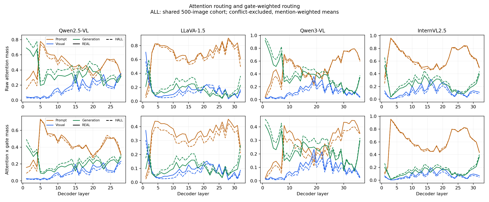
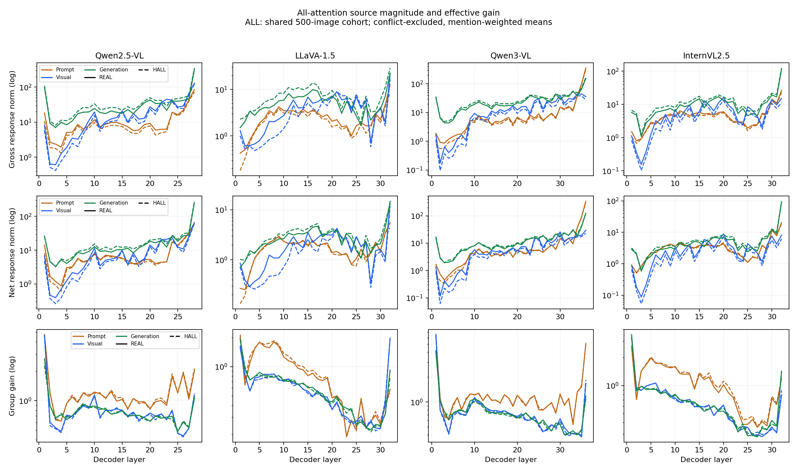
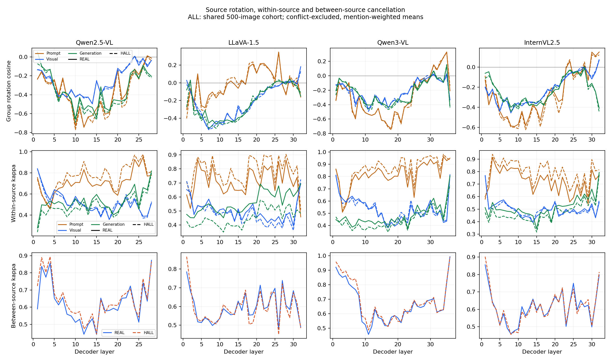
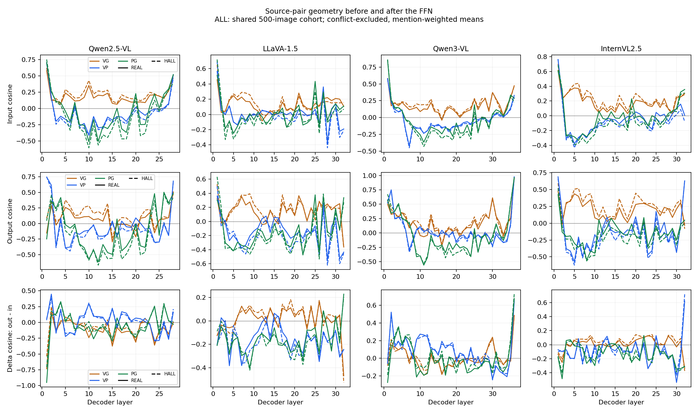
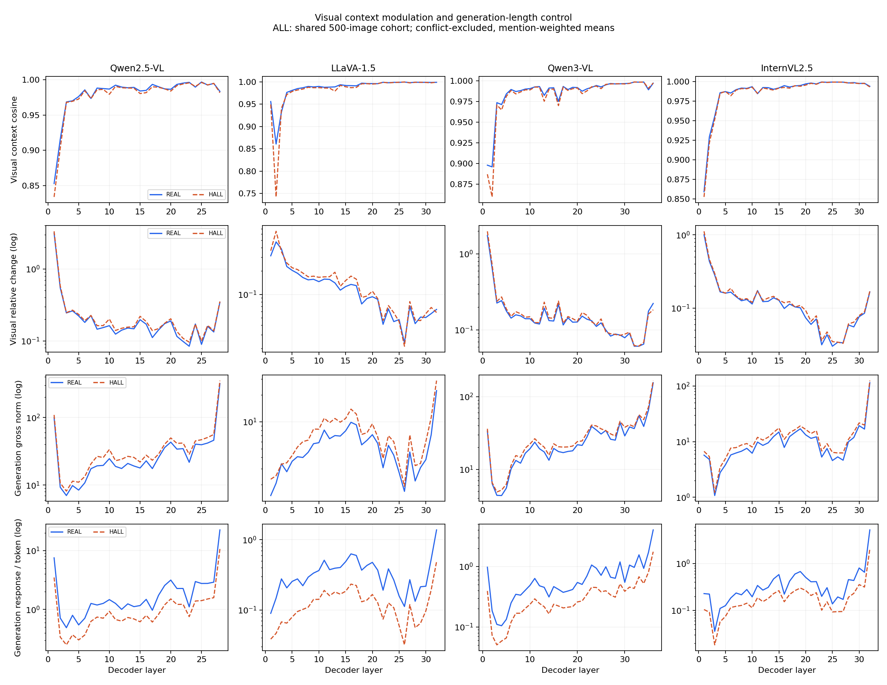
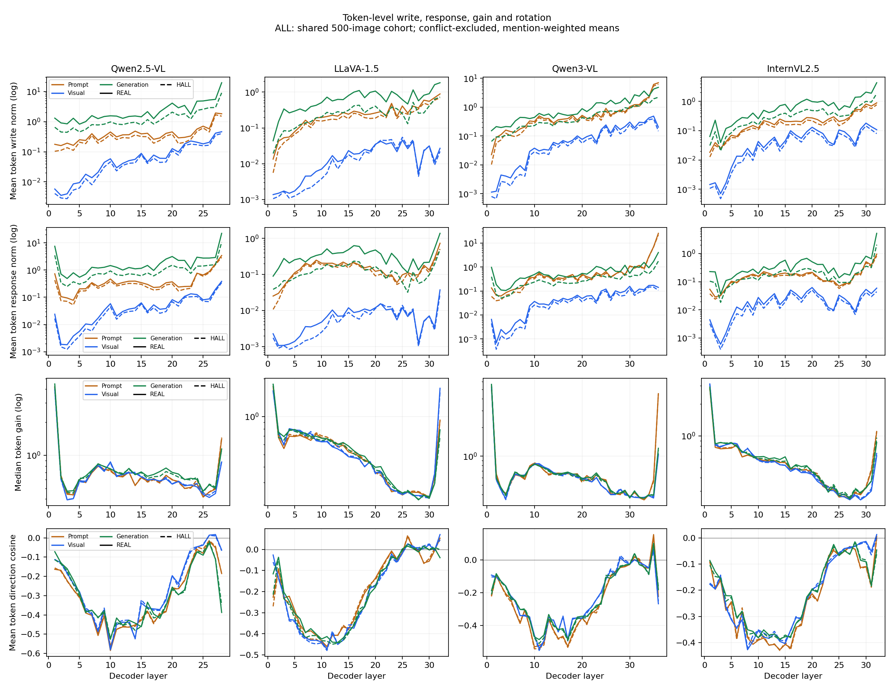
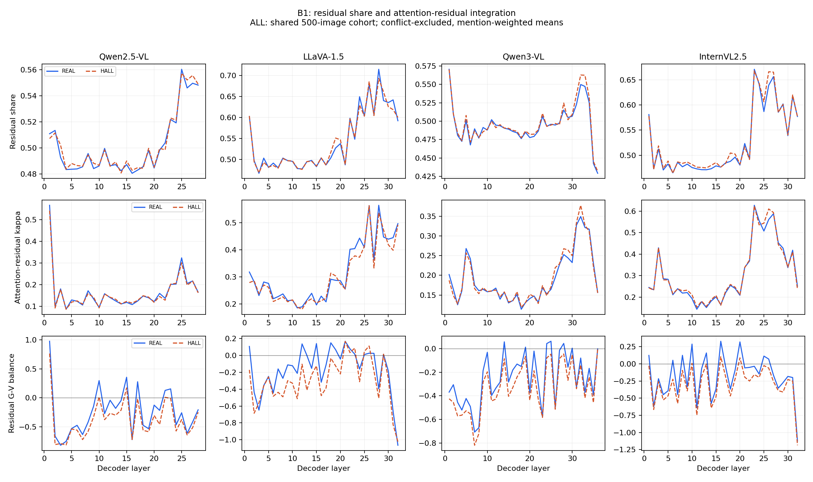
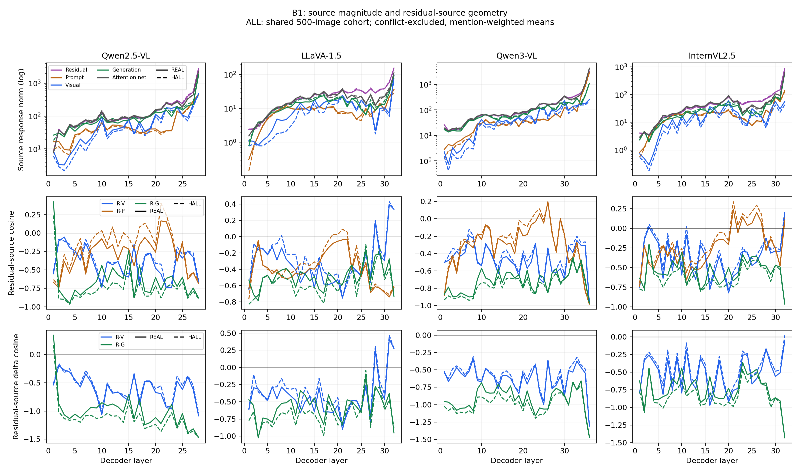
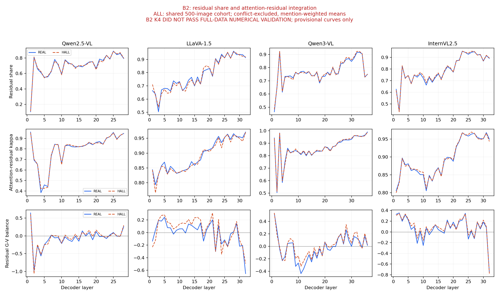
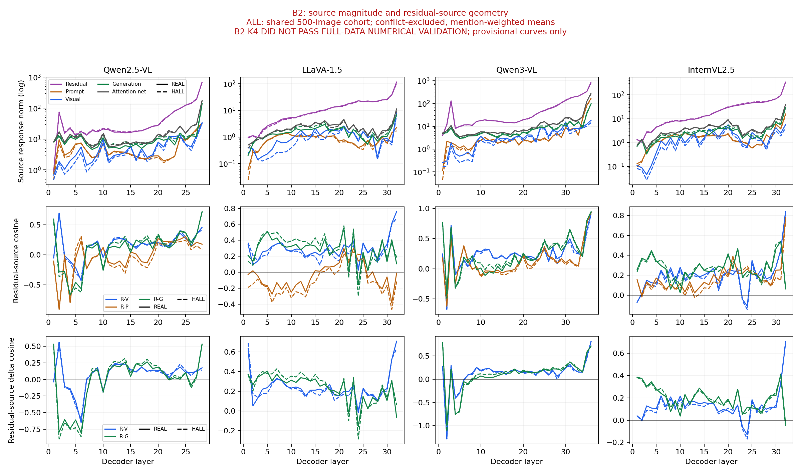

# 其他机制信号的完整分析与图册（2026-09-13）

这次补齐来源路由、逐 token 写入与响应、来源增益与旋转、组内与组间抵消、三对来源输入/输出几何、视觉上下文调制，以及 B1/B2 全部残差信号。没有重新选择检测特征或重训检测器。

最一致的观察是：HALL 的生成来源总 attention 和总响应更大，但生成前缀更长，每 token 写入和响应反而更小；生成组内部更抵消，prompt 组内部更一致；B1 中生成响应与残差更反向，视觉—生成相对残差的平衡值更低。相比之下，来源增益、整体旋转、组间抵消和残差份额的 REAL/HALL 差异不够统一。

这些是关联性的机制描述。同图配对控制图片身份，没有控制生成长度、目标位置或目标类别；不同层也不是独立样本。下文的跨层均值和同方向层数都不是显著性检验，不能代替原检测 bootstrap。

## 数据、图例与可复查入口

- 共享 500 图，原 train/test = 400/100，全部 decoder 层，mentions 等权。机制分析排除标签冲突目标，检测仍保留全部 mentions。
- 四模型保留 mentions：Qwen2.5 1128、LLaVA 1947、Qwen3 1917、InternVL 1496，共 6488。可做 REAL/HALL 同图配对的图片 all/test 数量分别为 95/12、241/45、237/40、161/24。因此 Qwen2.5 测试配对尤其不宜过度解读。
- 下图为 all 均值曲线，实线 REAL、虚线 HALL；P=prompt（包含 BOS/模板/非视觉特殊 token），V=visual，G=目标之前可见的生成前缀，R=历史残差。目标及未来 token 不属于 G。
- 颜色在来源图中固定：P 橙、V 蓝、G 绿、R 紫。成对几何图以自身图例 VG/VP/PG 为准。单指标图为 REAL 蓝、HALL 橙。标注 log 的纵轴只改变展示尺度。
- 表格中的 REAL→HALL 是先逐层按 mentions 求均值，再对层等权平均；范数仅宜同模型内比较。比例和余弦先逐 case 计算，不能从平均范数反推平均比例。
- [完整图册：10 组图，每组 all/train/test 和 PDF](../outputs/ffn_all_source_paths_v1/signals_20260913/index.html)
- [75 个字段的逐项跨层汇总](../outputs/ffn_all_source_paths_v1/signals_20260913/signal_summary.csv)；[逐层 mean/median/IQR/有效数量](../outputs/ffn_all_source_paths_v1/signals_20260913/all_curves.csv)；[逐层同图配对差](../outputs/ffn_all_source_paths_v1/signals_20260913/all_paired_images.csv)。未定义值保留 NaN，IQR 不是置信区间。
- 数值限制：All-attention K32 与 B1 的全量纯积分闭合均无 >1%；Visual K4 在 Qwen2.5 有 2 个 case 略超 1%；B2 K4 全量 7.46% target-layer cases 的纯积分误差 >1%，其图与统计只能作为待复核近似结果。详见[数值报告](ALL_SOURCE_PATHS_RESULTS_20260913.md)。闭合通过也不能自动证明每个未审计 case 的单组响应误差均低于 1%。

## 1. Attention 路由：更多质量分给生成前缀，视觉来源下降

复用原 full-prefix attention 缓存，严格按 mention ID、图片和标签对齐到相同 500 图；将原 BOS 与 prompt 合并。上排是组内 attention 直接求和，下排是 attention×gate 的直接和，后者没有再次归一化，也不是 FFN 的积分贡献。

生成来源的 raw attention 和 attention×gate 在四模型 **128/128 层**的 all 同图配对中都为 HALL 更高，test 也为 128/128。视觉 raw attention 在 all/test 均为 123/128 层 HALL 更低，视觉 attention×gate 均为 127/128 层更低。prompt 的跨层配对均值也在四模型 all/test 中更低。

这说明 HALL 的来源路由分配确实不同。但区域求和受区域长度影响，尤其 G 长度明显增加；不能把更大的 G attention 和认知意义上的“更信任自己”直接等同。乘 gate 后方向保留，表示这个现象并非只在 raw attention 上出现。

## 2. 来源总量、净量、增益：生成更强，视觉更弱；增益差别远没有总量统一

对来源 g，令 A_g 为 attention writes 的向量和，E_g 为该来源 token 路径响应的向量和：

\[
\mathrm{gross}_g=\sum_{m\in g}\|e_m\|,\qquad
\mathrm{net}_g=\|E_g\|,\qquad
\mathrm{gain}_g=\|E_g\|/\|A_g\|.
\]

gross 忽略 token 间抵消，net 保留抵消结果；gain 是来源净向量在指定路径上的有效范数增益，不是每个 token 的统一缩放系数。

| 来源 gross：REAL→HALL | Qwen2.5 | LLaVA | Qwen3 | InternVL |
|---|---:|---:|---:|---:|
| Prompt | 12.705→10.807 | 2.763→2.346 | 19.222→17.372 | 5.168→4.657 |
| Visual | 21.243→18.604 | 4.384→3.796 | 15.527→12.645 | 6.262→4.877 |
| Generation | 37.142→43.638 | 5.561→7.539 | 28.095→31.340 | 12.329→14.523 |

同图配对中，HALL 的生成 gross 更高为 all 126/128、test 127/128 层；视觉 gross 更低为 all 122/128、test 114/128 层；prompt gross 更低均为 127/128 层。视觉 net 普遍降低、生成 net 普遍升高，但并非所有层一致，prompt net 尤其不能直接照搬 gross 的解释。

来源增益具有层和来源差异，跨层平均 prompt gain 高于 V/G；但它的 HALL 差异小且依赖模型。例如 visual gain 为 .865→.855、.603→.594、.854→.840、.690→.691。不能据此说“FFN 在所有模型中都更放大幻觉来源”或“视觉降低完全由 FFN 增益降低造成”。

## 3. 旋转与抵消：组内和组间是不同信号

\[
\rho_g=\cos(A_g,E_g),\quad
\kappa_g=\frac{\|E_g\|}{\sum_{m\in g}\|e_m\|},\quad
\kappa_{\mathrm{source}}=\frac{\|E_P+E_V+E_G\|}{\|E_P\|+\|E_V\|+\|E_G\|}.
\]

κ 越小，抵消越强。前一个 κ 测来源内部 token 响应，后一个 κ 测三个来源净响应之间的关系。

| 组内 κ：REAL→HALL | Qwen2.5 | LLaVA | Qwen3 | InternVL |
|---|---:|---:|---:|---:|
| Generation | .526→.484 | .558→.451 | .478→.444 | .515→.474 |
| Prompt | .706→.762 | .711→.783 | .816→.860 | .727→.793 |

HALL 的 G 组内 κ 更低：all 125/128、test 123/128 层；P 组内 κ 更高：all 122/128、test 124/128 层。因此生成 token 响应更相互抵消，而 prompt token 响应更一致。V 组内 κ 没有统一方向。

三来源之间的 κ 跨层均值约 .59–.68，标签差异很小、模型和层间方向不统一。因此“生成来源内部更抵消”不能扩展成“所有来源彼此更冲突”。

组方向余弦的跨层均值普遍为负，说明原 attention write 与路径 FFN 响应并非简单正向缩放。但 REAL/HALL 曲线接近、局部交叉很多，强方向改变首先是两类共有的结构，不是单独的幻觉标志。

## 4. 三对来源几何：V–G 更对齐，P 与两者较分离；FFN 改变量依模型不同

上、中、下排依次是 cos(A_i,A_j)、cos(E_i,E_j) 和二者差。正余弦是同向，负余弦是反向；不表示语义正确或错误。

V–G 输出余弦的 REAL→HALL 为 .065→.139、.143→.166、.173→.205、.200→.263。同图配对 all/test 的跨层均值四模型都为正，说明 HALL 的视觉和生成净响应通常更加对齐。V–P、P–G 输出余弦通常更低，但层级一致性弱于“所有层相同”这样的强主张，Qwen2.5 的 V–P 测试配对尤其较弱。

不能把标签差解释成统一的 FFN 操作：Qwen2.5 的 V–G Δcos 跨层均值在 REAL/HALL 都为负（−.121/−.084），其他三模型为小幅正值。这意味着 Qwen2.5 的整个 Norm/FFN 路径平均降低 V–G 对齐程度，而另三模型平均略微提高；HALL 相对 REAL 的 Δcos 更高，不等于每个模型都把两来源变得更同向。

这里的 P/V/G 是 token 来源位置分类，其隐藏表示已含更早层混合的信息，不能将几何变化直接称为“忽视指令”或“视觉证据被生成文本污染”。

## 5. 视觉上下文调制与长度：方向相近，幅度仍可改变；总生成响应受长度影响

在相同 visual writes 下，比较 visual-only 与 all-attention 两条路径的视觉组响应：

\[
c_{ctx}=\cos(E_V^{vis},E_V^{all}),\qquad
d_{ctx}=\|E_V^{all}-E_V^{vis}\|/\|E_V^{vis}\|.
\]

跨层平均 c_ctx 在 .977–.987，说明两条路径的视觉响应总体方向接近；d_ctx 的 REAL→HALL 为 .287→.305、.134→.152、.194→.209、.145→.156。HALL 的调制差异更大在 all 配对 113/128、test 106/128 层成立。方向接近不意味着向量相等，d_ctx 同时受幅度与方向影响；早层会有更大的相对变化，不能把全层平均当作每层幅度。

| 长度与归一化：REAL→HALL | Qwen2.5 | LLaVA | Qwen3 | InternVL |
|---|---:|---:|---:|---:|
| N_G | 33.79→56.70 | 31.67→71.55 | 101.02→152.02 | 71.89→105.84 |
| generation gross / N_G | 2.535→1.289 | .355→.131 | .723→.342 | .488→.229 |

HALL 的每生成 token 平均响应在四模型 **全部 128 层** all/test 配对中都更低。更长的前缀、更高的总响应与更低的每 token 平均响应可以同时成立；总量上升不能单独证明每个生成 token 获得了更大增益。现有检测长度组的 N_G 与 response_index 两列相等，不是两项独立长度信息。这里只作每 token 尺度对照，没有做等长度匹配或回归残差化。

Prompt 数量固定为 25/17/14/28，LLaVA/InternVL 视觉数量固定 576/256；Qwen 系列视觉数量随图片变化，但同图 REAL/HALL 配对的视觉数量差为零。

## 6. 逐 token 信号：写入差别在进入局部 FFN 路径之前已经存在

本次从保存的 token 标量补算每来源的 write norm 均值、effect norm 均值、gain 中位数以及 direction cosine 均值。先在一个 target-layer 的该来源 token 内汇总，再按 mentions 等权，不把长前缀的所有 token 混入一个大池子。

G token 平均写入 REAL→HALL：2.849→1.496、.702→.275、1.181→.576、.801→.395；与平均响应一样，在 all/test 的 128/128 层配对中均更低。平均视觉和 prompt 写入、响应的跨层差也四模型均为负，但视觉存在层级例外。

G token gain 中位数的跨层均值仅由 .806→.787、.551→.533、.728→.719、.616→.615，远小于范数上的变化。其 all/test 配对均值为负，但并非所有层为负；V/P token gain 的标签差异依模型不同。由此可以说，输入 write 的差别已经存在，不能将输出范数差全归到 FFN 的放大率。

三来源的 token 方向余弦中层常明显为负，后段趋近零，REAL/HALL 接近。余弦接近零表示响应与 write 的平行部分占比较小，不代表 FFN 响应消失。来源净向量 gain 与逐 token gain 中位数采用不同权重并受向量抵消影响，数值不同不构成矛盾。

## 7. B1：有辨识度的是残差与生成的相对几何，不是残差占比本身

B1 经真实 Norm/FFN 路径 b_O+α(R+A_P+A_V+A_G)。令 E_A=E_P+E_V+E_G：

\[
D_R=\frac{\|E_R\|}{\|E_R\|+\|E_A\|},\quad
\kappa_{A,R}=\frac{\|E_R+E_A\|}{\|E_R\|+\|E_A\|},\quad
B=\cos(E_R,E_G)-\cos(E_R,E_V).
\]

D_R 的 REAL→HALL 约 .502→.503、.544→.544、.495→.498、.526→.530，差异很小。它的分母是 R 与合计 attention 两个净向量的范数和，不是四来源范数总和，更不是 residual token 的数量比例。

κ 的跨层均值 .16–.31 表明 B1 来源归因中存在强抵消，但标签差异在四模型中三个出现 all/test 配对均值反向，不能说 HALL 普遍更抵消。并且由三角不等式 |2D_R−1|≤κ 可知，小 κ 本身约束 D_R 靠近 .5；这两个量并不独立。

B 的 REAL→HALL 为 −.244→−.370、−.162→−.293、−.250→−.331、−.176→−.299。四模型 all/test 配对均值一致降低；测试中为 23/28、28/32、35/36、30/32 层降低。这个来源相对关系比 residual_share 的微小差异更值得关注。

| B1：REAL→HALL | Qwen2.5 | LLaVA | Qwen3 | InternVL |
|---|---:|---:|---:|---:|
| ‖E_V‖ | 80.72→70.79 | 12.46→10.19 | 67.24→55.83 | 19.65→15.28 |
| ‖E_G‖ | 149.50→166.39 | 15.49→16.97 | 119.83→125.60 | 44.32→49.55 |
| cos(R,G) | −.652→−.746 | −.491→−.561 | −.721→−.764 | −.550→−.618 |
| Δcos(R,G) | −1.010→−1.125 | −.579→−.672 | −.921→−.992 | −.748→−.832 |

HALL 的视觉、prompt 响应降低，生成响应升高，cos(R,G) 与 Δcos(R,G) 更负，这些跨层配对均值在四模型 all/test 均同向。cos(R,P) 更高也四模型一致。cos(R,V) 虽然总体更高，但 Qwen2.5 的 test 配对方向反转。残差范数和 attention_total_norm 没有跨模型一致升降。

B1 的 Δcos 输入使用原始 R/A_g，B2 使用冻结归一化后的来源，不能混用。B1 近径向 RMSNorm 路径可以产生很大而彼此抵消的横向来源响应；大的单组范数不等于大的最终 FFN 更新。历史 R 已包含此前的视觉、prompt、generation 与 FFN 信息，不能直接称为“语言先验”；负余弦也不等于因果上的抑制。

## 8. B2：全部信号保留展示，但目前不能确认机制

B2 冻结 clean endpoint RMS 缩放，在纯 FFN 的 αn 路径积分；几何字段名称与 B1 一一对应，但它们是不同路径下的响应，不能直接拼成同一机制。

现有 K4 产物中，视觉/prompt 响应下降、生成响应升高仍出现；residual_share 约 .70–.80，κ 约 .80–.90，与 B1 有较大差别；balance 的 HALL−REAL 跨层配对均值在四模型 all/test 为正，与 B1 相反。cos(R,V) 和 cos(R,P) 的配对均值为负，cos(R,G) 则不是所有模型 all/test 一致。

但全量 B2 积分误差已证实不合格，早期 50-case 抽样遗漏关键层。以上只是“目前计算出的近似曲线长什么样”，不能据此确认“冻结 RMS 后残差更支持幻觉”，也不能把 B1/B2 的相反 balance 解释为可靠机制差异。B2 仍属于正式实验，需修复求积并复核后更新这些图，而非从实验中删除。

## 9. 与此前 scalar identity 验证的关系

此前独立 visual-only 实验还检验了“响应是否只等于写入乘一个标量”。允许负增益及每个 target-layer 重新拟合后，完整 visual-write 子空间上的 cI 相对拟合残差仍约 .936–.966，逐 token 正交响应比例约 .944–.966；不支持简单标量算子近似。REAL/HALL 两类都如此，且类间差异小、方向不统一。

这与本次 token/组 rotation 图的用途不同：它验证算子结构，不能仅凭“不是 scalar identity”就解释幻觉。本次 All-attention 与旧 visual-only 的积分路径、冲突过滤口径也不同，不直接合并数值。

[旧完整子空间图](../outputs/ffn_scalar_identity_20260912/subspace500/all_subspace.png) · [旧逐 token 三指标图](../outputs/ffn_scalar_identity_20260912/tokens500/all_metrics.png) · [完整说明](FFN_SCALAR_IDENTITY.md)。

## 可复现与检查

新增离线脚本 `scripts/plot_all_source_signal_gallery.py`，复用正式 500 图分片和现有 routing 缓存，无模型 forward。57 个原字段与 18 个补充字段共 75 个；4 模型×3 scope，共 900 行逐字段跨层汇总。生成 30 张 PNG 与 30 张 PDF，保留完整曲线、同图配对和 NPZ/mention 表。

已检查：补充数据的 mention/图片/标签对齐、冲突目标排除、四模型 6488 mentions 覆盖；新算 generation token effect 均值与原 generation_per_token_gross 的 mean/median/q25/q75 在 rtol=atol=1e-6 内一致（最大绝对差 7.54e-7）；缓存 raw attention 组和与 1 的最大差 8.57e-4，保留原生精度偏差而不重新归一化。详见[验证数据](../outputs/ffn_all_source_paths_v1/signals_20260913/validation.json)。

本次探索命令有两项已绕过的小故障：vicr 无 pandas，改用标准库 csv；一次 rg 指定了不存在的 `features/prefix_attention_gate.py`，随后定位实际 `scripts/plot_prefix_attention_regions.py`。未改环境，未影响提取或分析结果。
