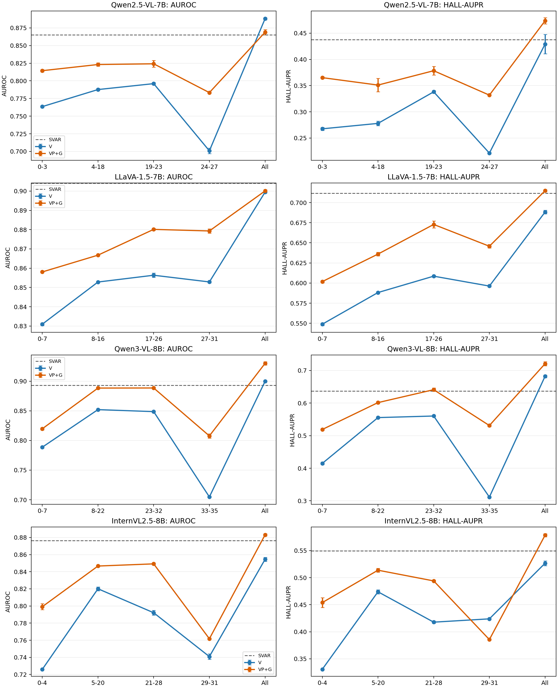

# 基于模型自身曲线的分层检测结果（batch 128，811）

## 实验设置

- 固定图片级8:1:1：3200/400/400，split seed 20260912，全部mentions；训练seeds43/44/45。表中为测试集三seed均值±总体标准差。
- True-RMS all-attention路径`z-A_all -> z`、局部FP32、Gauss–Legendre K32。V=`[AE_V,log1p(S_V^all)]`；VP+G=`[AE_VP,log1p(S_V^all+S_P^all),AE_G,log1p(S_G^all)]`。
- 所有分类器固定batch128、训练集逐列StandardScaler、无BatchNorm、完整150 epochs、最低validation BCE loss checkpoint。Qwen2.5 VP+G沿用其独立搜参赢家的其余参数；其他组沿用当前验证选定参数。
- 分段只使用训练mentions，不使用标签。对`AE_V/logS_V/AE_VP/logS_VP/AE_G/logS_G`六条训练均值层曲线分别做层维Z-score，再用等权四段piecewise-constant最小SSE动态规划确定边界；每段至少3层。
- 全层对照复用同协议batch128模型头，测试概率逐值一致。测试集此前已访问，因此这是探索性分层实验。

## 曲线确定的范围

| 模型 | 段1 | 段2 | 段3 | 段4 | 全层 |
|---|---:|---:|---:|---:|---:|
| Qwen2.5-VL-7B | 0–3 | 4–18 | 19–23 | 24–27 | 0–27 |
| LLaVA-1.5-7B | 0–7 | 8–16 | 17–26 | 27–31 | 0–31 |
| Qwen3-VL-8B | 0–7 | 8–22 | 23–32 | 33–35 | 0–35 |
| InternVL2.5-8B | 0–4 | 5–20 | 21–28 | 29–31 | 0–31 |

## 检测结果

### Qwen2.5-VL-7B

| 特征 | 层范围 | AUROC | HALL-AUPR |
|---|---:|---:|---:|
| V | 0–3 | 0.7635 ± 0.0016 | 0.2676 ± 0.0028 |
| V | 4–18 | 0.7877 ± 0.0015 | 0.2780 ± 0.0042 |
| V | 19–23 | **0.7961 ± 0.0016** | **0.3381 ± 0.0025** |
| V | 24–27 | 0.7009 ± 0.0038 | 0.2213 ± 0.0008 |
| V | 全层 0–27 | **0.8881 ± 0.0015** | **0.4291 ± 0.0185** |
| VP+G | 0–3 | 0.8144 ± 0.0017 | 0.3652 ± 0.0017 |
| VP+G | 4–18 | 0.8232 ± 0.0025 | 0.3510 ± 0.0128 |
| VP+G | 19–23 | **0.8242 ± 0.0046** | **0.3784 ± 0.0083** |
| VP+G | 24–27 | 0.7834 ± 0.0009 | 0.3319 ± 0.0008 |
| VP+G | 全层 0–27 | **0.8689 ± 0.0037** | **0.4735 ± 0.0060** |

### LLaVA-1.5-7B

| 特征 | 层范围 | AUROC | HALL-AUPR |
|---|---:|---:|---:|
| V | 0–7 | 0.8310 ± 0.0007 | 0.5489 ± 0.0016 |
| V | 8–16 | 0.8528 ± 0.0002 | 0.5882 ± 0.0011 |
| V | 17–26 | **0.8564 ± 0.0011** | **0.6086 ± 0.0011** |
| V | 27–31 | 0.8529 ± 0.0005 | 0.5963 ± 0.0012 |
| V | 全层 0–31 | **0.8994 ± 0.0004** | **0.6882 ± 0.0022** |
| VP+G | 0–7 | 0.8581 ± 0.0003 | 0.6018 ± 0.0015 |
| VP+G | 8–16 | 0.8668 ± 0.0003 | 0.6360 ± 0.0022 |
| VP+G | 17–26 | **0.8801 ± 0.0005** | **0.6728 ± 0.0042** |
| VP+G | 27–31 | 0.8793 ± 0.0011 | 0.6458 ± 0.0023 |
| VP+G | 全层 0–31 | **0.9001 ± 0.0007** | **0.7147 ± 0.0013** |

### Qwen3-VL-8B

| 特征 | 层范围 | AUROC | HALL-AUPR |
|---|---:|---:|---:|
| V | 0–7 | 0.7887 ± 0.0015 | 0.4149 ± 0.0040 |
| V | 8–22 | **0.8520 ± 0.0011** | 0.5554 ± 0.0028 |
| V | 23–32 | 0.8487 ± 0.0007 | **0.5602 ± 0.0010** |
| V | 33–35 | 0.7048 ± 0.0010 | 0.3115 ± 0.0013 |
| V | 全层 0–35 | **0.8997 ± 0.0011** | **0.6822 ± 0.0040** |
| VP+G | 0–7 | 0.8197 ± 0.0020 | 0.5189 ± 0.0025 |
| VP+G | 8–22 | 0.8884 ± 0.0020 | 0.6014 ± 0.0034 |
| VP+G | 23–32 | **0.8885 ± 0.0016** | **0.6410 ± 0.0053** |
| VP+G | 33–35 | 0.8077 ± 0.0037 | 0.5310 ± 0.0037 |
| VP+G | 全层 0–35 | **0.9300 ± 0.0029** | **0.7207 ± 0.0063** |

### InternVL2.5-8B

| 特征 | 层范围 | AUROC | HALL-AUPR |
|---|---:|---:|---:|
| V | 0–4 | 0.7260 ± 0.0002 | 0.3306 ± 0.0004 |
| V | 5–20 | **0.8201 ± 0.0022** | **0.4739 ± 0.0039** |
| V | 21–28 | 0.7921 ± 0.0029 | 0.4177 ± 0.0019 |
| V | 29–31 | 0.7409 ± 0.0031 | 0.4238 ± 0.0004 |
| V | 全层 0–31 | **0.8545 ± 0.0025** | **0.5266 ± 0.0044** |
| VP+G | 0–4 | 0.7992 ± 0.0034 | 0.4539 ± 0.0091 |
| VP+G | 5–20 | 0.8467 ± 0.0009 | **0.5138 ± 0.0036** |
| VP+G | 21–28 | **0.8492 ± 0.0012** | 0.4940 ± 0.0013 |
| VP+G | 29–31 | 0.7617 ± 0.0005 | 0.3855 ± 0.0005 |
| VP+G | 全层 0–31 | **0.8831 ± 0.0014** | **0.5785 ± 0.0028** |

## 结果解释

- 八个“模型×特征”组合全部由全层取得最高AUROC和HALL-AUPR。相对各自最强单段，全层AUROC提高0.0199–0.0920，说明检测信息分布在多个曲线阶段，跨阶段轨迹具有互补性。全层输入维度也更大，因此这一结果不能单独证明互补性是唯一原因；后续若要做严格归因，需要维度匹配或层数匹配控制。
- Qwen2.5：V和VP+G的最强单段均为19–23层；24–27末段明显下降。全层V的AUROC最高，VP+G的HALL-AUPR更高。
- LLaVA：17–26层是两组的最强单段；27–31层AUROC接近，但HALL-AUPR回落。相较其他模型，LLaVA末段仍保留较多检测信息。
- Qwen3：V的AUROC在8–22层最高、HALL-AUPR在23–32层最高；VP+G的23–32层最强。33–35末段单独使用时明显退化。
- InternVL：V的5–20层最强；VP+G的AUROC在21–28层最高，而HALL-AUPR在5–20层最高，说明两项指标依赖的深度阶段不同。29–31末段单独效果较弱。
- VP+G在四模型的每个单独层段上都取得更高AUROC；全层时只有Qwen2.5的V AUROC更高。HALL-AUPR方面，VP+G在除InternVL末段29–31以外的单段以及四个全层对照中均高于V，说明prompt/generation响应的增益分布在多个深度阶段。
- 没有任何单独层段的AUROC超过对应SVAR；只有Qwen3的VP+G 23–32层在HALL-AUPR上略高于SVAR。这进一步表明，当前方法超过SVAR主要依赖完整跨层轨迹。

## 图

模型自身信号曲线与分段边界：

- [Qwen2.5-VL-7B 曲线](../outputs/ours_curve_layer_ranges_batch128_811_v1/qwen2_5_vl_7b/layer_curve_segmentation.png)
- [LLaVA-1.5-7B 曲线](../outputs/ours_curve_layer_ranges_batch128_811_v1/llava_1_5_7b/layer_curve_segmentation.png)
- [Qwen3-VL-8B 曲线](../outputs/ours_curve_layer_ranges_batch128_811_v1/qwen3_vl_8b/layer_curve_segmentation.png)
- [InternVL2.5-8B 曲线](../outputs/ours_curve_layer_ranges_batch128_811_v1/internvl_2_5_8b/layer_curve_segmentation.png)

## 原始数据

- `outputs/ours_curve_layer_ranges_batch128_811_v1/summary.json`
- `outputs/ours_curve_layer_ranges_batch128_811_v1/seed_metrics.csv`
- 各模型目录中的`layer_curves.csv`与`curve_segmentation.json`。
