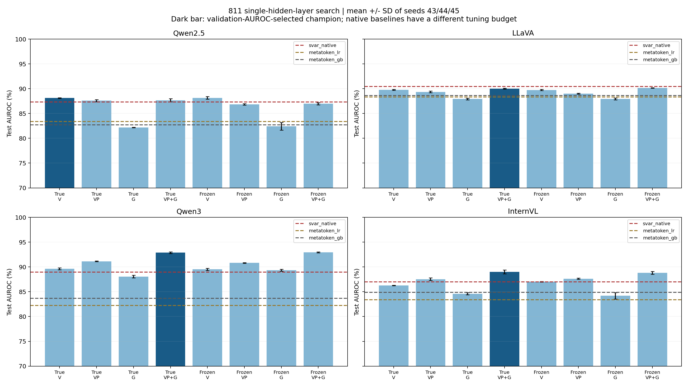
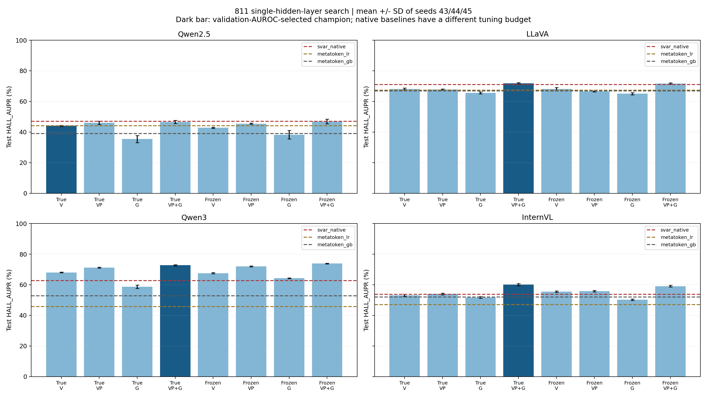

# 811 单隐藏层 MLP 固定预算搜索结果

实验设置：按图片 3200 训练 / 400 验证 / 400 测试，固定 split seed=20260912，保留全部 mentions。沿用原训练集，原 800 图留出集分半；该留出集此前已被查看，本轮属于探索性比较。
分类器严格单隐藏层：Linear → 可选 BatchNorm → ReLU/GELU → Dropout → Linear，BCE（REAL=1）、Adam；输入标准化若启用，仅拟合训练集。最多150 epochs、早停 patience=20、ReduceLROnPlateau factor=0.5/patience=6/min_lr=1e-6。预注册候选中 checkpoint/调度/早停依据为 val_loss 或 val_AUROC，见参数表。
每个模型、每组24个固定候选先跑 seed43；验证 AUROC 排名前3补44/45，再按三 seed 验证 AUROC 均值选配置。并列依次看验证 HALL-AUPR、较小候选序号。每模型再按相同指标选一个跨8组 champion；四模型选择全部冻结后才计算本轮测试指标。总计960次训练、96个测试头，不 train+val 重训。
**下列 AUROC / HALL-AUPR 均为 seeds43/44/45 分别计算后取均值，单位 %；不是概率 ensemble。** 完整结果表与 CSV 另列总体标准差，ensemble 单独保存在 CSV。排名指标无阈值依赖；附带阈值结果采用 train REAL-F1 和固定0.5。原生基线阈值采用 val REAL-F1。

## 特征与路径

| 组 | 每层输入 |
|---|---|
| V | `[AE_V, log1p(S_V)]` |
| VP | `[AE_VP, log1p(S_V+S_P)]` |
| G | `[AE_G, log1p(S_G)]` |
| VP+G | 完整拼接 VP 与 G 两块 |

AE_VP 在视觉+prompt 区域重新归一化并计算 gate，不是 AE_V+AE_P。空 generation 在检测输入置零，保留该 mention。四模型层数为28/32/36/32，V/VP/G维度2L，VP+G维度4L。
真实 RMS：S 是逐 token 积分响应范数之和（gross），路径 z−A_all → z，J_(FFN∘Norm)，K32。冻结 RMS：固定 clean endpoint 的 D(z)，纯 FFN 的 αNorm(z) 路径，K50；完整分解包含 residual、attention、bias，这四组仅输入 attention gross。两版 AE 逐值相同；两条路径和基点也不同，不能把差值全部归因于 RMS 导数。
继承的数值限制：冻结K50纯积分闭合已通过，但 Qwen2.5/Qwen3 原生来源重构的总闭合存在尾部误差（最大约9.51%/11.62%）；本轮只搜索分类器，不改变提取结果。

## 验证集选出的代表配置与原生基线

| 模型 | 验证选出的组 | 本方法 AUROC / AP | SVAR AUROC / AP | Meta LR AUROC / AP | Meta GB AUROC / AP | 对SVAR差值 AUROC / AP (pp) |
|---|---|---|---|---|---|---|
| Qwen2.5 | 真实 RMS V | 88.12 / 44.04 | 87.34 / 47.06 | 83.39 / 44.08 | 82.73 / 38.98 | +0.78 / -3.01 |
| LLaVA | 真实 RMS VP+G | 90.01 / 71.85 | 90.44 / 70.96 | 88.35 / 67.36 | 88.61 / 66.88 | -0.44 / +0.88 |
| Qwen3 | 真实 RMS VP+G | 92.88 / 72.75 | 88.95 / 62.66 | 82.24 / 45.74 | 83.66 / 52.76 | +3.92 / +10.10 |
| InternVL | 真实 RMS VP+G | 88.99 / 60.08 | 86.98 / 53.73 | 83.38 / 46.96 | 84.89 / 52.03 | +2.01 / +6.34 |

验证集选出的代表配置在测试 AUROC 上超过全部三种原生基线的模型：Qwen2.5, Qwen3, InternVL（3/4）。这只表示当前测试集的均值比较，没有显著性检验或独立测试的推广保证。

原生 SVAR：248单隐藏ReLU、Adam lr=.001/batch32/max50、val_loss/patience5，无BN/dropout/scaler。MetaToken：训练集StandardScaler+LR(lbfgs,max2000)或GB100。原生基线没有获得本轮相同的搜索预算；本表比较方法连同分类器配置，不证明公平预算下的特征单独优势。基线使用项目已有原生分类器和同目标 controlled 特征，并非论文原始数据集复现；MetaToken 保留完整回答长度/对象span统计，不能称严格前缀信号的公平因果对比。详见 [原生基线设置](NATIVE_BASELINES_811_RESULTS.md)。

## 全部8组结果

| 模型 | 组 | 验证AUROC | 测试AUROC ± SD | 测试HALL-AUPR ± SD | Δ旧单层 AUROC / AP (pp) |
|---|---|---:|---:|---:|---:|
| Qwen2.5 | 真实 RMS V ★ | 88.40 | 88.12 ± 0.07 | 44.04 ± 0.40 | +6.07 / +11.80 |
| Qwen2.5 | 真实 RMS VP | 87.58 | 87.60 ± 0.22 | 45.99 ± 1.13 | +5.81 / +12.97 |
| Qwen2.5 | 真实 RMS G | 80.15 | 82.20 ± 0.05 | 35.44 ± 2.35 | +1.56 / +6.35 |
| Qwen2.5 | 真实 RMS VP+G | 86.75 | 87.68 ± 0.33 | 46.54 ± 1.05 | +3.93 / +9.56 |
| Qwen2.5 | 冻结 RMS V | 88.01 | 88.16 ± 0.25 | 42.78 ± 0.38 | +4.57 / +9.04 |
| Qwen2.5 | 冻结 RMS VP | 87.59 | 86.83 ± 0.16 | 45.47 ± 0.43 | +5.60 / +11.92 |
| Qwen2.5 | 冻结 RMS G | 80.17 | 82.44 ± 0.77 | 38.27 ± 2.77 | +1.13 / +8.23 |
| Qwen2.5 | 冻结 RMS VP+G | 87.24 | 86.96 ± 0.20 | 46.92 ± 1.52 | +3.30 / +10.36 |
| LLaVA | 真实 RMS V | 89.89 | 89.77 ± 0.10 | 68.19 ± 0.52 | +0.86 / +1.47 |
| LLaVA | 真实 RMS VP | 89.99 | 89.36 ± 0.15 | 67.85 ± 0.36 | +2.33 / +2.75 |
| LLaVA | 真实 RMS G | 88.13 | 87.92 ± 0.15 | 65.55 ± 0.64 | +1.55 / +1.89 |
| LLaVA | 真实 RMS VP+G ★ | 91.16 | 90.01 ± 0.10 | 71.85 ± 0.39 | +0.90 / +1.74 |
| LLaVA | 冻结 RMS V | 90.06 | 89.75 ± 0.14 | 68.17 ± 0.86 | +0.54 / +1.18 |
| LLaVA | 冻结 RMS VP | 90.05 | 89.01 ± 0.10 | 66.57 ± 0.36 | +0.64 / -0.61 |
| LLaVA | 冻结 RMS G | 88.18 | 87.95 ± 0.18 | 65.08 ± 0.71 | +1.30 / +0.93 |
| LLaVA | 冻结 RMS VP+G | 91.02 | 90.16 ± 0.04 | 71.71 ± 0.40 | +0.45 / +0.36 |
| Qwen3 | 真实 RMS V | 89.02 | 89.62 ± 0.20 | 68.06 ± 0.28 | +1.60 / +6.26 |
| Qwen3 | 真实 RMS VP | 88.18 | 91.14 ± 0.07 | 71.18 ± 0.28 | +4.78 / +10.31 |
| Qwen3 | 真实 RMS G | 87.63 | 88.06 ± 0.25 | 58.73 ± 1.17 | +5.15 / +8.15 |
| Qwen3 | 真实 RMS VP+G ★ | 90.76 | 92.88 ± 0.17 | 72.75 ± 0.43 | +3.98 / +8.74 |
| Qwen3 | 冻结 RMS V | 88.79 | 89.52 ± 0.22 | 67.56 ± 0.42 | +0.52 / +3.16 |
| Qwen3 | 冻结 RMS VP | 88.34 | 90.82 ± 0.07 | 71.94 ± 0.33 | +3.82 / +10.34 |
| Qwen3 | 冻结 RMS G | 87.63 | 89.33 ± 0.19 | 64.26 ± 0.26 | +5.34 / +13.27 |
| Qwen3 | 冻结 RMS VP+G | 90.46 | 92.95 ± 0.09 | 73.91 ± 0.23 | +3.50 / +8.20 |
| InternVL | 真实 RMS V | 84.85 | 86.27 ± 0.07 | 53.17 ± 0.75 | +0.49 / -3.23 |
| InternVL | 真实 RMS VP | 86.06 | 87.53 ± 0.27 | 54.05 ± 0.56 | +4.78 / +5.45 |
| InternVL | 真实 RMS G | 85.06 | 84.61 ± 0.21 | 51.73 ± 0.62 | +2.46 / +6.92 |
| InternVL | 真实 RMS VP+G ★ | 87.06 | 88.99 ± 0.38 | 60.08 ± 0.77 | +4.59 / +9.56 |
| InternVL | 冻结 RMS V | 84.87 | 87.02 ± 0.06 | 55.52 ± 0.44 | +0.62 / -1.45 |
| InternVL | 冻结 RMS VP | 86.08 | 87.62 ± 0.11 | 55.88 ± 0.48 | +5.40 / +9.98 |
| InternVL | 冻结 RMS G | 84.84 | 84.18 ± 0.63 | 50.22 ± 0.46 | +1.73 / +5.46 |
| InternVL | 冻结 RMS VP+G | 86.71 | 88.80 ± 0.29 | 59.03 ± 0.56 | +3.73 / +7.26 |

★ 仅表示验证集选出的 champion，不表示按测试集选出的最佳组。旧单层为 sklearn 12候选（宽度64/128/256、lr .01/.001、Adam/SGD、max500）、无额外标准化；新旧差值包含训练实现、正则化、早停与预算差异，不能单独归因某一超参数。

## 选出的具体参数

| 模型 | 组 | c编号 | 宽度 | 标准化 | BN | dropout | 激活 | lr | wd | batch | checkpoint | 最佳epoch 43/44/45 |
|---|---|---:|---:|---|---|---:|---|---:|---:|---:|---|---|
| Qwen2.5 | 真实 RMS V | 11 | 256 | True | True | 0.5 | gelu | 0.003 | 1e-06 | 256 | val_loss | 30/31/22 |
| Qwen2.5 | 真实 RMS VP | 15 | 1024 | True | True | 0.3 | gelu | 0.01 | 0.0001 | 128 | val_loss | 45/45/32 |
| Qwen2.5 | 真实 RMS G | 18 | 512 | False | True | 0.1 | gelu | 0.01 | 0.0 | 64 | val_auroc | 34/48/61 |
| Qwen2.5 | 真实 RMS VP+G | 12 | 128 | False | True | 0.3 | relu | 0.001 | 0.001 | 512 | val_auroc | 89/51/94 |
| Qwen2.5 | 冻结 RMS V | 11 | 256 | True | True | 0.5 | gelu | 0.003 | 1e-06 | 256 | val_loss | 28/32/22 |
| Qwen2.5 | 冻结 RMS VP | 19 | 128 | True | False | 0.3 | relu | 0.003 | 0.0001 | 256 | val_auroc | 78/57/67 |
| Qwen2.5 | 冻结 RMS G | 20 | 1024 | True | True | 0.0 | relu | 0.001 | 1e-06 | 128 | val_auroc | 17/14/31 |
| Qwen2.5 | 冻结 RMS VP+G | 12 | 128 | False | True | 0.3 | relu | 0.001 | 0.001 | 512 | val_auroc | 70/117/73 |
| LLaVA | 真实 RMS V | 19 | 128 | True | False | 0.3 | relu | 0.003 | 0.0001 | 256 | val_auroc | 24/17/20 |
| LLaVA | 真实 RMS VP | 20 | 1024 | True | True | 0.0 | relu | 0.001 | 1e-06 | 128 | val_auroc | 33/29/10 |
| LLaVA | 真实 RMS G | 13 | 512 | False | True | 0.5 | gelu | 0.001 | 0.0001 | 256 | val_auroc | 24/43/44 |
| LLaVA | 真实 RMS VP+G | 12 | 128 | False | True | 0.3 | relu | 0.001 | 0.001 | 512 | val_auroc | 61/53/70 |
| LLaVA | 冻结 RMS V | 19 | 128 | True | False | 0.3 | relu | 0.003 | 0.0001 | 256 | val_auroc | 12/19/20 |
| LLaVA | 冻结 RMS VP | 20 | 1024 | True | True | 0.0 | relu | 0.001 | 1e-06 | 128 | val_auroc | 33/29/10 |
| LLaVA | 冻结 RMS G | 13 | 512 | False | True | 0.5 | gelu | 0.001 | 0.0001 | 256 | val_auroc | 30/43/24 |
| LLaVA | 冻结 RMS VP+G | 12 | 128 | False | True | 0.3 | relu | 0.001 | 0.001 | 512 | val_auroc | 47/50/70 |
| Qwen3 | 真实 RMS V | 21 | 248 | True | True | 0.1 | gelu | 0.0003 | 0.001 | 512 | val_loss | 72/65/69 |
| Qwen3 | 真实 RMS VP | 4 | 512 | False | True | 0.1 | relu | 0.001 | 1e-05 | 256 | val_loss | 66/66/87 |
| Qwen3 | 真实 RMS G | 15 | 1024 | True | True | 0.3 | gelu | 0.01 | 0.0001 | 128 | val_loss | 45/27/36 |
| Qwen3 | 真实 RMS VP+G | 12 | 128 | False | True | 0.3 | relu | 0.001 | 0.001 | 512 | val_auroc | 109/83/88 |
| Qwen3 | 冻结 RMS V | 21 | 248 | True | True | 0.1 | gelu | 0.0003 | 0.001 | 512 | val_loss | 72/65/69 |
| Qwen3 | 冻结 RMS VP | 20 | 1024 | True | True | 0.0 | relu | 0.001 | 1e-06 | 128 | val_auroc | 62/49/42 |
| Qwen3 | 冻结 RMS G | 2 | 248 | False | True | 0.1 | relu | 0.001 | 1e-05 | 256 | val_loss | 27/60/50 |
| Qwen3 | 冻结 RMS VP+G | 12 | 128 | False | True | 0.3 | relu | 0.001 | 0.001 | 512 | val_auroc | 75/83/93 |
| InternVL | 真实 RMS V | 20 | 1024 | True | True | 0.0 | relu | 0.001 | 1e-06 | 128 | val_auroc | 21/19/34 |
| InternVL | 真实 RMS VP | 19 | 128 | True | False | 0.3 | relu | 0.003 | 0.0001 | 256 | val_auroc | 46/79/53 |
| InternVL | 真实 RMS G | 20 | 1024 | True | True | 0.0 | relu | 0.001 | 1e-06 | 128 | val_auroc | 17/24/26 |
| InternVL | 真实 RMS VP+G | 21 | 248 | True | True | 0.1 | gelu | 0.0003 | 0.001 | 512 | val_loss | 48/62/62 |
| InternVL | 冻结 RMS V | 13 | 512 | False | True | 0.5 | gelu | 0.001 | 0.0001 | 256 | val_auroc | 47/39/45 |
| InternVL | 冻结 RMS VP | 15 | 1024 | True | True | 0.3 | gelu | 0.01 | 0.0001 | 128 | val_loss | 47/47/48 |
| InternVL | 冻结 RMS G | 20 | 1024 | True | True | 0.0 | relu | 0.001 | 1e-06 | 128 | val_auroc | 17/15/24 |
| InternVL | 冻结 RMS VP+G | 21 | 248 | True | True | 0.1 | gelu | 0.0003 | 0.001 | 512 | val_loss | 48/62/63 |

## 为什么可能改善，哪些解释尚不能成立

本轮允许标准化、BN、正则化、学习率和宽度共同匹配 AE 与 log1p(gross) 的尺度，并用验证集控制 checkpoint；这些设置可能改善优化和泛化。实际效果见完整表，不能保证每个模型、每组或两个指标同时改善。
这些解释是机制假设。搜索不是逐因素消融实验，选出的参数也不等于每个参数都必要；不能根据赢家配置断言“BN带来多少百分点”或“冻结RMS必然更好”。要估计某个设置的独立影响，需要固定其他条件的另行对照。
本轮没有按测试结果继续扩大网格，也没有隐藏落后组。三seed标准差描述训练随机性，不是图片抽样置信区间。

## 图与可复核数据

图中深色柱为验证选出的组，误差线为三个seed标准差，虚线是原生基线；AUROC纵轴70–100%，HALL-AUPR纵轴0–100%；阅读差值时以表中百分点为准。
- [所有组指标及ensemble](../outputs/single_mlp_search_811_v1/detection.csv)
- [96个seed指标](../outputs/single_mlp_search_811_v1/seed_metrics.csv)
- [具体参数](../outputs/single_mlp_search_811_v1/selected_parameters.csv)
- [对三种原生基线的全部差值](../outputs/single_mlp_search_811_v1/vs_native.csv)
- [960次验证搜索记录](../outputs/single_mlp_search_811_v1/validation_trials.csv)
- [核验记录](../outputs/single_mlp_search_811_v1/validation.json)
- 每模型目录的 protocol.json 与 selection.json 保存完整预注册候选、来源指纹、验证选择及冻结时间；candidate*/seed*/result.pt 保存可恢复checkpoint。
- 日志 outputs/single811_{qwen2,llava,qwen3,internvl}.log；双机进度文件每10秒覆写，最终状态保留。

- InternVL 曾在 progress.json 的 NFS inode 验证上阻塞；确认旧worker退出及锁释放后恢复，并同字节原子重发进度文件。240次训练和冻结选择保持不变，未重训；恢复日志 outputs/single811_internvl_resume1.log。全960 fits / 96测试头 / 36原生头复算核验PASS。
