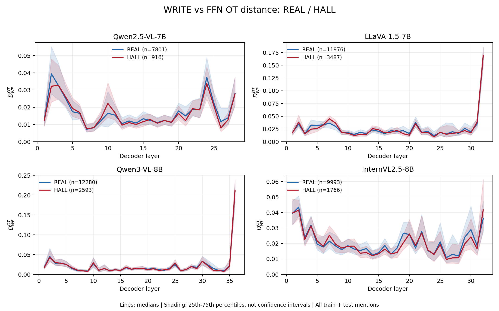
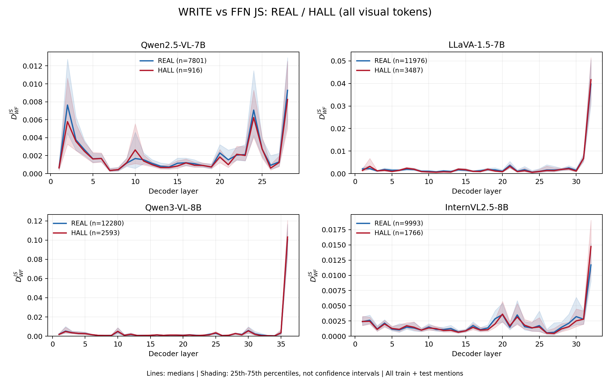
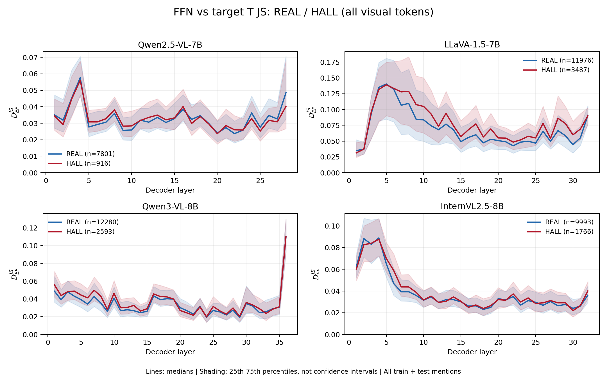

# Vector FFN Source Attribution 正式实验报告

日期：2026-09-04
基线提交：`b11cfc0f`；实验执行时在现有未提交工作树上增量开发，未覆盖旧实验。正式研究随后发布于 `d6f0728`，此前增补发布于 `9b00af1`。本次发布快照截至 2026-09-08，包含新增§5.14–5.19及四模型紧凑结果。

GitHub 发布范围（2026-09-08）：实验代码、主报告、紧凑 JSON/CSV 指标、参数/状态/数值门控，并补齐正式cohort的历史结果与基线对照。按用户最后确认，本次不新增上传 PNG/PDF 图表；报告中的新增图片引用仅对应本地文件，旧 Git 历史内的图片保持不变。原始特征、完整向量、训练预测 `.pt`、逐epoch日志与模型 checkpoint 仍保留在本地，不包含在本次提交中；实验checksum清单记录的是本地完整验收集合，不表示其中全部文件均已上传。入口见 [结果索引](docs/EXPERIMENT_RESULTS_INDEX.md)，本次新增发布文件见 [发布清单](docs/GITHUB_RESULTS_PUBLICATION_20260908.json)。

> v1 执行状态：**FORMAL COMPLETE / PASS**。四模型的 audit、COCO4000 全层提取、13 组 detector、预注册 gate 和三类正式因果干预均已完成；所有必需 shard、状态、bootstrap 与 checksum 通过验收。新增数值一致性 v2 全量数值验收未通过，现经用户授权保留原K4继续探索性训练，见 §5.16，不包含在这个 v1 完成声明中。

## 1. 方法与预注册决策

主 source attribution 定义为

\[
e_m=\int_0^1 J_G(z^0+\alpha A)a_m\,d\alpha,
\qquad
z^0=z-\sum_m a_m,
\qquad
A=\sum_m a_m.
\]

其中 `FFN_PATH_GROSS_m=||e_m||₂`，`P_FFN` 是 gross 的归一化分布；`PATH_SIGNED_Q_m` 是 `e_m` 在总有限 FFN effect 方向上的投影；gross strength、net strength 和 `kappa=net/gross` 分别记录总响应、净响应和 cancellation。Riesz 只保留为 downstream target consequence，不作为 FFN source attribution 定义。旧 bbox 指标只作 auxiliary sanity check，不参与方法成立或 gate 判定。

数值规则预注册为：以 Gauss–Legendre K64 作数值参考而非真值，从 K={4,8,16,32} 选同时通过两模型所有代表层五项阈值的最小值；`torch.func.linearize` 只有在两模型 FP32 synthetic/real 检查均通过误差、显存和速度条件时才启用。OOM 只允许按 token chunk `256/128/64/32` 回退，耗尽后必须 FAIL。

Detector 使用固定 image 8:2 split。`WRITE` block 只指 `D_EW` 轨迹；JS 与 OT 分开训练，共 13 组：共享 A/B/F，以及各距离的 C/D/E/G/H。三 seed 为 43/44/45，MLP `[128,64,32]`、dropout 0.3、batch 256、最多 100 epochs、无标准化、无重采样和无类别权重、minimum-train-loss checkpoint、train-REAL-F1 threshold，并同时报告固定 0.5。

条件 gate 是两模型 × JS/OT 四个 `G-C` seed-ensemble AUROC 差中，任一 10,000 次图片级 paired-bootstrap 95% CI 下界大于 0。只有通过才扩展 Qwen3/InternVL 并运行四模型正式因果实验。

## 2. 实现与验证

- `features/ffn_visual_path_attribution.py` 新增分块、批量、默认不保存 `[M,T,D]` 的 `streaming_vector_path_statistics()`；保留 `vector_path_components()` 为完整向量 parity oracle。零 gross 返回 uniform P，零 net 返回 zero signed-Q/kappa，并显式记录 degenerate flag。
- `features/ffn_visual_interactions.py` 新增 vector-valued sampled Shapley，保存 `[region,D]` attribution、标准误、running estimates、总 effect 与 vector completeness。
- 四个独立 CLI 分别负责 audit、全量提取、分析/gate 和 gated counterfactual；全部使用原子 shard、resume、状态、失败、环境、命令与 checksum 记录。
- 真实 full-path smoke 已在四模型各完成 1 图全层：Qwen2/LLaVA/Qwen3/InternVL 分别有 4/3/5/3 个 unique targets；所有主张量 shape 正确、有限，三个非负分布逐层归一化。扩展模型另完成独立 audit smoke。
- 核心路径、Shapley、JS/OT、feature registry、主模型 gate 隔离、resume、counterfactual selection/coverage 与 bootstrap 的定向测试通过；最终完整测试数见第 7 节。

## 3. 200 图 vector audit

### 3.1 覆盖与验收

| Model | Processed images | Target-layer cases | FP32/scaling/Shapley cases | Regions | Permutations | Remaining failures |
| --- | ---: | ---: | ---: | --- | ---: | ---: |
| Qwen2.5-VL-7B | 200 | 1,316 | 50 | 8/16 | 128 | 0 |
| LLaVA-1.5-7B | 200 | 1,420 | 50 | 8/16 | 128 | 0 |
| Qwen3-VL-8B | 200 | 1,456 | 50 | 8/16 | 128 | 0 |
| InternVL2.5-8B | 200 | 1,380 | 50 | 8/16 | 128 | 0 |

Qwen2 audit 发生过两次可恢复 CUDA OOM：第一次来自复制整层做 FP32，改为只把当前 norm+FFN 临时转 FP32 后恢复；第二次来自 FP32 K64 chunk 256，随后把预注册的 `256/128/64/32` 回退统一用于整个 audit path。两次均在首个失败处停止、保留已完成 shard、修复后 resume；没有跳过 case。最终两模型 audit 状态均为 PASS，checksum 完整。

Gate 通过后，Qwen3/InternVL 使用已经冻结的 K4，未参与重新选 K。Qwen3 image `150779` 的首次 FP32 K64 在全部 chunk 都 OOM；根因是仍持有 36 层 capture，而 audit 只需四个代表层。释放非代表层 capture 后原 case resume 成功。扩展 audit 最终同样为 200 图、50 个详细 case、0 remaining failure。Qwen3/InternVL 的 FP32 completeness median/p90/max 分别为 `3.41e-6/1.07e-5/2.98e-5` 与 `7.83e-6/3.86e-5/1.01e-4`；8-region Shapley/path median cosine 为 `0.9999934/0.9999979`，median norm relative error 为 `0.00372/0.00214`。

### 3.2 K 冻结

正式选择为 **Gauss–Legendre K=4**。K4 相对 K64 的逐代表层结果如下；全部明显通过 `rho≥.99 / JS≤.005 / Top32≥.95 / p90 gross≤1% / p90 |delta kappa|≤.01`。

| Model | Layer | Median Spearman | Median JS | Median Top-32 overlap | p90 gross rel. error | p90 abs(delta kappa) |
| --- | ---: | ---: | ---: | ---: | ---: | ---: |
| Qwen2 | 7 | 0.99999942 | 2.58e-9 | 1.000 | 6.47e-4 | 3.86e-4 |
| Qwen2 | 14 | 0.99999943 | 2.80e-9 | 1.000 | 7.69e-4 | 3.41e-4 |
| Qwen2 | 21 | 0.99999954 | 3.05e-9 | 1.000 | 8.19e-4 | 3.75e-4 |
| Qwen2 | 28 | 0.99999825 | 3.49e-8 | 1.000 | 1.75e-3 | 9.42e-4 |
| LLaVA | 8 | 0.99999975 | 2.57e-10 | 1.000 | 2.84e-4 | 1.57e-4 |
| LLaVA | 16 | 0.99999987 | 9.10e-11 | 1.000 | 2.71e-4 | 1.27e-4 |
| LLaVA | 24 | 0.99999975 | 1.71e-10 | 1.000 | 2.76e-4 | 1.33e-4 |
| LLaVA | 32 | 0.99999969 | 7.64e-10 | 1.000 | 2.97e-4 | 2.13e-4 |

### 3.3 FP32、quadrature 与 Shapley

Native K64 与 FP32 K64 的 median P Spearman 为 Qwen2 `0.99999934`、LLaVA `0.99999975`，median JS 为 `3.23e-9/2.21e-10`，Top-32 overlap 均为 1.0。p90 gross relative error 为 `0.00270/0.000111`，p90 |delta kappa| 为 `0.00801/0.000777`。FP32 trapezoid K64 与 FP32 Gauss K64 的 median Spearman/Top-32 均为 1.0，median JS 约 `1e-15`。

Vector Shapley 与 path region component 高度一致：Qwen2 8/16-region 的 case-level median cosine 为 `0.9999953/0.9999966`，median norm relative error 为 `0.00318/0.00308`；LLaVA 为 `0.9999981/0.9999985` 和 `0.00205/0.00178`。全部 Shapley vector completeness 为有限且保存的真实值；本次观测最大值为 0（每个 permutation 的 telescoping vector sum 在保存精度下精确闭合）。

FP32 Gauss K64 的 path completeness relative error median/p90/max 为 Qwen2 `4.41e-6/1.14e-5/2.25e-5`、LLaVA `4.24e-6/1.02e-5/2.78e-5`，支持积分与有限 FFN effect 的向量闭合。模型原生低精度 K4 的同一误差为 Qwen2 `0.0400/0.1244/1.0750`、LLaVA `0.00493/0.01568/0.17993`；这是小 net effect 下 BF16/FP16 endpoint subtraction 与 JVP 量化的真实相对误差，未硬编码成零，也未被用于 K 选择或 detector 特征。因而 source 排名的数值稳定性与原生精度下的 vector completeness 必须分别陈述。

Source scaling 呈连续且按 ranking 分离。相对 lambda=1 的有限 effect norm，中位 lambda=0 比例在 Qwen2 的最高 P_FFN token/最高 8-region/随机 region 为 `0.932/0.704/0.911`，LLaVA 为 `0.953/0.747/0.915`；lambda=1.25 时对应为 Qwen2 `1.017/1.076/1.023`、LLaVA `1.012/1.071/1.023`。

`linearize` 没有同时满足“相对 L2≤5e-3、峰值显存不增加、耗时至少下降 10%”的全部条件，因此正式 backend 冻结为现有 `vmap(jvp)`。

## 4. COCO4000 全层 source attribution

所有模型均使用冻结的 Gauss–Legendre K4 与 `vmap(jvp)`。无目标图片也进入 processed-image manifest；它们不伪造 position row。

| Model | Decoder layers | Processed | With target | No target | Unique targets | Mentions | Train / test mentions |
| --- | ---: | ---: | ---: | ---: | ---: | ---: | ---: |
| Qwen2.5-VL-7B | 28 | 4,000 | 3,679 | 321 | 8,654 | 8,717 | 6,985 / 1,732 |
| LLaVA-1.5-7B | 32 | 4,000 | 3,971 | 29 | 14,951 | 15,463 | 12,317 / 3,146 |
| Qwen3-VL-8B | 36 | 4,000 | 3,943 | 57 | 14,704 | 14,873 | 11,846 / 3,027 |
| InternVL2.5-8B | 32 | 4,000 | 3,927 | 73 | 11,630 | 11,759 | 9,378 / 2,381 |

全局 loader 验证了跨 shard 图片/target 无重复、position 集合与 mention target 集合精确一致、固定 8:2 image split 对齐、所有层的 `ATTENTION_EVIDENCE/P_WRITE/P_FFN/PATH_SIGNED_Q` shape 与 finite，以及三个非负分布的逐层归一化。正式 shard 只保存 compact 轨迹；完整 `e_m` 仅存在于 50-case audit 子集。固定、按 image/response 排序而非结果筛选的 REAL/HALL 示例图位于各模型 `figures/fixed_examples.png/.pdf`；旧 bbox 数值只保留为 auxiliary sanity check。

## 5. Detector、bootstrap 与预注册 gate

每个模型均完成 13 feature sets × seeds 43/44/45。下表为 test 上三 seed 概率平均后的 AUROC；所有固定 0.5 与 train-REAL-F1 threshold 的 AUROC、REAL/HALL AUPR、precision、recall、F1 位于各模型的 `tables/detector_metrics.csv`。

| Model | A | F | C_JS | G_JS | H_JS | C_OT | G_OT | H_OT |
| --- | ---: | ---: | ---: | ---: | ---: | ---: | ---: | ---: |
| Qwen2.5 | .8341 | .8694 | .7998 | .8718 | .8824 | .8054 | .8723 | .8912 |
| LLaVA | .8948 | .9010 | .8912 | .9026 | .9053 | .8900 | .9046 | .9068 |
| Qwen3 | .8789 | .8855 | .8650 | .8846 | .8945 | .8639 | .8919 | .8974 |
| InternVL | .8474 | .8697 | .8537 | .8742 | .8796 | .8489 | .8770 | .8842 |

预注册 gate 的四个比较全部通过，而不只是“任一通过”：

| Model | Comparison | AUROC delta | Image-level paired-bootstrap 95% CI | Gate |
| --- | --- | ---: | ---: | --- |
| Qwen2.5 | G_JS − C_JS | +.07192 | [.04113, .10490] | PASS |
| Qwen2.5 | G_OT − C_OT | +.06685 | [.03775, .09814] | PASS |
| LLaVA | G_JS − C_JS | +.01139 | [.00228, .02090] | PASS |
| LLaVA | G_OT − C_OT | +.01456 | [.00505, .02374] | PASS |

因此条件阶段状态为 `RUN_REQUIRED`。每个 detector 比较均恰有 10,000 个有效图片级 resample。扩展模型的描述性 `G-C` 也为正且 CI 下界大于 0，但没有被反向用于 gate。主要单块消融显示：`G-D/G-E` 大多显著为正；主模型的 `G-F` CI 均跨 0，而扩展模型只有 OT 的 `G-F` 明确为正。这意味着 gate 的大增益主要是相对单独 `D_EW` 加入 `S/kappa` 与其余距离，不能归因于“把三种距离拼在一起”本身。四模型两种距离的 `H-A` CI 均大于 0。

### 5.1 Strength、kappa 与 R_cos 事后探索性消融

这五组不属于预注册 13 组，也不参与 gate。它们复用完全相同的 image 8:2 split、seeds 43/44/45、MLP、checkpoint 和 threshold 协议；输入分别为全层 `gross_strength`、全层 `kappa=net_strength/gross_strength`、两者拼接、全层旧 `R_cos`，以及三者直接拼接。联合组不含 AE、JS 或 OT path-distance blocks。

| Model | Feature | Ensemble AUROC | Mean HALL-AUPR | Mean HALL-F1 |
| --- | --- | ---: | ---: | ---: |
| Qwen2.5 | strength | .8569 | .3727 | .1613 |
|  | kappa | .7950 | .3312 | .2175 |
|  | strength+kappa | .8637 | .3970 | **.2379** |
|  | R_cos | .7988 | .3061 | .2399 |
|  | strength+kappa+R_cos | **.8696** | **.3988** | .2193 |
| LLaVA | strength | .8860 | .6828 | .6191 |
|  | kappa | .8693 | .6274 | .5633 |
|  | strength+kappa | .8912 | .6925 | .6367 |
|  | R_cos | .8735 | .6266 | .5787 |
|  | strength+kappa+R_cos | **.8998** | **.6983** | **.6390** |
| Qwen3 | strength | .8704 | .5655 | .5010 |
|  | kappa | .8152 | .4669 | .4234 |
|  | strength+kappa | .8721 | .5682 | .5329 |
|  | R_cos | .8292 | .5119 | .4298 |
|  | strength+kappa+R_cos | **.8785** | **.5820** | **.5394** |
| InternVL | strength | .8443 | .5054 | .3030 |
|  | kappa | .8151 | .4484 | .3619 |
|  | strength+kappa | .8594 | .5212 | .3971 |
|  | R_cos | .7771 | .3782 | .3254 |
|  | strength+kappa+R_cos | **.8648** | **.5321** | **.4855** |

`strength+kappa − strength` 的 seed-ensemble AUROC 增益及 10,000 次图片级 paired-bootstrap 95% CI 为：Qwen2 `+.00683 [.00120,.01254]`、LLaVA `+.00523 [.00083,.00948]`、Qwen3 `+.00170 [-.00319,.00654]`、InternVL `+.01511 [.00859,.02182]`。因此 kappa 在三个模型提供明确的小幅增益，在 Qwen3 没有显著增益；`strength+kappa − kappa` 四模型的 CI 下界均大于 0。再加入 R_cos 相对 `strength+kappa` 在 Qwen2、LLaVA、Qwen3 有明确 AUROC 增益，InternVL 的 CI 跨 0。总体上 strength 仍是跨模型最稳定、贡献最大的单信号。

全正式 cohort（train+test，仅作描述、不作为 test 指标）按 mention 绘制了逐层 median 与 IQR，四模型多数层均为 REAL strength 高于 HALL：Qwen2 `24/28`、LLaVA `23/32`、Qwen3 `33/36`、InternVL `29/32`。单层 raw strength 预测 REAL 的最高 AUROC 分别为 Qwen2 `.6965`（layer 7）、LLaVA `.7807`（layer 11）、Qwen3 `.7354`（layer 13）、InternVL `.7369`（layer 9）。曲线和逐层原始统计位于各模型 `figures/strength_real_hall_curve.png` 与 `tables/strength_real_hall_curve.csv`。

### 5.2 A 组来源及与旧实验的口径差异

正式表中的 A 是本方案内部 reference group，不是 `baseline/results/comparison/` 中的 SVAR/native baseline。其定义严格为 `R_cos + AE strength`：`R_cos` 从原 `features.pkl` 的 `dgst_t_hpre_raw_logit_gauss_source_hpre_cos_risk_sqrt_hpre_per_layer` 原样读取；`AE strength` 是每层非负 `attention × hpre_raw_logit_gauss gate` 在 support token 上求和。旧 selected-feature 实验最接近的一组则是 `R_cos + hpre_raw_logit_gauss_ev_target_dist_mass_x_cosine`，第二个 block 是 EV 而不是 AE。

| Model | Formal A: ensemble AUROC | Formal A: per-seed mean±std | Old R_cos+EV: per-seed mean±std |
| --- | ---: | ---: | ---: |
| Qwen2.5 | .8341 | .8234±.0032 | .8286±.0068 |
| LLaVA | .8948 | .8876±.0024 | .8890±.0017 |
| Qwen3 | .8789 | .8633±.0112 | .8581±.0025 |
| InternVL | .8474 | .8386±.0032 | .8482±.0055 |

表面差异还来自两个训练/汇总口径：正式 A 使用三 seed 概率平均后再算一次 AUROC，旧 summary 报三个 seed AUROC 的均值±总体标准差；正式 A 的 `drop_last=False`，旧 selected-feature/YAML shared MLP 使用 `drop_last=True`。两边的图片 8:2 split、mention 数和标签 cohort 完全一致，AUROC 也不受 threshold 选择影响。因此不能把正式 A 的 ensemble 数直接与旧表的 per-seed mean、SVAR 原方法或 shared-MLP SVAR 横向当成同一实验。

### 5.3 AE strength 公式与替换为旧 mass×cosine 的全组对照

对层 \(\ell\)、当前 target response 位置 \(p\)、视觉 support \(V\) 和目标词 \(y\)，先取当前 target query row 的 post-softmax 多头平均注意力，并只在视觉 support 上重新归一化：

\[
a_{\ell j}=\frac{H^{-1}\sum_h A_{\ell h}[p,j]}
{\sum_{u\in V}H^{-1}\sum_h A_{\ell h}[p,u]},\qquad j\in V.
\]

令 \(r_{\ell j}=\operatorname{LMHead}_y(h^{pre}_{\ell j})\) 为视觉位置对目标词的 hpre raw logit，\(m_\ell=\operatorname{median}_{j\in V}r_{\ell j}\)，则当前名为 `hpre_raw_logit_gauss` 的 gate 实际实现为带 Gaussian-consistent MAD scale 的 sigmoid：

\[
\hat\sigma_\ell=1.4826\operatorname{median}_{j\in V}|r_{\ell j}-m_\ell|+\epsilon,
\qquad
g_{\ell j}=\operatorname{sigmoid}\!\left(\frac{r_{\ell j}-m_\ell}{\hat\sigma_\ell}\right).
\]

非归一化 attention evidence、AE strength 和用于 JS/OT 的 target distribution 分别为

\[
u_{\ell j}=\max(a_{\ell j}g_{\ell j},0),\qquad
AE_\ell=\sum_{j\in V}u_{\ell j},\qquad
T_{\ell j}=\frac{u_{\ell j}}{AE_\ell}.
\]

零和时实现返回 uniform \(T\)。由于 \(a\) 已归一化且 \(g\in(0,1)\)，`AE strength` 本质上是 attention-weighted mean gate，通常位于 `[0,1]`；它不是 FFN vector path 的 `gross_strength`。

旧 mass×cosine EV 使用相同 \(T_\ell\)，取稳定 Top-32 集合 \(R_\ell\)（不足 32 时取全部），再定义

\[
M_\ell=\sum_{j\in R_\ell}T_{\ell j},\qquad
C_\ell=|R_\ell|^{-1}\sum_{j\in R_\ell}
\cos(h^{pre}_{\ell p},h^{pre}_{\ell j}),\qquad
EV_\ell=M_\ell C_\ell.
\]

所以 AE 是全视觉 support 上的非负门控注意力总量；旧 EV 是 Top-32 concentration 与 hpre state alignment 的有符号乘积。以下实验只把正式 13 组中的 AE block 替换成旧 EV，`R_cos/S/kappa/JS/OT`、固定图片 split、seeds、MLP、`drop_last=False` 和其他训练协议均保持不变。表中为旧 EV 版本的 seed-ensemble AUROC，括号为 `old EV − AE`；粗体表示 10,000 次图片级 paired-bootstrap CI 不含 0。

| Feature | Qwen2.5 | LLaVA | Qwen3 | InternVL |
| --- | ---: | ---: | ---: | ---: |
| A | .8468 (+.0127) | .8953 (+.0005) | .8725 (-.0065) | .8555 (+.0081) |
| B | .7931 (+.0053) | .8679 (-.0086) | .8350 (-.0135) | .8430 (+.0083) |
| F | .8692 (-.0002) | **.8949 (-.0061)** | **.8786 (-.0069)** | .8722 (+.0024) |
| C_JS | .8093 (+.0094) | .8908 (-.0004) | .8653 (+.0003) | .8499 (-.0039) |
| D_JS | .8223 (+.0005) | .8805 (-.0051) | .8461 (-.0087) | .8566 (+.0025) |
| E_JS | .8139 (+.0085) | .8857 (+.0011) | .8702 (+.0057) | .8579 (+.0042) |
| G_JS | .8771 (+.0053) | .9024 (-.0002) | .8835 (-.0011) | .8713 (-.0030) |
| H_JS | .8846 (+.0022) | .9045 (-.0008) | **.8880 (-.0066)** | .8755 (-.0041) |
| C_OT | .8107 (+.0053) | **.8805 (-.0095)** | .8656 (+.0017) | .8483 (-.0006) |
| D_OT | .8354 (+.0102) | **.8842 (-.0127)** | .8584 (-.0086) | .8596 (+.0061) |
| E_OT | .8035 (-.0082) | .8806 (-.0076) | .8645 (+.0073) | .8521 (+.0036) |
| G_OT | .8726 (+.0003) | .9039 (-.0007) | **.8851 (-.0068)** | .8697 (-.0073) |
| H_OT | .8899 (-.0013) | .9053 (-.0015) | **.8864 (-.0110)** | .8763 (-.0079) |

52 个直接比较中没有任何一个显著支持旧 EV；显著下降共有 7 项：LLaVA 的 F `-.0061 [-.0106,-.0018]`、C_OT `-.0095 [-.0187,-.0004]`、D_OT `-.0127 [-.0230,-.0029]`，以及 Qwen3 的 F `-.0069 [-.0114,-.0025]`、H_JS `-.0066 [-.0115,-.0019]`、G_OT `-.0068 [-.0120,-.0015]`、H_OT `-.0110 [-.0161,-.0061]`。Qwen2/InternVL 的全部 CI 跨 0。结论是旧 EV 可以在 A 等个别点估计上升，但没有可靠增益；对含 `S/kappa` 的完整组，保留 AE 更稳妥。

### 5.4 AE 与 Top-32 mass 的区别，以及 AE×Cosine 对照

`AE` 的求和范围是当前图片的全部视觉 token support（不含文本 token），每个视觉 token 对应模型视觉网格中的 patch/merged patch，而不是人工 bbox。它是每层一个绝对证据强度标量：

\[
AE_\ell=\sum_{j\in V}u_{\ell j}.
\]

`M` 则先用 AE 把同一批 token 归一化成 \(T_{\ell j}=u_{\ell j}/AE_\ell\)，再只累加 Top-32：

\[
M_\ell=\sum_{j\in R_\ell}T_{\ell j}
=\frac{\sum_{j\in R_\ell}u_{\ell j}}{AE_\ell}.
\]

因此 `AE` 衡量“全图视觉证据有多强”，`M` 衡量“已经归一化的证据有多集中”；若对全部视觉 token 求 `M`，它恒等于 1。按用户指定的新对照固定使用旧 Top-32 区域 cosine，但用 `AE` 替代 `M`：

\[
AE\!C_\ell=AE_\ell C_\ell,
\qquad
C_\ell=|R_\ell|^{-1}\sum_{j\in R_\ell}
\cos(h^{pre}_{\ell p},h^{pre}_{\ell j}).
\]

这与旧 \(MC\) 的区别只在乘数；它也不同于 Top-32 的绝对证据 \(AE\,M\,C=(\sum_{j\in R}u_j)C\)。实验将 13 组中的 AE block 原位替换为 \(AE C\)，其余 block 与训练协议保持不变。四模型各完成 13 组×3 seeds，共 156 个 checkpoint。遵照用户要求，本实验不做 bootstrap；下表只给 seed-ensemble AUROC 点估计，括号为 `AE×Cosine − AE`，不得解释为显著差异。

| Feature | Qwen2.5 | LLaVA | Qwen3 | InternVL |
| --- | ---: | ---: | ---: | ---: |
| A | .8377 (+.0036) | .8983 (+.0035) | .8819 (+.0030) | .8610 (+.0136) |
| B | .7951 (+.0074) | .8689 (-.0076) | .8482 (-.0002) | .8293 (-.0053) |
| F | .8659 (-.0035) | .9012 (+.0002) | .8838 (-.0017) | .8699 (+.0001) |
| C_JS | .8144 (+.0146) | .8865 (-.0047) | .8655 (+.0004) | .8510 (-.0027) |
| D_JS | .8316 (+.0097) | .8810 (-.0046) | .8506 (-.0042) | .8526 (-.0015) |
| E_JS | .8235 (+.0181) | .8861 (+.0014) | .8686 (+.0041) | .8480 (-.0058) |
| G_JS | .8669 (-.0048) | .9048 (+.0023) | .8861 (+.0016) | .8727 (-.0016) |
| H_JS | .8799 (-.0025) | .9072 (+.0019) | .8927 (-.0019) | .8790 (-.0006) |
| C_OT | .8101 (+.0046) | .8838 (-.0063) | .8630 (-.0009) | .8369 (-.0120) |
| D_OT | .8399 (+.0146) | .8930 (-.0039) | .8667 (-.0003) | .8496 (-.0038) |
| E_OT | .8121 (+.0004) | .8847 (-.0035) | .8574 (+.0002) | .8420 (-.0066) |
| G_OT | .8736 (+.0013) | .9066 (+.0020) | .8903 (-.0016) | .8719 (-.0051) |
| H_OT | .8873 (-.0040) | .9097 (+.0029) | .8945 (-.0030) | .8807 (-.0036) |

52 个点差中 23 个为正，平均差仅 `+0.00007`。Qwen2 平均 `+.00459`，但其完整 G/H 组有升有降；LLaVA/Qwen3/InternVL 的跨组平均分别为 `-.00127/-.00034/-.00269`。因此 `AE×Cosine` 没有形成跨模型一致增益，不能替代 AE；其较清楚的用途是作为“证据强度是否需要 signed state-alignment 调制”的探索性敏感性分析。

### 5.5 JS 改为 pairwise Union-Top32 的对照

正式 JS 在全部视觉 token 上计算；本对照只改 JS support。对每个分布对 \(P,Q\in\{(E,W),(W,F),(E,F)\}\) 分别定义

\[
U_{PQ}=\operatorname{Top32}(P)\cup\operatorname{Top32}(Q),\qquad |U_{PQ}|\le64,
\]

随后把 \(P,Q\) 截取到各自的 \(U_{PQ}\)、分别重新归一化，再计算 JS。三对使用三个独立 union，不共享区域。实验仅重训 `C_JS/D_JS/E_JS/G_JS/H_JS`，AE、`R_cos`、S、kappa、OT、固定图片 split 和三 seed 训练协议均不变，共完成 4 模型×5 组×3 seeds=60 个 checkpoint。按用户要求不做 bootstrap；下表是 seed-ensemble AUROC 的“全 support → Union-Top32（差值）”。

| Feature | Qwen2.5 | LLaVA | Qwen3 | InternVL |
| --- | ---: | ---: | ---: | ---: |
| C_JS | .7998 → .7969 (-.0030) | .8912 → .8869 (-.0043) | .8650 → .8630 (-.0021) | .8537 → .8562 (+.0025) |
| D_JS | .8218 → .8159 (-.0060) | .8856 → .8851 (-.0005) | .8548 → .8632 (+.0084) | .8542 → .8483 (-.0058) |
| E_JS | .8054 → .8012 (-.0042) | .8847 → .8810 (-.0037) | .8645 → .8624 (-.0021) | .8537 → .8498 (-.0039) |
| G_JS | .8718 → .8712 (-.0005) | .9026 → .9020 (-.0006) | .8846 → .8906 (+.0060) | .8742 → .8762 (+.0020) |
| H_JS | .8824 → .8853 (+.0029) | .9053 → .9072 (+.0019) | .8945 → .8931 (-.0015) | .8796 → .8749 (-.0047) |

20 个模型×组点差中只有 6 个为正，平均差 `-.00097`。`E_JS` 四模型全部下降，平均 `-.00350`；`G_JS` 平均 `+.00171`，但只在 Qwen3/InternVL 上升；`H_JS` 在 Qwen2/LLaVA 小升、在 Qwen3/InternVL 下降。Union-Top32 因而没有跨模型一致改善，主方法继续保留全视觉 support JS；它可以作为稀疏-support 敏感性对照，但当前点估计不支持替换正式 JS。

### 5.6 C/Q 使用边界、Snet 与 D_OT+strength

`C_m` 与 `Q_m` 不是同一信号。`C_m` 是带 downstream target gradient 的 target consequence：

\[
C_m^{target}=\int_0^1\nabla S_y(\alpha)^\top
J_G(z(\alpha))a_m\,d\alpha.
\]

它保留在既有 Riesz/path 基础设施和旧解释层中，但本轮正式全层提取按预注册明确不运行 downstream gradient，因此 **C_m 没有进入 COCO4000 compact shard、13 组 detector、gate 或因果 region ranking**。正式 A/H 中的 `R_cos` 是旧 hpre-cos/sqrt-matched-state OT risk，不是 `C_m`。

`Q_m=\hat\Delta^\top e_m` 则已在四模型所有正式 target-layer 保存为 `PATH_SIGNED_Q`，并通过 shape、finite、chunk parity、零 net 和 vector completeness 相关检查，也用于固定 signed-Q 示例图。但预注册 detector 只使用 gross 分布、gross strength、kappa 和三组距离；因果 ranking 只比较 `P_FFN/P_WRITE/random`，所以 **Q_m 已计算和验证，但没有作为 detector 输入或 region ranking**。

追加实验直接使用已保存的净强度

\[
S_{net}=\left\|\sum_m e_m\right\|_2
=\|G(z)-G(z^0)\|_2,
\]

并把 `D_OT+strength` 精确定义为 `AE + D_WF^OT + gross_strength`；这里的 `D_OT` 沿用正式 D 组，而不是三种 OT 的合称。两组均复用相同 split、三 seeds 和 MLP，不做 bootstrap。

| Model | Snet AUROC | Gross S AUROC | Δ | Snet HALL-AUPR / F1 |
| --- | ---: | ---: | ---: | ---: |
| Qwen2.5 | .8586 | .8569 | +.0017 | .3986 / .2614 |
| LLaVA | .8799 | .8860 | -.0061 | .6591 / .5818 |
| Qwen3 | .8670 | .8704 | -.0034 | .5695 / .4952 |
| InternVL | .8393 | .8443 | -.0050 | .4945 / .3284 |

| Model | D_OT+strength AUROC | D_OT AUROC | Δ | HALL-AUPR / F1 |
| --- | ---: | ---: | ---: | ---: |
| Qwen2.5 | .8697 | .8252 | +.0445 | .3990 / .2972 |
| LLaVA | .8987 | .8970 | +.0017 | .7021 / .6506 |
| Qwen3 | .8811 | .8669 | +.0141 | .5997 / .5506 |
| InternVL | .8606 | .8534 | +.0071 | .5295 / .4850 |

Snet 单独相对 gross strength 仅 Qwen2 小升，其余三模型下降，说明把 gross transformation 和 cancellation 压成一个乘积没有稳定收益。`D_OT+strength` 四模型均高于 D_OT 单独，但仍低于各模型正式 `G_OT`；strength 提供了清楚的增量，完整的三距离与 kappa 仍保留额外信息。

全 cohort 的逐层 median/IQR 曲线如下：

| Model | Snet: REAL>HALL layers | Snet 最强单层 REAL-AUROC | kappa: REAL>HALL layers | kappa 单层 AUROC 范围 |
| --- | ---: | ---: | ---: | ---: |
| Qwen2.5 | 26/28 | L7: .6924 | 14/28 | [.3444, .6211] |
| LLaVA | 26/32 | L7: .7805 | 25/32 | [.2330, .7413] |
| Qwen3 | 36/36 | L13: .7298 | 10/36 | [.3746, .5796] |
| InternVL | 32/32 | L9: .7359 | 14/32 | [.3843, .6176] |

Snet 曲线整体随深度呈锯齿式放大，REAL median 在绝大多数层高于 HALL，主要间隔出现在早中层，但 IQR 仍有重叠。kappa 曲线不是单向的类别偏移：不同层频繁交叉，Qwen2/Qwen3/InternVL 很多层反而是 HALL 更高，LLaVA 多数中后层 REAL 更高；其检测力来自整条层轨迹，而不是“kappa 越高越真实”的单调规则。完整曲线与逐层数值位于各模型 `figures/{net_strength,kappa}_real_hall_curve.png` 和对应 CSV。

### 5.7 Bounded strength 对照（2026-09-06）

按后续问题追加软饱和变换，只作用于 detector 输入，不修改 `e_m`、`P_FFN`、原始 strength 或 kappa：

\[
S_{bounded,\ell}=\frac{S_{gross,\ell}}
{S_{gross,\ell}+\tau_\ell+\epsilon},\qquad
\tau_\ell=\operatorname{median}_{\text{training mentions}}S_{gross,\ell}.
\]

`tau` 由每个模型的训练集逐层独立估计，测试集只复用训练值；不使用 label，也不读取测试统计。只训练回答问题所需的 `bounded_strength` 与 `D_OT+bounded_strength` 两组，后者仍精确定义为 `AE+D_WF^OT+bounded_strength`。split、三 seeds、MLP、checkpoint 和 threshold 均不变，不做 bootstrap。

| Model | Bounded S | Raw S | delta | D_OT+bounded S | D_OT+raw S | delta |
| --- | ---: | ---: | ---: | ---: | ---: | ---: |
| Qwen2.5 | .8476 | .8569 | -.0093 | .8881 | .8697 | +.0184 |
| LLaVA | .8933 | .8860 | +.0073 | .9064 | .8987 | +.0078 |
| Qwen3 | .8812 | .8704 | +.0108 | .9027 | .8811 | +.0217 |
| InternVL | .8550 | .8443 | +.0106 | .8681 | .8606 | +.0076 |

组合组的 HALL-AUPR/HALL-F1 从 raw 到 bounded 分别为：Qwen2 `.3990/.2972 → .4816/.4680`、LLaVA `.7021/.6506 → .6989/.6598`、Qwen3 `.5997/.5506 → .6519/.5974`、InternVL `.5295/.4850 → .5240/.5075`。因此 AUROC 和 HALL-F1 在四模型组合中全部提高；HALL-AUPR 在 Qwen2/Qwen3 提高、LLaVA/InternVL 略降。

变换后的全 train/test 实际范围为 Qwen2 `[.0427,.9651]`、LLaVA `[.0292,.9605]`、Qwen3 `[.0145,.9763]`、InternVL `[.0153,.9420]`；各层训练 median 按定义映射到 0.5。`tau` 的逐层范围分别为 `[.419,101.442]`、`[.493,18.197]`、`[.0876,38.142]`、`[.124,16.278]`。完整 calibration、曲线和指标位于各模型 `tables/bounded_strength_calibration.csv`、`figures/bounded_strength_real_hall_curve.png` 与 `tables/bounded_strength_feature_metrics.csv`。

结果支持“尺度约束有利于 strength 与 D_OT 拼接”的优化解释，因为 `D_OT+bounded strength` 四模型一致优于 raw 组合；但 bounded strength 单独在 Qwen2 下降，说明变换不是无条件提升信号本身。由于这是无 bootstrap 的事后消融，暂不替换预注册正式 G/H 结果。

### 5.8 提取时相对 strength 对照（2026-09-06）

进一步测试完全不依赖训练集标定的 0--1 特征。对每个 target-layer 直接使用提取阶段已有量：

\[
R_\ell=\sum_m\lVert e_{m,\ell}\rVert_2,
\qquad
W_\ell=\sum_m\lVert a_{m,\ell}\rVert_2,
\qquad
S_{relative,\ell}=\frac{R_\ell}{R_\ell+W_\ell}.
\]

其中 `R` 是原 gross FFN path response，`W` 是同一视觉 source writes 的 gross input energy。`R+W` 退化为 0 时返回 0；实现将结果限制在 `[0,1)`。该比值无量纲、逐样本逐层计算，不读取 label、训练集或测试集统计，也没有可拟合的 `tau`。它表达的是“FFN path response 占 response+input-write 的相对比例”，不再等同于原始绝对 response strength。

只训练 `relative_strength` 和 `D_OT+relative_strength`；后者仍是 `AE+D_WF^OT+relative_strength`。split、三 seeds、MLP、checkpoint 与 train-REAL-F1 threshold 全部复用正式协议，不做 bootstrap。

| Model | Relative S | Raw S | delta | D_OT+relative S | D_OT+raw S | delta | vs D_OT |
| --- | ---: | ---: | ---: | ---: | ---: | ---: | ---: |
| Qwen2.5 | .8237 | .8569 | -.0331 | .8575 | .8697 | -.0123 | +.0322 |
| LLaVA | .8830 | .8860 | -.0030 | .9064 | .8987 | +.0077 | +.0094 |
| Qwen3 | .8871 | .8704 | +.0167 | .8928 | .8811 | +.0118 | +.0259 |
| InternVL | .8671 | .8443 | +.0227 | .8697 | .8606 | +.0091 | +.0162 |

`D_OT+relative_strength` 的 HALL-AUPR/HALL-F1 分别为 Qwen2 `.4117/.3870`、LLaVA `.6974/.6432`、Qwen3 `.6215/.5639`、InternVL `.5295/.5030`。全 train/test 实际范围为 Qwen2 `[.1930,.6893]`、LLaVA `[.1355,.7487]`、Qwen3 `[.0977,.8834]`、InternVL `[.1502,.8466]`，均已在特征构造时落入 `[0,1)`。

REAL median 高于 HALL median 的层数依次为 `15/28、24/32、30/36、16/32`；最佳单层 REAL-AUROC 为 Qwen2 L21 `.6616`、LLaVA L19 `.7231`、Qwen3 L21 `.6620`、InternVL L11 `.6473`。曲线有层结构但大量重叠和交叉，不能解释为“relative strength 越大就一定越真实”。逐层 CSV、曲线和训练指标位于各模型 `tables/relative_strength_real_hall_curve.csv`、`figures/relative_strength_real_hall_curve.png` 与 `tables/relative_strength_feature_metrics.csv`。

结论是相对化对 Qwen3/InternVL 有帮助、对 LLaVA 联合组基本持平并略升，但对 Qwen2 明显有害；它也没有像 train-median bounded strength 那样让四模型联合 AUROC 一致优于 raw。因此可把该量保留为无标定的独立候选特征，不能直接替换 raw strength 或正式 G/H。四模型均复核为 3,200/800 image split、交集 0；实现层面没有 train/test 统计或 label 泄漏。但本对照是在已多次查看同一 test cohort 后追加，存在后验特征选择偏差，只能作为探索性结果，真正确认需冻结公式后换独立 held-out cohort。

### 5.9 Plain log1p strength 对照（2026-09-06）

按后续问题直接对 gross strength 做逐元素自然对数压缩：

\[
S_{log1p,\ell}=\ln(1+S_{gross,\ell}).
\]

这里没有加入 `tau`、标准化、裁剪或 train-set calibration；`D_OT+log1p_strength` 精确定义为 `AE+D_WF^OT+log1p_strength`。其余 split、三 seeds、MLP、checkpoint 与 train-REAL-F1 threshold 不变，不做 bootstrap。

| Model | log1p S | Raw S | delta | D_OT+log1p S | D_OT+raw S | delta | vs bounded combo |
| --- | ---: | ---: | ---: | ---: | ---: | ---: | ---: |
| Qwen2.5 | .8484 | .8569 | -.0084 | .8831 | .8697 | +.0134 | -.0050 |
| LLaVA | .8921 | .8860 | +.0061 | .9061 | .8987 | +.0074 | -.0003 |
| Qwen3 | .8774 | .8704 | +.0071 | .8937 | .8811 | +.0126 | -.0090 |
| InternVL | .8548 | .8443 | +.0105 | .8694 | .8606 | +.0088 | +.0012 |

四个 `D_OT+log1p_strength` 都高于 D_OT 单独，增量依次为 `+.0579/+.0091/+.0267/+.0159`。组合 HALL-AUPR/HALL-F1 为 Qwen2 `.4600/.4582`、LLaVA `.7045/.6612`、Qwen3 `.6268/.5594`、InternVL `.5385/.5018`。相对 bounded 组合，只有 InternVL AUROC 略高，其余三模型略低；因此 plain log1p 是比 raw 更稳定的简单压缩，但没有取代此前 bounded 方案。

变换后 train/test 合并实际范围为 Qwen2 `[.0573,5.7246]`、LLaVA `[.1250,4.2965]`、Qwen3 `[.00615,5.1331]`、InternVL `[.0155,4.1988]`。它显著缩小原始动态范围，但并不把数值限制到 `[0,1]`。由于 `log1p` 严格单调，逐层排序、单层 AUROC 和 REAL/HALL median 的相对方向与 raw strength 相同；检测器差异反映固定有限训练下的数值条件变化，而不是新增信息。完整曲线和指标位于各模型 `figures/log1p_strength_real_hall_curve.png`、`tables/log1p_strength_real_hall_curve.csv` 与 `tables/log1p_strength_feature_metrics.csv`。

该变换不读取 label 或任何 train/test 统计，因而没有预处理统计泄漏；但与 5.7/5.8 相同，它是在已查看同一 test cohort 后追加的事后消融，只能作为探索性结果。

### 5.10 D_OT 的 REAL/HALL 逐层曲线（2026-09-06）

为避免组名和单个信号混淆，本节画的是纯距离 `D_WF^OT=OT(P_WRITE,P_FFN)`；此前 detector 的 `D_OT` 组实际输入为 `AE+D_WF^OT`。距离沿用双方各 Top-32 的 union（最多 64 token），截取后分别重新归一化，cost 为 `sqrt_matched_state`。图中没有 AE，也不是检测器预测概率或 R_cos。

复用四模型正式 COCO4000 的全部 train+test mentions，每个 mention 等权；蓝线为 REAL 中位数，红线为 HALL 中位数，阴影为 25%–75% 分位区间（IQR，不是置信区间）。仅做描述性分析，不训练、不重提取、不做 bootstrap，不据此报告显著性或选择最优层。



上图各子图纵轴独立缩放，以看清层间差异；跨模型绝对尺度比较可看[统一 0–1 纵轴版](outputs/ffn_visual_source_d_ot_real_hall_full_01.png)。另存有[矢量 PDF](outputs/ffn_visual_source_d_ot_real_hall.pdf)。

| Model | REAL 逐层中位数的平均值 | HALL 逐层中位数的平均值 | HALL 中位数较高的层数 |
| --- | ---: | ---: | ---: |
| Qwen2.5 | .01717 | .01668 | 12/28 |
| LLaVA | .02691 | .02629 | 12/32 |
| Qwen3 | .02238 | .02217 | 13/36 |
| InternVL | .02075 | .02011 | 12/32 |

表中先在每层、每类内取中位数，再跨层平均，不是全部 observations 的均值。两类曲线多次交叉，IQR 大量重叠，不支持“幻觉的 D_OT 始终更大”这一简单解释。多数层中位数约在 `.01–.04`；LLaVA 最后一层 REAL/HALL 为 `.16841/.16870`，Qwen3 为 `.21034/.21238`，两类一起升高，不能把末层峰值本身当成幻觉特异信号。逐层边际分布接近也不排除跨层组合包含检测信息；此前 `D_OT` 组的 AUROC 包含 AE，不能解释为纯 `D_WF^OT` 单独训练的表现。

这也说明理论范围 `[0,1]` 不等于实际特征铺满该区间；与 strength 拼接时应比较实际分布，而不能仅按理论上下界判断尺度已匹配。各模型完整逐层表、单模型图和统计分别保存于 `ffn_visual_source_attribution_v1/tables/d_ot_real_hall_curve.csv`、`figures/d_ot_real_hall_curve.png`、`metrics/d_ot_curve_results.json`；总统计为 `outputs/ffn_visual_source_d_ot_real_hall.json`。

复现命令：`CUDA_VISIBLE_DEVICES='' PYTHONUNBUFFERED=1 /opt/conda/private/envs/vicr/bin/python scripts/plot_ffn_visual_source_d_ot.py`。脚本主流程耗时 89.6 秒（不含初始模块导入）；四模型均核验 4000 processed images，合计 256 行逐层/标签统计，有限值、分位数顺序、AE/距离拆分与所有图表产物检查通过。

### 5.11 JS 的 REAL/HALL 逐层曲线（2026-09-06）

与 5.10 使用同一对 WRITE/FFN 分布，本节展示纯 `D_WF^JS=JS(P_WRITE,P_FFN)`，不包含 AE；此前 `D_JS` detector 组输入仍是 `AE+D_WF^JS`。实际实现为自然对数 JS 散度：

\[
JS(P,Q)=\tfrac12 KL(P\Vert M)+\tfrac12 KL(Q\Vert M),\qquad M=\tfrac12(P+Q).
\]

没有取平方根，也没有除以 `ln(2)`；理论范围为 `[0,ln(2)]≈[0,.6931]`。正式版本在全部视觉 token 上计算。统计沿用四模型全部正式 train+test mentions，每个 mention 等权，蓝色 REAL、红色 HALL，实线为中位数，阴影为 IQR（不是置信区间）；不重训、不做 bootstrap。



| Model | REAL 逐层中位数的平均值 | HALL 逐层中位数的平均值 | HALL 中位数较高的层数 | 最后一层 REAL / HALL 中位数 |
| --- | ---: | ---: | ---: | ---: |
| Qwen2.5 | .002155 | .001962 | 7/28 | .009280 / .008258 |
| LLaVA | .002890 | .002822 | 9/32 | .039749 / .041679 |
| Qwen3 | .004535 | .004541 | 15/36 | .100795 / .103195 |
| InternVL | .001983 | .001968 | 12/32 | .011712 / .014745 |

表中平均值是先逐层、逐类取中位数，再跨层平均。两类曲线仍多次交叉、IQR 大量重叠，没有统一的“JS 越大越幻觉”方向；LLaVA/Qwen3 末层仍是两类同时升高。多数层中位数为 `10^-3` 量级，JS 数值比此前 OT 更小，但两种距离定义不同，不能据数值大小判断检测优劣，也不能把单层边际重叠解释为跨层组合无信息。

上图各模型纵轴独立缩放；另见[统一理论范围纵轴版](outputs/ffn_visual_source_d_js_real_hall_full_ln2.png)和[矢量 PDF](outputs/ffn_visual_source_d_js_real_hall.pdf)。四模型的逐层数值、单图、统计分别为各自 `ffn_visual_source_attribution_v1/tables/d_js_real_hall_curve.csv`、`figures/d_js_real_hall_curve.png`、`metrics/d_js_curve_results.json`。

为对齐后续的稀疏-support 实验，同时从已有分布调用原 `union_topk_js_matrices()` 生成[双方 Top-32 并集版曲线](outputs/ffn_visual_source_d_js_union_topk_real_hall.png)及[统一理论范围版](outputs/ffn_visual_source_d_js_union_topk_real_hall_full_ln2.png)。该版本先取 `Top32(P_WRITE)∪Top32(P_FFN)`，在并集内分别重新归一化，再计算相同的自然对数 JS；不是取全量 JS 的 Top-K 项，也不使用 OT cost。

| Model | Union JS：REAL 逐层中位数的平均值 | Union JS：HALL 逐层中位数的平均值 | HALL 中位数较高的层数 |
| --- | ---: | ---: | ---: |
| Qwen2.5 | .001700 | .001567 | 10/28 |
| LLaVA | .002887 | .002827 | 11/32 |
| Qwen3 | .004619 | .004712 | 14/36 |
| InternVL | .001708 | .001633 | 12/32 |

Union 版同样存在多次交叉和大量重叠，没有出现跨模型一致的单向分离。Qwen3 末层 REAL/HALL 中位数为 `.11460/.11937`，LLaVA 为 `.05188/.05314`，仍都是两类共同升高。对应逐层 CSV/单图/JSON 文件名使用 `d_js_union_topk` 前缀；两版总统计分别为 `outputs/ffn_visual_source_d_js_real_hall.json` 与 `outputs/ffn_visual_source_d_js_union_topk_real_hall.json`。这些只是描述性曲线，不是新训练或新显著性结论；5.5 的旧训练对照保持不变。

复现命令：

```bash
CUDA_VISIBLE_DEVICES='' PYTHONUNBUFFERED=1 /opt/conda/private/envs/vicr/bin/python scripts/plot_ffn_visual_source_d_ot.py --distance js
CUDA_VISIBLE_DEVICES='' PYTHONUNBUFFERED=1 /opt/conda/private/envs/vicr/bin/python scripts/plot_ffn_visual_source_d_ot.py --distance js_union_topk
```

复用同一绘图脚本，默认 `--distance ot` 保持可用，本次未重写已有 OT 图。两版 CPU 主流程耗时分别为 83.7 秒、228.2 秒（均不含初始模块导入）；合计 512 行统计，正式 cohort 与旧 OT 的 counts 完全一致。所有输入 finite/范围、AE 与距离拆分、分位数顺序、逐层标签去重和 JSON/CSV/PNG/PDF 产物检查通过；四张总图已目视检查。原有 JS 对称性/恒等性、union-support 与 feature 拼接两个定向单测通过，`py_compile` 与 `git diff --check` 通过。

### 5.12 JS(P_FFN,T) 的 REAL/HALL 逐层曲线（2026-09-06）

本节将 5.11 的分布对从 WRITE/FFN 换成 FFN/目标证据：`JS(P_FFN,T)=D_EF^JS`。其中 `T=ATTENTION_EVIDENCE=normalize(attention_support×hpre_raw_logit_gauss_gate)`，是视觉 token 上的归一化目标证据分布，不是标量 `AE strength`、词表概率或 bbox。JS 对称，因此复用已保存的 `JS(T,P_FFN)`；此前 `E_JS` detector 组输入为 `AE+D_EF^JS`，本图仅画纯距离，不含 AE。

正式全视觉 token 版如下；蓝色为 REAL、红色为 HALL，实线为中位数，阴影为 IQR（不是置信区间）。样本仍是各模型 COCO4000 的全部正式 train+test mentions，每 mention 等权；自然对数 JS、不取平方根、不除以 ln(2)，理论范围 `[0,ln(2)]`。



| Model | REAL 逐层中位数的平均值 | HALL 逐层中位数的平均值 | HALL 中位数较高的层数 |
| --- | ---: | ---: | ---: |
| Qwen2.5 | .032865 | .032794 | 14/28 |
| LLaVA | .069637 | .079370 | 28/32 |
| Qwen3 | .034091 | .036449 | 30/36 |
| InternVL | .038259 | .039504 | 23/32 |

表中先逐层、逐类取中位数，再跨层平均。与此前 `JS(P_WRITE,P_FFN)` 相比，本分布对在 LLaVA/Qwen3/InternVL 更常出现 HALL 中位数较高；可描述为这些模型的多数层中，幻觉样本的 FFN source 分布与目标证据分布偏离更多。Qwen2 没有统一方向，不能推广成四模型通用的单调规律。两类 IQR 仍明显重叠，层数计数不等于独立重复实验，也不能据此宣称显著性或纯 JS 检测器准确率。

上图各模型纵轴独立缩放；另有[统一理论范围版](outputs/ffn_visual_source_d_ef_js_real_hall_full_ln2.png)和[矢量 PDF](outputs/ffn_visual_source_d_ef_js_real_hall.pdf)。各模型 `ffn_visual_source_attribution_v1/` 下的 `tables/d_ef_js_real_hall_curve.csv`、`figures/d_ef_js_real_hall_curve.png`、`metrics/d_ef_js_curve_results.json` 保存完整逐层统计及单图。

同时完成[Union-Top32 版](outputs/ffn_visual_source_d_ef_js_union_topk_real_hall.png)及[统一理论范围版](outputs/ffn_visual_source_d_ef_js_union_topk_real_hall_full_ln2.png)：取 `Top32(T)∪Top32(P_FFN)`，分别重归一化后计算 JS，不沿用 WRITE/FFN 的并集。

| Model | Union：REAL 逐层中位数的平均值 | Union：HALL 逐层中位数的平均值 | HALL 中位数较高的层数 |
| --- | ---: | ---: | ---: |
| Qwen2.5 | .028888 | .029242 | 16/28 |
| LLaVA | .077656 | .090307 | 27/32 |
| Qwen3 | .030700 | .033709 | 31/36 |
| InternVL | .037290 | .038694 | 21/32 |

Union 版的方向计数与全 token 版大体一致，LLaVA/Qwen3 多数层 HALL 较高，Qwen2 仍较混合；但此描述不等于 union 能提高检测 AUROC，既有训练结果仍以 5.5 为准。并集版逐模型产物使用 `d_ef_js_union_topk` 前缀；两版总图/统计使用 `outputs/ffn_visual_source_d_ef_js_real_hall.*` 和 `outputs/ffn_visual_source_d_ef_js_union_topk_real_hall.*`。

复现命令：

```bash
CUDA_VISIBLE_DEVICES='' PYTHONUNBUFFERED=1 /opt/conda/private/envs/vicr/bin/python scripts/plot_ffn_visual_source_d_ot.py --pair ef --distance js
CUDA_VISIBLE_DEVICES='' PYTHONUNBUFFERED=1 /opt/conda/private/envs/vicr/bin/python scripts/plot_ffn_visual_source_d_ot.py --pair ef --distance js_union_topk
```

本次仅复用已有特征及绘图/union JS 函数，不训练、不重跑 VLM、不做 bootstrap；默认 `--pair wf` 及旧图保持不变。两版主流程耗时 105.7/254.5 秒（不含初始模块导入），退出码均为 0。四模型 counts 与前一轮完全一致；512 行统计、finite/范围、标签数/层数/去重/分位数顺序、JSON/CSV/PNG/PDF 全部核验通过。运行时验证 `E_JS` 的 AE 拆分和距离与 `G_JS` 的 `D_EF` block 精确一致；原 union feature 单测新增 `E_JS` 对应断言，连同 JS 对称性/恒等性测试共 `2/2 PASS`。四张总图目视检查、`py_compile` 和 `git diff --check` 通过。

### 5.13 WRITE/gross/net/core 消融与距离的条件增量（2026-09-06）

按新增优先级，只复用已保存紧凑特征，不运行 VLM forward。符号固定为：

\[
I_\ell=\sum_m\|a_{m,\ell}\|_2,\qquad
S_\ell=\sum_m\|e_{m,\ell}\|_2,\qquad
N_\ell=\|G(z_\ell)-G(z^0_\ell)\|_2,\qquad
\kappa_\ell=N_\ell/S_\ell.
\]

`I` 是保存的 `write_mag` 在视觉 token 上求和，**不是** `||sum_m a_m||`；`S/N` 分别取原始 `gross_strength/net_strength`。数值积分的 `sum_m e_m` 不一定与有限端点 effect 完全相等，本次不替换保存的 N。AE 仍是 `hpre_raw_logit_gauss` attention×gate 的总和，R_cos 仍取正式 old-hpre-cos source/相同 target/sqrt-matched-state OT。

全部 I/S/N 使用原始尺度，不混入此前的 bounded、relative 或 log1p。U 的四条轨迹是 `AE+S+kappa+R_cos`，实际拼接顺序为 `[R_cos,AE,S,kappa]`，严格保持 H 删除全部三条距离后的 block 顺序。H_JS 使用正式**全视觉 token JS**，不是 Union-Top32 对照。

新增训练 `AE+I、AE+S、AE+I+S、AE+N、AE+S+N、U` 六组；`AE、AE+S+kappa、H_OT、H_JS` 分别精确复用正式 `B/F/H_OT/H_JS` 的三个 checkpoint/预测，核验原配置及当前 cohort 后复用，不重训、不覆盖。共 72 个新 checkpoint、48 个复用 checkpoint。所有组沿用固定 image 8:2 split、seeds 43/44/45、MLP `[128,64,32]`（原 Linear–BatchNorm–ReLU–Dropout）、dropout `.3`、batch 256、最多 100 epochs、BCE、无输入标准化/重采样/类别加权、minimum-train-loss checkpoint 和 train-REAL-F1 threshold；另报固定 0.5 指标。**按用户要求不做 bootstrap，均为探索性点估计。**

#### 5.13.1 三种子概率集成 AUROC

下面是先平均三个种子的预测概率、再计算 AUROC，不是 per-seed AUROC 的均值。AE 一行是正式 B，而非旧 A 或 baseline comparison 中的 SVAR。

| Feature | Qwen2.5 | LLaVA | Qwen3 | InternVL |
| --- | ---: | ---: | ---: | ---: |
| AE（复用 B） | .7877 | .8765 | .8484 | .8346 |
| AE+I | .8444 | .8927 | .8655 | .8464 |
| AE+S | .8670 | .8990 | .8789 | .8543 |
| AE+I+S | .8616 | .9004 | .8969 | .8644 |
| AE+N | .8679 | .8941 | .8800 | .8545 |
| AE+S+kappa（复用 F） | .8694 | .9010 | .8855 | .8697 |
| AE+S+N | .8800 | .8972 | .8886 | .8654 |
| U=AE+S+kappa+R_cos | .8812 | .9055 | .8906 | .8768 |
| H_OT（复用） | .8912 | .9068 | .8974 | .8842 |
| H_JS（复用） | .8824 | .9053 | .8945 | .8796 |

#### 5.13.2 回答各项消融问题

1. **WRITE 强度有用，但未解释全部 FFN 收益。** `AE+I−AE` 为 Qwen2/LLaVA/Qwen3/InternVL `+.05667/+.01626/+.01707/+.01175`。在已含 I 时再加 S，`AE+I+S−AE+I` 为 `+.01727/+.00760/+.03137/+.01806`；四模型、全部 12 个配对 seed 差均为正。因此在当前固定训练协议下，S 的预测增量不能完全由 gross WRITE 强度替代。
2. **I 与 S 的互补存在模型差异。** `AE+I+S−AE+S` 为 `-.00540/+.00136/+.01796/+.01012`；Qwen2 加 I 后下降，Qwen3/InternVL 增益较大。不能仅从 I 与 S 的相关性推断应删除其中之一。
3. **净 effect 单独不能稳定替代总强度与比例。** `AE+N−AE+S` 为 `+.00086/-.00491/+.00104/+.00021`，与 gross 单独总体接近；但 `AE+N−(AE+S+kappa)` 四模型均为负：`-.00147/-.00692/-.00554/-.01523`。
4. **κ 没有跨模型独占的优势。** `AE+S+kappa−(AE+S)` 为 `+.00233/+.00200/+.00659/+.01544`；把 κ 换成 N 后，`AE+S+kappa−(AE+S+N)` 为 `-.01059/+.00376/-.00306/+.00435`。Qwen2/Qwen3 更偏向 S+N，LLaVA/InternVL 更偏向 S+κ。对于本轮所有 S>0 的记录，`(S,κ)` 与 `(S,N)` 可相互确定；不同分数反映有限 MLP 的参数化/优化差异，**不是 κ 引入了独立于 S/N 的额外信息，也不能单凭其提升断言学会了复杂的语义冲突机制。**
5. **U 已接近 H，但不能统一删除距离。** R_cos 在 F 之上的增量 `U−F` 为 `+.01180/+.00448/+.00514/+.00710`。距离在 U 之上的条件增量如下：

| Comparison：ensemble AUROC delta | Qwen2.5 | LLaVA | Qwen3 | InternVL |
| --- | ---: | ---: | ---: | ---: |
| H_OT−U | +.01006 | +.00133 | +.00680 | +.00740 |
| H_JS−U | +.00123 | −.00015 | +.00390 | +.00275 |

OT 在 Qwen2/Qwen3/InternVL 的三个单种子差也全部为正；**LLaVA 是需要明确区分集成与单种子的例外**：H_OT 的 seed-mean AUROC 为 `.900563`，低于 U 的 `.901817`，三个配对 seed 差分别为 `-.000326/-.002515/-.000921`，仅概率集成后反超。因此不能把 LLaVA 的 `+.00133` 表述为稳定的单模型距离收益，更不能在未做 bootstrap 时称其显著。JS 增量整体较小；Qwen2 的 seed 方向也有混合。

#### 5.13.3 数值/恢复验收与结果文件

四模型合计 `1,650,608` 个 mention-layer 条目，全部 S>0；保存的 N 与 `S*kappa` 最大相对偏差低于 `5.96e-8`，最大绝对偏差 `8.56e-6`。这是存储字段的代数一致性，**不是新的 vector completeness 证明**。原始 κ 大于 1 的条目数分别为 `28/244076、0/494816、2427/535428、76/376288`，最大 κ 分别为 `1.5420/.9630/3.2319/1.5140`。由于这里分子是有限端点 effect，分母来自数值积分 gross，不能把所有保存的 κ 当成严格 `[0,1]` 的精确抵消率。本轮如实保留原值，没有裁剪或重跑积分来改变对照；对应数值边界不能被机制解释掩盖。

新增和相关单测 `16/16 PASS`，`py_compile`、`git diff --check` 通过。独立从 120 个新/复用 MLP checkpoint 在当前 test 特征上重算概率，与保存预测的最大绝对偏差低于 `3e-6`；40 行组汇总、240 行 seed×threshold 指标和 52 行条件比较均 finite。四模型恢复检查中禁止任何 trainer 调用，并逐文件对比 hash/mtime，验证没有重训或改写完成产物。验收清单包含 382 个文件的 checksum，GPU 已释放，无实验或验收失败。

各模型 `ffn_visual_source_attribution_v1/` 下新增：

- `metrics/core_signal_feature_results.json`：公式、I/S/N 范围、恒等式误差、全部组指标、13 个配对 seed/集成差和旧 checkpoint 来源。
- `metrics/core_signal_feature_training_progress.pt`：30 组 seed 预测及完整 threshold reports；新 checkpoint 在 `metrics/probes_core_signal_features/`，复用的仍在原 `metrics/probes/`。
- `tables/core_signal_feature_metrics.csv`：10 组集成 AUROC/AUPR、seed-mean±std、mean HALL precision/recall/F1。标准差采用 `ddof=0`；F1/precision/recall 是按各 seed 的训练集 REAL-F1 阈值评估后取均值，**不是集成 F1**。
- `tables/core_signal_feature_seed_metrics.csv`：全部 3 seeds×固定 0.5/train-F1 的 AUROC、REAL/HALL AUPR/P/R/F1 和阈值。
- `tables/core_signal_feature_comparisons.csv`：13 个条件比较的集成 AUROC/HALL-AUPR 点差；逐 seed 差保存在 JSON。

跨模型[机器可读汇总](outputs/ffn_visual_source_core_signal_ablation_summary.json)与[独立验收/checksum](outputs/ffn_visual_source_core_signal_ablation_audit.json)已保存。首次模型主流程耗时依次 `144.1/280.2/261.7/228.7` 秒（不含初始模块导入，含读取/检查/18 个新 MLP 训练）；两 GPU 分别串行执行 Qwen2→Qwen3、LLaVA→InternVL，因此这些秒数不是应直接相加的墙钟总耗时。复现命令：

```bash
OMP_NUM_THREADS=1 MKL_NUM_THREADS=1 /opt/conda/private/envs/vicr/bin/python -u scripts/analyze_ffn_visual_source_signal_ablation.py --study core_signals --models qwen2_5_vl_7b,qwen3_vl_8b --training-device cuda:0 --bootstrap-resamples 0 --resume
OMP_NUM_THREADS=1 MKL_NUM_THREADS=1 /opt/conda/private/envs/vicr/bin/python -u scripts/analyze_ffn_visual_source_signal_ablation.py --study core_signals --models llava_1_5_7b,internvl_2_5_8b --training-device cuda:1 --bootstrap-resamples 0 --resume
```

该阶段没有从测试集拟合预处理或选择 checkpoint/threshold，但使用了此前已反复查看的 test cohort，属于事后探索；不据此更改预注册 gate 或追认因果机制。确认泛化增益仍需冻结方案后的独立 held-out 评估。

### 5.14 全 AE、Top-32 AE 曲线与信号组合消融（2026-09-07）

#### 5.14.1 定义与单变量对照

复用 5.3 的非归一化 evidence `u=attention×hpre_raw_logit_gauss_gate`，定义

\[
AE_\ell=\sum_{j\in V}u_{\ell j},\quad
T_{\ell j}=u_{\ell j}/AE_\ell,\quad
R_\ell=\operatorname{Top32}(T_\ell),\quad
AE_{32,\ell}=\sum_{j\in R_\ell}u_{\ell j}
=AE_\ell\underbrace{\sum_{j\in R_\ell}T_{\ell j}}_{M_{32,\ell}}.
\]

Top-32 按每层的 **T/AE contribution** 排序，不是按原始 attention 排序，也不是某个固定像素框；不足 32 token 时全部保留。截取后**不重新归一化**，不乘 cosine，所以它既不是单独的 mass `M32`，也不是旧 `mass×cosine` EV。零 AE 返回零。理想精确算术下 `0≤AE32≤AE≤1`；本轮保留保存的 FP32 T，不为凑范围重归一化或裁剪。

本次仅从已有 AE/T 计算 `AE32=AE*M32`，没有 VLM forward，也没有从训练集或测试集拟合任何变换参数。**这不是单纯统一数值范围：它把总 evidence 与集中度相乘，改变了信号本身。** `S/I/N/kappa/R_cos` 全部保持原值，尤其 `AE32+S` 的 S 仍是全视觉 token gross FFN strength，不是 Top-32 上的 S。三对距离也保持原值：JS 仍用全视觉 support，OT 仍用双方 Top-32 union，不因替换 AE 而重新定义距离。

四模型各 4000 processed images；固定原 3200/800 image split、seeds 43/44/45、原 `[128,64,32]` Linear–BatchNorm–ReLU–Dropout MLP、dropout .3、batch 256、最多 100 epochs、未加权 BCE、无输入标准化/重采样，minimum-train-loss checkpoint、train-REAL-F1 与固定 0.5 双阈值。20 组×3 seeds×4 模型共 **240 个新 checkpoint**；相同组合的全 AE 对照复用正式/core/net-strength 的 240 个已有 checkpoint，没有重训或覆盖。按用户要求不做 bootstrap，属于同一已查看 test cohort 上的探索性点估计。

#### 5.14.2 幻觉与非幻觉曲线

全 AE：


Top-32 AE：


蓝色为 REAL、红色为 HALL；实线为中位数，阴影为 25%–75% 分位数，不是 CI。曲线使用全部正式 train+test mentions、mention 等权，不是检测器预测概率；两张总图统一 0–1 纵轴，逐模型单图另保留自适应纵轴以查看细节。

| Model | REAL / HALL mentions | 全 AE：REAL 中位数更高层数 | Top-32 AE：REAL 中位数更高层数 | 全 AE / Top-32 AE 实际范围（全 cohort） |
| --- | ---: | ---: | ---: | --- |
| Qwen2.5 | 7801 / 916 | 19/28 | 10/28 | [.1894,.9432] / [.0809,.9120] |
| LLaVA | 11976 / 3487 | 32/32 | 27/32 | [.0328,.9701] / [.0100,.9368] |
| Qwen3 | 12280 / 2593 | 36/36 | 26/36 | [.0370,.9761] / [.0305,.9624] |
| InternVL | 9993 / 1766 | 29/32 | 28/32 | [.2054,.9495] / [.0984,.9202] |

全 AE 在 LLaVA/Qwen3 的所有层、InternVL 的多数层表现为 REAL 中位数较高；Qwen2 两类更接近、方向混合。Top-32 后两类仍大量重叠：Qwen2 后半段多为 HALL 较高，Qwen3 中后段增加交叉，LLaVA/InternVL 多数层仍为 REAL 较高。不能将“某类中位数更高的层数”当作分类准确率，或据曲线的绝对间距推断 MLP 一定变好。固定 32 token 的 concentration 也受模型视觉 token 数/分辨率影响，不作跨模型因果解释。

#### 5.14.3 全部 20 组的检测结果

表中为 **Top-32 AE 版本的三 seed 概率集成 AUROC**，括号为“Top-32 AE − 同组合全 AE”。`F32=AE32+S+kappa`，`U32=R_cos+AE32+S+kappa`；`C/D/E` 分别附加 `D_EW/D_WF/D_EF`，`G` 在 AE32 上加入三条距离及 S/kappa，`H=R_cos+G`。JS 与 OT 是两套独立对照，没有拼成联合距离组。

| Top-32 AE feature group | Qwen2.5 | LLaVA | Qwen3 | InternVL |
| --- | ---: | ---: | ---: | ---: |
| B32 = AE32 | .8031 (+.0154) | .8685 (−.0080) | .8584 (+.0100) | .8474 (+.0128) |
| A32 = R_cos+AE32 | .8424 (+.0083) | .8966 (+.0018) | .8795 (+.0005) | .8584 (+.0110) |
| AE32+I | .8494 (+.0050) | .8906 (−.0021) | .8650 (−.0005) | .8472 (+.0008) |
| AE32+S | .8729 (+.0059) | .8970 (−.0020) | .8791 (+.0002) | .8598 (+.0055) |
| AE32+I+S | .8613 (−.0003) | .8956 (−.0048) | .8964 (−.0005) | .8658 (+.0014) |
| AE32+N | .8695 (+.0016) | .8933 (−.0008) | .8795 (−.0005) | .8606 (+.0061) |
| F32 = AE32+S+kappa | .8722 (+.0028) | .8991 (−.0019) | .8836 (−.0019) | .8731 (+.0034) |
| AE32+S+N | .8817 (+.0018) | .8952 (−.0020) | .8904 (+.0019) | .8707 (+.0053) |
| U32 | .8848 (+.0037) | .9061 (+.0006) | .8884 (−.0023) | .8758 (−.0010) |
| AE32+D_WF^OT+S | .8727 (+.0030) | .8974 (−.0012) | .8804 (−.0007) | .8643 (+.0038) |
| C_JS32 | .8160 (+.0161) | .8887 (−.0025) | .8721 (+.0071) | .8544 (+.0007) |
| D_JS32 | .8180 (−.0039) | .8834 (−.0022) | .8682 (+.0134) | .8622 (+.0080) |
| E_JS32 | .8158 (+.0104) | .8849 (+.0003) | .8779 (+.0134) | .8619 (+.0082) |
| G_JS32 | .8805 (+.0087) | .9031 (+.0006) | .8876 (+.0030) | .8692 (−.0051) |
| H_JS32 | .8867 (+.0042) | .9075 (+.0021) | .8919 (−.0027) | .8782 (−.0014) |
| C_OT32 | .8193 (+.0139) | .8878 (−.0023) | .8704 (+.0065) | .8546 (+.0058) |
| D_OT32 | .8377 (+.0125) | .8912 (−.0057) | .8771 (+.0102) | .8668 (+.0134) |
| E_OT32 | .8159 (+.0041) | .8859 (−.0023) | .8744 (+.0171) | .8538 (+.0052) |
| G_OT32 | .8834 (+.0112) | .9062 (+.0016) | .8916 (−.0003) | .8742 (−.0028) |
| H_OT32 | .8912 (−.0001) | .9092 (+.0024) | .8951 (−.0024) | .8820 (−.0023) |

主要结论：

- **Top-32 AE 单独在三个模型提高，但不能普遍替代全 AE。** Qwen2/Qwen3/InternVL 的 B 提高，LLaVA 下降；80 个组×模型点差有 50 个为正，按模型正值数为 `17/7/11/15`（每模型20组）。A32 与 E_JS32 的四模型点差均为正，但幅度不一，不称为统计显著。
- **S 仍提供额外信息，但替换 AE 的收益随模型变化。** 相对 AE32 单独，AE32+S 的 AUROC 再提高 `.06985/.02854/.02068/.01241`。相对原 AE+S，则为 `+.00588/−.00195/+.00019/+.00551`；Qwen2/InternVL 三个配对 seed 差均为正，LLaVA/Qwen3 的 seed 方向混合。
- **含 κ 的强组合没有统一收益。** F32 在 Qwen2/InternVL 提高，在 LLaVA/Qwen3 下降；这四个方向在各自三个 seed 均一致。U32/H_JS32 则在两个 Qwen 版本之间出现相反效果，不能只看单 AE 的提升就推断完整检测器应替换。
- **完整 H_OT 只有 LLaVA 的集成分数提高。** LLaVA 的三个 seed 也均提高；InternVL 三个 seed 均下降。Qwen2 的集成变化为 `−.000067`，近乎不变且 seed 方向混合；Qwen3 虽有两个 seed 提高、一个降低，概率集成后仍下降 `.00239`，再次说明 ensemble 与 seed-mean 不是同一指标。
- 在 Top-32 体系内部，`H_OT32−U32=+.00634/+.00313/+.00670/+.00616`，距离仍有探索性条件增量；这不等于“Top-32 比全 AE 更好”。本轮不改变原预注册 gate，也不从这些事后结果追认新的机制或显著性。

#### 5.14.4 产物、复现与验收

各模型原 `ffn_visual_source_attribution_v1/` 根目录新增：

- `metrics/top32_ae_feature_results.json`：20组汇总、逐 seed AUROC 差、原对照来源、特征/cohort SHA256、范围及产物 checksum。
- `tables/top32_ae_feature_metrics.csv`：20组 ensemble AUROC/HALL-AUPR、全 AE 对照、seed-mean±std 与 HALL P/R/F1。
- `tables/top32_ae_feature_seed_metrics.csv`：240行，两种 AE 版本×20组×3seeds×2阈值，包含 REAL/HALL AUPR、P/R/F1。汇总中的 mean HALL P/R/F1 使用各 seed 的 train-REAL-F1 阈值，不是集成阈值下的 F1。
- `tables/{ae,ae_top32}_real_hall_curve.csv` 与 `figures/{ae,ae_top32}_real_hall_curve.png`：逐层统计及单模型曲线。
- `metrics/probes_top32_ae_features/` 与 `metrics/top32_ae_feature_training_progress.pt`：新 checkpoint/配置/history 和 seed 预测，保留本地。

跨模型[完整汇总](outputs/ffn_visual_source_top32_ae_summary.json)、[独立验收](outputs/ffn_visual_source_top32_ae_audit.json)以及两张总图的 [AE PDF](outputs/ffn_visual_source_ae_real_hall.pdf) / [Top-32 AE PDF](outputs/ffn_visual_source_ae_top32_real_hall.pdf)均已保存。

```bash
OMP_NUM_THREADS=1 MKL_NUM_THREADS=1 /opt/conda/private/envs/vicr/bin/python -u scripts/analyze_ffn_visual_source_top32_ae.py --models qwen2_5_vl_7b,qwen3_vl_8b --training-device cuda:0
OMP_NUM_THREADS=1 MKL_NUM_THREADS=1 /opt/conda/private/envs/vicr/bin/python -u scripts/analyze_ffn_visual_source_top32_ae.py --models llava_1_5_7b,internvl_2_5_8b --training-device cuda:1
OMP_NUM_THREADS=1 MKL_NUM_THREADS=1 /opt/conda/private/envs/vicr/bin/python scripts/analyze_ffn_visual_source_top32_ae.py --summarize-only
```

脚本自动恢复；完成模型会核验当前特征/cohort 与产物 checksum 后直接返回，不重训或改写。四模型主流程分别耗时 `548.7/927.2/919.8/707.6` 秒，含读取、校验、绘图及训练，不含初始模块导入；两条 GPU 队列并行，不能把四项之和当作总墙钟时间。

最终验收：240 个新 checkpoint、240 个复用对照；独立在 CPU 对全部 **480 个 checkpoint** 重算 test 预测，逐模型最大绝对差为 `2.03e-6/2.50e-6/3.28e-6/2.98e-6`。直接在 `AE*T` 上求 Top-32 并累加，与 `AE*mass32` 的 FP32 结果完全一致。80行组汇总、960行 seed×threshold 指标、512行曲线统计均完整有限；四模型恢复验证禁止调用 trainer，完成文件 hash/mtime 全部保持不变。新增和相关单测最终 `19/19 PASS`，`py_compile`、`git diff --check` 通过，GPU 已释放，无训练或验收失败。验收与数据处理按 Ponytail 复用现有实现，未新增依赖、重跑 VLM 或做 bootstrap；本节新增结果尚未提交/上传。

### 5.15 Top-32 AE × 同区域平均 cosine 检测消融（2026-09-07）

#### 5.15.1 精确定义与固定对照

按用户确认的 Top-32 AE 定义，在每个 target 的预测位置、每个 decoder 层分别计算：

\[
R_\ell=\operatorname{Top32}_{j\in V}(u_{\ell j}),\qquad
AE_{32,\ell}=\sum_{j\in R_\ell}u_{\ell j},\qquad
C_{32,\ell}=\frac{1}{|R_\ell|}\sum_{j\in R_\ell}
\cos(h^{pre}_{\ell,\mathrm{prediction}},h^{pre}_{\ell,j}),\qquad
X_\ell=AE_{32,\ell}C_{32,\ell}.
\]

其中 `u=attention×hpre_raw_logit_gauss_gate≥0`。**先按原始 AE 选最大 32 个视觉 token，把它们的 AE 相加，再乘同一批 token 的无权 cosine 算术平均。** 不足32个时全取，不按 cosine 重新选择，不取绝对值、不截断负 cosine；它不是逐 token 加权和 `sum(u_j*cos_j)`。AE32 本身非负，但 `C32` 与乘积 X 可以为负。

cosine 精确复用旧字段 `dgst_t_hpre_raw_logit_gauss_target_cosine_topk32_hpre_per_layer`；原实现 `features/dgst_t.py` 在 `stable_topk(target_dist)` 上直接调用 `local_cosine.mean()`。当 AE>0 时 `Top32(T)=Top32(u)`，不是全图所有视觉 token 的 cosine 平均。另有可独立核验的恒等式：

\[
M_{32,\ell}=\sum_{j\in R_\ell}T_{\ell j},\quad
EV_{\mathrm{old},\ell}=M_{32,\ell}C_{32,\ell},\quad
X_\ell=AE_\ell EV_{\mathrm{old},\ell}.
\]

因此 X 既不是旧 `EV=M32*C32` 单独，也不是 5.4 节的**全 AE×C32**。本轮直接主对照为 5.14 节的 AE32，同组只把 AE32 替换为 X；S/I/N/kappa/R_cos 与三对距离完全不变，JS 仍为全视觉 support、OT 仍为双方 Top-32 union。采用相同20组、原3200/800图片split、seeds43/44/45、原MLP `[128,64,32]`（含BatchNorm）、dropout .3、batch256、最多100epochs、minimum-train-loss checkpoint，固定0.5与train-REAL-F1双阈值，无输入标准化/重采样/类别加权。沿用 Ponytail 复用已有特征及训练实现，不增加 VLM forward、依赖或 bootstrap。

#### 5.15.2 全部20组结果：直接对比 AE32

表中为 X 版本的三 seed 概率集成 AUROC，括号为 **X版本−同组合AE32版本**。以下组名中的 AE 已替换为 X；`F_X=X+S+kappa`，`U_X=R_cos+X+S+kappa`。`C/D/E` 分别加入 `D_EW/D_WF/D_EF`，`G` 加入三条距离及 S/kappa，`H=R_cos+G`；S 仍是全视觉 gross FFN strength。

| X feature group | Qwen2.5 | LLaVA | Qwen3 | InternVL |
| --- | ---: | ---: | ---: | ---: |
| B_X = X | 0.8017 (-0.0013) | 0.8724 (+0.0039) | 0.8550 (-0.0035) | 0.8477 (+0.0003) |
| A_X = R_cos+X | 0.8456 (+0.0032) | 0.8955 (-0.0011) | 0.8793 (-0.0001) | 0.8614 (+0.0030) |
| X+I | 0.8435 (-0.0058) | 0.8896 (-0.0010) | 0.8629 (-0.0022) | 0.8441 (-0.0032) |
| X+S | 0.8687 (-0.0042) | 0.8935 (-0.0036) | 0.8774 (-0.0017) | 0.8572 (-0.0026) |
| X+I+S | 0.8584 (-0.0029) | 0.8978 (+0.0022) | 0.8939 (-0.0024) | 0.8622 (-0.0036) |
| X+N | 0.8668 (-0.0027) | 0.8897 (-0.0036) | 0.8766 (-0.0029) | 0.8562 (-0.0044) |
| F_X = X+S+kappa | 0.8689 (-0.0033) | 0.8980 (-0.0011) | 0.8824 (-0.0012) | 0.8713 (-0.0019) |
| X+S+N | 0.8797 (-0.0020) | 0.8949 (-0.0003) | 0.8893 (-0.0012) | 0.8669 (-0.0037) |
| U_X | 0.8825 (-0.0024) | 0.9035 (-0.0026) | 0.8851 (-0.0033) | 0.8721 (-0.0037) |
| X+D_WF^OT+S | 0.8696 (-0.0031) | 0.8982 (+0.0007) | 0.8770 (-0.0034) | 0.8623 (-0.0020) |
| C_JS_X | 0.8173 (+0.0014) | 0.8877 (-0.0010) | 0.8771 (+0.0050) | 0.8595 (+0.0050) |
| D_JS_X | 0.8336 (+0.0157) | 0.8849 (+0.0016) | 0.8702 (+0.0020) | 0.8612 (-0.0009) |
| E_JS_X | 0.8257 (+0.0099) | 0.8844 (-0.0005) | 0.8848 (+0.0069) | 0.8606 (-0.0013) |
| G_JS_X | 0.8718 (-0.0087) | 0.9038 (+0.0007) | 0.8849 (-0.0027) | 0.8717 (+0.0026) |
| H_JS_X | 0.8852 (-0.0015) | 0.9064 (-0.0010) | 0.8909 (-0.0010) | 0.8767 (-0.0015) |
| C_OT_X | 0.8181 (-0.0011) | 0.8803 (-0.0075) | 0.8749 (+0.0045) | 0.8516 (-0.0030) |
| D_OT_X | 0.8382 (+0.0005) | 0.8890 (-0.0022) | 0.8725 (-0.0047) | 0.8618 (-0.0050) |
| E_OT_X | 0.8215 (+0.0057) | 0.8818 (-0.0041) | 0.8714 (-0.0030) | 0.8562 (+0.0024) |
| G_OT_X | 0.8753 (-0.0081) | 0.9039 (-0.0023) | 0.8881 (-0.0035) | 0.8711 (-0.0031) |
| H_OT_X | 0.8871 (-0.0040) | 0.9065 (-0.0027) | 0.8940 (-0.0011) | 0.8774 (-0.0046) |

结论：

- **不支持把 AE32 普遍替换成 AE32×平均 cosine。** 80个组×模型集成点差中仅20个为正，按模型分别为 `6/5/4/5`；这不是统计检验。
- **单独 X 并不一致优于 AE32。** LLaVA提高约.0039且三个seed均提高；InternVL提高约.0003，近乎不变，三个seed均小幅提高；两个Qwen的集成分数下降但seed方向混合。
- **X+S、F_X、U_X、H_JS_X、H_OT_X 的四模型集成分数全部下降。** X+I、X+N、X+S+N、G_OT_X也全部下降。但这不等于每个seed都下降，例如LLaVA的F_X seed-mean略升而ensemble下降，InternVL的H_OT_X有两个seed上升、一个明显下降。不能混淆seed-mean与概率ensemble，或把点差称为统计显著。
- 存在局部收益，例如Qwen2的D_JS增加.0157、E_JS增加.0099，但这些简化距离组合的提升没有转化为完整H的提升。已有结果不足以说明cosine提供了稳定、独立的检测增量，也不能从相乘后的下降推出cosine单独或单独拼接一定无用——后者不是本次实验。

#### 5.15.3 与此前“全 AE×C32”的次要对照

为了避免复用错baseline，另对5.4节的13个已有正式组合比较。下表只报集成 AUROC 点差 **AE32×C32版本−全AE×C32版本**，不是上表对AE32的点差。

| Group | Qwen2.5 | LLaVA | Qwen3 | InternVL |
| --- | ---: | ---: | ---: | ---: |
| B | +0.0066 | +0.0035 | +0.0067 | +0.0184 |
| A | +0.0079 | -0.0028 | -0.0026 | +0.0004 |
| F | +0.0030 | -0.0032 | -0.0014 | +0.0014 |
| C_JS | +0.0029 | +0.0012 | +0.0116 | +0.0084 |
| D_JS | +0.0020 | +0.0039 | +0.0196 | +0.0086 |
| E_JS | +0.0021 | -0.0017 | +0.0162 | +0.0127 |
| G_JS | +0.0049 | -0.0010 | -0.0013 | -0.0009 |
| H_JS | +0.0052 | -0.0007 | -0.0017 | -0.0023 |
| C_OT | +0.0081 | -0.0035 | +0.0119 | +0.0148 |
| D_OT | -0.0017 | -0.0040 | +0.0058 | +0.0122 |
| E_OT | +0.0094 | -0.0029 | +0.0140 | +0.0142 |
| G_OT | +0.0017 | -0.0027 | -0.0022 | -0.0008 |
| H_OT | -0.0001 | -0.0032 | -0.0005 | -0.0033 |

单独X相对全AE×C32在四模型都提高，但相对AE32本身并不如此；两个比较回答不同问题。完整H_OT甚至相对全AE×C32也四模型下降。本轮没有把两个旧baseline混用，没有重训旧对照或从test拟合预处理参数，所有结果仍属于此前已查看test cohort上的探索性分析，按用户要求不做bootstrap、不更改预注册gate。

#### 5.15.4 数值范围、产物与验收

下表范围统计全部正式train+test mentions的逐层输入，不是预测概率；负数个数是mention-layer条目数，不是图片数。

| Model | X 实际范围 | X<0 条目 | 原始u直接Top32求和 vs 保存AE32 最大误差 | X vs 全AE×old_EV 最大误差 |
| --- | --- | ---: | ---: | ---: |
| Qwen2.5 | [-.016727,.593118] | 773 | 1.79e-7 | 1.79e-7 |
| LLaVA | [-.002277,.417609] | 1625 | 2.98e-7 | 8.94e-8 |
| Qwen3 | [-.008076,.628776] | 1376 | 2.98e-7 | 1.79e-7 |
| InternVL | [-.008606,.570178] | 4270 | 2.38e-7 | 1.49e-7 |

输入核验重新读取原始 `features.pkl`，从保存的attention×gate直接求Top32总和，确认与上一轮AE32在FP32误差内一致；重复target行各保存字段完全一致。当前20组AE32矩阵的cohort/feature SHA256与上一轮相同，所有非AE列逐项不变。没有为了让结果位于0–1而修改cosine或乘积。

每模型仍为4000 processed images；train/test mentions分别为 `6985/1732、12317/3146、11846/3027、9378/2381`。四模型共240个新checkpoint，直接对照复用240个AE32 checkpoint，次要对照复用156个全AE×C32 checkpoint。独立CPU复算全部 **636个新旧checkpoint** 的test预测，逐模型最大绝对差为 `1.67e-6/3.04e-6/3.28e-6/2.38e-6`；AUROC、集成点差、HALL-AUPR与保存值一致。四模型完成后均重新读取真实输入并验证resume，禁止trainer调用，产物hash/mtime保持不变。

各模型原 `ffn_visual_source_attribution_v1/` 根目录新增：

- `metrics/top32_ae_cosine_feature_results.json`：20组集成/逐seed AUROC、对照点差、输入检查、原协议及checksum；原组名保留，但其中AE块代表本次X。
- `tables/top32_ae_cosine_feature_metrics.csv`：20组ensemble AUROC/HALL-AUPR、seed-mean±std、均值HALL P/R/F1和三类旧对照。7个非正式附加组合没有既有全AE×C32对照，相关CSV单元留空，不伪填结果。
- `tables/top32_ae_cosine_feature_seed_metrics.csv`：240行，X/AE32双版本×20组×3seeds×2阈值，含REAL/HALL AUPR/P/R/F1及阈值。汇总mean HALL P/R/F1来自各seed的train-REAL-F1阈值，不是ensemble F1。
- `metrics/top32_ae_cosine_inputs.pt`、`metrics/top32_ae_cosine_feature_training_progress.pt`、`metrics/probes_top32_ae_cosine_features/`：输入、预测、模型及配置，保留本地。

跨模型[完整汇总](outputs/ffn_visual_source_top32_ae_cosine_summary.json)与[独立验收](outputs/ffn_visual_source_top32_ae_cosine_audit.json)均已保存，验收为PASS。合计80行组汇总、960行seed×threshold指标完整；预期非适用对照单元除外，数值均finite。

复现训练命令如下，四个进程的模型输出互不重叠：

```bash
OMP_NUM_THREADS=1 MKL_NUM_THREADS=1 /opt/conda/private/envs/vicr/bin/python -u scripts/analyze_ffn_visual_source_top32_ae_cosine.py --models qwen2_5_vl_7b --training-device cuda:0
OMP_NUM_THREADS=1 MKL_NUM_THREADS=1 /opt/conda/private/envs/vicr/bin/python -u scripts/analyze_ffn_visual_source_top32_ae_cosine.py --models qwen3_vl_8b --training-device cuda:0
OMP_NUM_THREADS=1 MKL_NUM_THREADS=1 /opt/conda/private/envs/vicr/bin/python -u scripts/analyze_ffn_visual_source_top32_ae_cosine.py --models llava_1_5_7b --training-device cuda:1
OMP_NUM_THREADS=1 MKL_NUM_THREADS=1 /opt/conda/private/envs/vicr/bin/python -u scripts/analyze_ffn_visual_source_top32_ae_cosine.py --models internvl_2_5_8b --training-device cuda:1
# 等四模型结果文件均生成后汇总；脚本自动恢复已完成模型，不重训或重写。
OMP_NUM_THREADS=1 MKL_NUM_THREADS=1 /opt/conda/private/envs/vicr/bin/python scripts/analyze_ffn_visual_source_top32_ae_cosine.py --summarize-only
```

四模型主流程耗时依次 `506.2/913.8/891.5/699.6` 秒，含读取、检查、60个MLP训练头，不含初始模块导入；四进程并行，不直接相加当墙钟总时长。四个训练进程退出0，独立验收退出0，GPU已释放；定向单测 `20/20 PASS`、py_compile、git diff --check通过。训练和验收无失败；首次汇总命令早于LLaVA结果文件生成，明确报FileNotFoundError，未写入不完整总表；等待四模型训练全部退出0后重新汇总成功，未修改或重训任何实验。结果尚未提交/上传。

### 5.16 2026-09-07：双净量、共同尺度与独立确认 v2（数值门槛未通过，获准继续探索性训练）

本节使用独立 `ffn_visual_source_consistency_v2/` 产物，不覆盖上述 v1 数据。v1 的 `net_strength` 实际来自有限端点范数 **N_end**；即使早先以理论恒等式写成 `||sum_m e_m||`，其已发表检测数字也不能直接当成数值积分 **N_vec** 的训练结果。v1 的流程完成状态不代替本节新的数值门控。

v2 从同一次 streaming 计算真实保存的 `component_sum` 计算 `N_vec`，并列保留 `N_end、N_vec、S、kappa_end、kappa_vec`、闭合绝对/相对误差与退化标记。不裁剪 kappa，不从旧误差反推净向量。局部 FP32 指当前 Norm+FFN、路径构造及 JVP 的 FP32；前缀模型和原始 attention writes 仍为原生精度，**不是整模型 FP32 重跑**。

预先固定异常/匹配正常及每模型20图全层case清单；同次捕获比较 native K4/K64、局部FP32 K4/K64。先按四模型共同数值门槛选择 native K4 → FP32 K4 → FP32 K64，再验收旧4000图；最高候选仍不合格则停止后续训练，不放宽门槛。

后续仅用原3200训练图片的mentions拟合逐层 `tau=median_train(S)`，S/N_vec/N_end共用 `L(x)=log1p(x/tau)`，I另用自己的训练中位数。比较固定16组；两种融合为 `L((S+N_vec)/2)` 和 `L(sqrt(S*N_vec))`，不是变换后再融合。全AE、R_cos与原OT定义不变；P_FFN变化时重新计算相关OT。无bootstrap，无AE32/cosine或新JS扩展。

独立确认固定共享2000张未用于本研究选型的COCO图片，排除可识别COCO/POPE旧使用记录及图像checksum重复。先封存数值版本、tau、所有检测器/阈值和比较清单，再生成/标注/提取并仅评估，绝不重新划分训练集。融合容差为每模型 ensemble AUROC下降≤.005且HALL-AUPR下降≤.01；这是点估计容差，不是统计非劣检验。

四模型数值审计已经全部完成，共2968个case、11872条四条件测量。原生K4与K64均未通过；按预设顺序共同选定**局部FP32 K4**，不是按检测成绩选型。以下是整个审计集的闭合误差概览；正式门控另外检查异常/正常组及全层抽查每一层，均通过。

| 模型 | case数 | FP32 K4 闭合相对误差 P90 | 最大值 |
| --- | ---: | ---: | ---: |
| Qwen2.5 | 616 | 1.624e-5 | 1.123e-4 |
| LLaVA | 640 | 1.856e-5 | 1.114e-4 |
| Qwen3 | 920 | 1.093e-4 | 8.361e-4 |
| InternVL | 792 | 1.524e-4 | 1.116e-3 |

完整分组、四条件、P_FFN与强度差异见本地 [audit_gate.json](outputs/ffn_visual_source_consistency_v2/audit_gate.json) 和 [逐case CSV](outputs/ffn_visual_source_consistency_v2/audit_cases.csv)。这些结果支持此次局部精度修正，但不代替旧4000图全量验收。

独立图片清单已固定：扫描448份使用记录，排除4451个已用ID，从36053张本地候选选取2000张，同时排除JPEG checksum重复。尚未运行这些新图片的生成、标注或检测评估。

2026-09-07 用户范围修订：K64参考不再扩展到全部4000图。固定使用Qwen2.5已完成的1007图、Qwen3的873图，以及LLaVA/InternVL原定处理顺序前500图做数值验证，不按结果筛选。已停止原全量K64队列并保留全部完成产物；原2968-case四条件审计不变。

子集数值验证通过后，仍提取全部4000图的FP32 K4特征并保持原3200/800训练划分，逐条核验闭合误差、κ边界、finite与层/mention对齐；不再对剩余图片逐条计算K64参考。已有K4特征以父checksum及真实计算来源复用到独立 `production_k4/` 命名空间，原K4+K64产物不覆盖。这个修订减少了K64参考覆盖，不能称为原定4000图逐条K64验收。

Qwen与InternVL子集已完成数值验收；全部层及整体门槛均通过，κ_vec范围检查全部通过。LLaVA的500图提取按用户要求改为双GPU、不重算已完成图片；2026-09-07 13:01 UTC检查为372/500，已用独立screen会话续跑，尚不能宣称其数值验证通过。

| 数值子集 | processed images | 唯一目标×全部层 | 闭合相对误差P90 | 最大值 | 状态 |
| --- | ---: | ---: | ---: | ---: | --- |
| Qwen2.5 | 1007 | 2135×28 | 1.061384e-5 | .003739372 | PASS |
| Qwen3 | 873 | 3138×36 | 3.139963e-5 | .001384320 | PASS |
| InternVL | 500 | 1469×32 | 4.062403e-5 | .003571673 | PASS |

三个已完成模型相对FP32 K64的median Spearman与Top32 overlap均约为1，S/N_vec相对差P90均小于1.24e-7；K64仍只是数值参考。固定图片清单、checksum与逐层结果见本地 `outputs/ffn_visual_source_consistency_v2/numerical_subset_20260907/`。

**192个检测器与独立2000图确认尚未完成，当前没有 v2 检测成绩。** 子集及全量K4数值验收仍先于训练，封存仍先于新图确认。

#### 2026-09-08：全量验收停止与两个尾部案例的定点复核

四模型K4-only旧4000图均已完成，shard/sidecar齐全。Qwen3、LLaVA、InternVL通过全量数值验收；Qwen2.5未通过，故总门控为 **FAIL_NUMERICAL_OLD_COHORT**，队列于2026-09-07 20:39:41 UTC自动停止。不是OOM或缺失图片：只读复核Qwen2.5全部242312个target-layer后，发现且仅发现下表两个案例超过闭合相对误差最大值1%的预设上限，均在第23层；κ_vec、finite及差异界检查正常。192个检测器与独立2000图确认仍未开始。

用户随后同意仅对这两个case进行局部FP32 K4/K64复核。为保持可比性，复核使用原生产的完整caption因果query-row捕获、相同目标batch、相同Norm+FFN/streaming实现，未切换为单目标截断prefix。每图捕获一次，仅第23层额外计算K64；其它层沿用原K4。两个目标的K4结果与原生产的S、N_end、N_vec、κ_vec、P_FFN及闭合相对误差均**完全一致**；K4/K64的端点向量逐元素相同。前缀/原始writes仍是BF16，Norm+FFN、路径和JVP使用局部FP32，禁用AMP/TF32，不声称整模型FP32。

| 图片 / 目标位置 / 层 | K4闭合相对误差 | K64闭合相对误差 | K4闭合绝对误差 | K64闭合绝对误差 |
| --- | ---: | ---: | ---: | ---: |
| 248069 / 17 / 23 | .01061598495（1.0616%） | 5.314491e-7 | .72529632 | 3.630921e-5 |
| 546325 / 30 / 23 | .01039515869（1.0395%） | 7.064114e-7 | .61632591 | 4.188293e-5 |

| 图片 | S：K4 → K64 | N_vec：K4 → K64 | κ_vec：K4 → K64 | P_FFN Spearman | JS | Top32 overlap |
| --- | ---: | ---: | ---: | ---: | ---: | ---: |
| 248069 | 102.26759 → 102.62836 | 67.96084 → 68.32114 | .66453933 → .66571405 | .999999708 | 8.648105e-7 | 1 |
| 546325 | 94.86392 → 95.22748 | 58.95438 → 59.28970 | .62146256 → .62261129 | .999999599 | 9.971901e-7 | 1 |

以K64为分母，S相对差为 `.3515%/.3818%`，N_vec相对差为 `.5274%/.5656%`，κ_vec绝对差为 `.00117472/.00114873`。N_end分别固定为 `68.32115173/59.28970718`。在捕获、精度和端点都固定的条件下，增加积分节点显著降低了残差，支持**这两个case的闭合失败主要来自K4求积不足**，不能归因于输入改变或两次采用不同精度的端点。K64仍仅为数值参考，不称为解析真值；本结果不保证新的检测AUROC更高。

完整向量仅为本次两个诊断case额外保存，生产shard未被替换，原门控及其阈值未修改。单图复核耗时9.412/5.376秒（不含模型加载）；第23层K4/K64计算分别 `.065/.994` 秒与 `.101/1.536` 秒，包含保存选定目标向量的同步开销；最大allocated显存约16.83 GiB，均使用chunk256，无OOM重试。实际数据见[诊断汇总](outputs/qwen2_5_vl_7b/COCO4000-INSLEN-OFFICIAL-TARGET/results/ffn_visual_source_consistency_v2/diagnostics/tail_k4_k64_20260908/summary.json)。

相关54项单测通过。额外CPU检查从完整分量重算component_sum/S/N_vec，component_sum相对差≤1.14e-7、S相对差≤1.61e-7（FP32归约顺序）；禁止模型加载后的resume验证确认诊断产物checksum/mtime不变，原生产结果和gate亦未改写，见[向量与恢复验收](outputs/qwen2_5_vl_7b/COCO4000-INSLEN-OFFICIAL-TARGET/results/ffn_visual_source_consistency_v2/diagnostics/tail_k4_k64_20260908/verification.json)。

此处仅完成诊断，**正式总门控仍为FAIL，未自动开始训练**。若后续采用“固定数值误差门槛触发K64复算”的统一规则，必须明确记录为自适应K的新协议，保留原K4失败版本、重算受影响特征和相关OT并重新验收；不能将混合K结果仍称为纯K4-only。尚未据这两个诊断结果擅自修改后续计算协议。

#### 2026-09-08 后续授权：保持原K4，先完成探索性训练

用户随后要求“就先这样吧，先训练把”。本次不采用上面提出的自适应K方案，保持所有K4特征（包括两个超标case），按原3200/800划分启动16组×3seeds×4模型训练、checkpoint复核和旧测试集汇总。原数值gate仍为FAIL，不放宽1%上限、不删除case，也不把训练获准写成数值验证通过。独立2000图确认暂不启动。

例外显式绑定原失败gate的checksum，限定当前已诊断的失败；正常入口仍需数值PASS。训练产物保存在各模型 `production_k4/exploratory_training_20260908/training/fp32_k4/`，跨模型汇总在 `outputs/ffn_visual_source_consistency_v2/exploratory_training_20260908/`。所有训练manifest/summary记录探索性例外，保留原特征、共同尺度及训练协议；不以检测结果反向挑选精度。相关56项单测通过，实际192头训练/验收完成情况以运行产物为准，不能将启动队列当作训练完成。

闭合相对误差的含义是：`||sum_m ehat_m - (G(z)-G(z0))|| / ||G(z)-G(z0)||`。它衡量各source数值归因向量的和与直接FFN端点变化的差距，而不是分类错误率，也不是 `|N_vec-N_end|/N_end` 或 `S-N_vec`；不同source贡献的抵消是允许的，不是积分失败。端点效应为零时只审计绝对残差，不人为设置相对误差为零表示通过。

### 5.17 v1 WRITE–FFN 空间重分配与 gross strength 对照（2026-09-07）

按用户指定，在不重跑 VLM、不训练检测器的前提下，直接复用四模型 v1 正式 COCO4000 shard。单位仍为一个正式 target mention×一个 decoder 层，REAL/HALL 按 mention 等权；所有 train+test mention 仅用于描述性曲线，不作独立泛化或显著性结论。定义

\[
S_{WRITE,\ell}=\sum_m\|a_{m,\ell}\|_2,\qquad
S_{FFN,\ell}=\sum_m\|e_{m,\ell}\|_2,
\]

\[
\Delta^{FF}_{\ell m}=P_{FFN,\ell m}-P_{WRITE,\ell m},\qquad
R_{amp,\ell}=\frac12\sum_m|\Delta^{FF}_{\ell m}|.
\]

这里的 `S_WRITE` 就是保存的 `write_mag` 对视觉 token 求和，即此前的 `I`，不是 `||sum_m a_m||`；`S_FFN` 是 `gross_strength`。`R_amp` 正是 total variation distance，也等于正向或负向重新分配的概率质量。由于两个 P 都逐层归一化，`sum_m Delta^FF=0`，不能用无绝对值的差值和衡量重分配。

下表中 Spearman、JS、Top-32 与 `R_amp` 均先逐层逐类取中位数，再跨层平均；Top-1 是逐层类内 agreement rate 再跨层平均。

| Model | Spearman REAL/HALL | JS REAL/HALL | Top-1 agreement REAL/HALL | Top-32 overlap REAL/HALL | R_amp REAL/HALL |
| --- | --- | --- | --- | --- | --- |
| Qwen2.5 | .99424 / .99449 | .002155 / .001962 | .86572 / .88576 | .94978 / .94978 | .04835 / .04609 |
| LLaVA | .98567 / .98365 | .002890 / .002822 | .87505 / .89471 | .94238 / .93750 | .05082 / .04886 |
| Qwen3 | .99225 / .99127 | .004535 / .004541 | .87201 / .88381 | .94705 / .94531 | .05435 / .05324 |
| InternVL | .99496 / .99417 | .001983 / .001968 | .87810 / .89354 | .95898 / .95654 | .04712 / .04589 |

多数层的两张归一化图非常接近：典型 `R_amp` 约 .046–.054，即 FFN 相对 WRITE 重分配约 4.6%–5.4% 的概率质量。四模型的跨层平均均为 REAL 略高于 HALL；HALL 的逐层 `R_amp` 中位数更高只出现于 Qwen2/LLaVA/Qwen3/InternVL 的 `8/28、10/32、14/36、10/32` 层。因此当前描述性结果不支持“幻觉 target 经 FFN 后发生更强空间重分配”，反而多数层点估计略偏向 REAL。Top-1 agreement 在 HALL 更高而 Spearman/Top-32 多数略低，说明最高点稳定性与全排序接近程度不能混为一个量。

跨层平均也会掩盖显著的末层效应。最后一层 `R_amp` 的 REAL/HALL 中位数为 Qwen2 `.10556/.09853`、LLaVA `.24021/.24792`、Qwen3 `.39700/.40075`、InternVL `.11871/.13784`；所以不能把“多数中间层很接近”表述成所有层的 `P_FFN` 都可无损替换为 `P_WRITE`。

强度结果如下。前三列仍是先逐层逐类取中位数、再跨层平均；最后两列是每层在全部 mention 上求相关后跨层平均。

| Model | S_WRITE REAL/HALL | S_FFN REAL/HALL | S_FFN/S_WRITE REAL/HALL | mean layer Spearman | mean layer log-Pearson |
| --- | --- | --- | --- | ---: | ---: |
| Qwen2.5 | 33.0559 / 27.7923 | 19.0615 / 16.3265 | .63525 / .63177 | .96140 | .97067 |
| LLaVA | 10.5256 / 10.4158 | 4.2133 / 3.7105 | .52094 / .51418 | .94517 | .95360 |
| Qwen3 | 29.2098 / 24.1742 | 14.4691 / 11.8576 | .65421 / .63776 | .96326 | .96834 |
| InternVL | 14.8944 / 10.6936 | 6.1541 / 4.4529 | .56228 / .55701 | .97526 | .98126 |

`S_FFN` 与 `S_WRITE` 的逐层相关很高，确认 FFN gross response 的主要样本间变化由 incoming WRITE magnitude 驱动；但比例随层明显变化，早层和末层可超过 1，也不能解释成 Jacobian 接近恒等映射。Qwen2/Qwen3/InternVL 的 `S_WRITE` 与 `S_FFN` 均为全部层 REAL 中位数高于 HALL；LLaVA 两者各有 23/32 层如此。gross gain 的 REAL/HALL 差总体较小，Qwen3 最大（跨层中位数平均差约 .01645）；没有形成“HALL 普遍获得更高 FFN gain”的方向。


完整机器汇总为 [ffn_write_ffn_comparison_summary.json](outputs/ffn_write_ffn_comparison_summary.json)。各模型 `ffn_visual_source_attribution_v1/` 下新增 `tables/write_ffn_comparison_real_hall_curve.csv`、`tables/write_ffn_strength_correlation_by_layer.csv`、三组 PNG/PDF（分布曲线、强度关系、固定 `P_WRITE/P_FFN/Delta^FF` 热图）和 `metrics/write_ffn_comparison_results.json`。固定图继续使用按 image/response 排序的首个 REAL/HALL，不按结果筛选。

四模型共核验 4,000 图/模型、50,812 mentions、全部正式层；归一化最大误差 `2.45e-7`，`sum Delta^FF` 最大绝对值 `2.02e-16`，TV 与正/负迁移质量最大误差 `2.23e-16`，无越界或零 WRITE strength。新 JS 与既有正式 JS 曲线最大差小于 `2.20e-7`，新 `S_FFN` 与旧 strength 曲线最大差小于 `2.71e-6`（FP64重算与旧FP32统计差异）。本轮没有 bootstrap，因此曲线差异不得称为显著；也没有据此更改 v1/v2 gate 或 detector。

### 5.18 单隐藏层 MLP / XGBoost：内部调参与固定特征组对照（2026-09-08）

用户确认比较一个隐藏层的MLP与XGBoost（不是bootstrap）。本轮复用局部FP32 K4的全部紧凑特征，保留原4000图3200/800图片划分、全AE、16组定义及seeds43/44/45；无VLM forward、额外标准化、类别加权、bootstrap或新2000图确认。旧数值FAIL例外和旧InternVL严格CPU复核状态均不改写。

为控制搜索范围，预先固定U_SN为调参基准。四模型共享相同的内部2560/640图片划分（seed20260908），每图全部mentions保持在同一侧；内层S/I尺度仅从2560图训练mentions拟合。每模型、每分类器以seed43试12个候选，按内部验证AUROC选取，精确平局依次比较HALL-AUPR和候选顺序。两类参数均封存后，才在完整3200图上以三seeds训练全部16组并评估原800图。每模型/分类器一套参数迁移到所有组，不是每组单独最优；新头调过参而旧头为固定参数，不能单独归因于网络深度。旧800图已用于此前探索，因此本轮也不是严格未见测试集确认。

- 单隐藏层保留既有Linear→BatchNorm→ReLU→Dropout→Linear结构；候选为hidden `{32,64,128}`、dropout `{0,.3}`、lr `{3e-4,1e-3}`。Adam、weight_decay1e-5、batch256、最多100epochs、minimum-train-loss checkpoint和train-REAL-F1阈值沿用旧训练器。
- XGBoost候选为depth `{2,3,5}`、lr `{.03,.1}`、trees `{100,300}`；固定hist/CPU、subsample=.8、colsample_bytree=.8、min_child_weight5、lambda1、alpha0、scale_pos_weight1。

| 模型 | 单隐藏层：hidden / dropout / lr | XGBoost：depth / trees / lr |
|---|---|---|
| Qwen2.5 | 64 / 0 / 3e-4 | 5 / 300 / .03 |
| LLaVA | 128 / .3 / 3e-4 | 5 / 300 / .03 |
| Qwen3 | 128 / .3 / 1e-3 | 5 / 300 / .1 |
| InternVL | 64 / .3 / 1e-3 | 5 / 300 / .1 |

以下为三seed概率ensemble的 **AUROC / HALL-AUPR（%）**，仅作点估计：

| 模型 | 特征组 | 旧三隐藏层固定头 | 单隐藏层调参头 | XGBoost调参头 |
|---|---|---:|---:|---:|
| Qwen2.5 | U_SN | 89.130 / 50.060 | 89.058 / 48.566 | 87.102 / 44.913 |
| Qwen2.5 | H_SN | 88.010 / 48.230 | 89.660 / 50.168 | 87.472 / 47.217 |
| LLaVA | U_SN | 90.415 / 72.043 | 90.425 / 71.363 | 89.934 / 70.944 |
| LLaVA | H_SN | 90.574 / 72.425 | 90.576 / 72.154 | 90.335 / 71.623 |
| Qwen3 | U_SN | 90.612 / 67.903 | 90.147 / 66.876 | 89.546 / 63.960 |
| Qwen3 | H_SN | 90.997 / 68.411 | 90.444 / 67.636 | 90.027 / 65.624 |
| InternVL | U_SN | 88.204 / 56.162 | 87.534 / 56.379 | 86.068 / 53.052 |
| InternVL | H_SN | 88.228 / 56.057 | 87.810 / 56.235 | 87.049 / 56.658 |

单隐藏层在Qwen2.5 H_SN的AUROC提高1.651个百分点；Qwen3 H_SK从90.534%提高到91.214%，HALL-AUPR从66.884%提高到67.975%。但64个同特征组对照中，单隐藏层只有16个AUROC高于旧头，XGBoost只有1个。部分XGBoost组的HALL-AUPR仍有提高，例如LLaVA H_SK的72.662%高于旧头71.889%；不能将AUROC趋势扩大成所有指标都下降。这轮支持“训练头/超参数会影响新增距离的收益”，不支持“单隐藏层或树模型普遍更好”。

共完成96个搜索头、384个最终新头，并复用192个旧头。新头逐一在原设备、FP32和固定batch256上重新加载checkpoint复算，384个最终头训练/测试最大概率差为0；未将CPU与GPU的逐位一致性混为同设备复现。新旧实验目录隔离，resume有指纹/checksum校验及真实小模型不重训/不改写测试。相关61项测试通过。独立进程进一步核验1440个文件SHA、1536份训练/测试双阈值报告、96条搜索及选型、seed/ensemble汇总和384行总CSV，全部通过；这里是指标复算，不是独立图片确认。

完整16组×三种头、参数与AUROC/HALL-AUPR表见 [单隐藏层/XGBoost总报告](outputs/ffn_visual_source_consistency_v2/head_search_20260908/summary.md)；[完整JSON](outputs/ffn_visual_source_consistency_v2/head_search_20260908/summary.json)包含逐seed、均值±标准差、ensemble、REAL/HALL AUPR及双阈值P/R/F1；另有 [CSV](outputs/ffn_visual_source_consistency_v2/head_search_20260908/groups.csv) 和 [独立指标验收](outputs/ffn_visual_source_consistency_v2/head_search_20260908/independent_metrics_audit.json)。实际执行及两路耗时记录在 `docs/CURRENT_TASK.md`；未提交、未上传，也未调整原数值门控。

### 5.19 AE + log1p(原始 S)：独立于U_SN的扩大调参（2026-09-08，完成）

用户要求直接采用 `concat(AE, log1p(S))`，这里S是原始FFN gross strength，不是已缩放的s；不除tau，不做二次log，不新增标准化、AE32、距离或其他信号。旧local-FP32 K4及其数值FAIL例外保留，不重跑VLM。

四模型均沿用原3200/800图划分，并在3200训练图内部固定2560/640划分，图片而非mention为分组单位。单隐藏层MLP、三隐藏层MLP和XGBoost分别只针对该特征组搜索48候选（12锚点+36确定性随机配置）；seed43初筛，前三补seed44/45，按三seed平均内部验证AUROC选参，平局按HALL-AUPR及index。三种分类器全部选参封存后，再在3200图上重训seeds43/44/45、评估800图。测试集指标不进入选择，但旧800图已用于研究探索，因此不声称新的独立确认。

MLP搜索宽度、dropout、学习率及weight decay；三隐藏层也给48组预算，避免上一轮“新浅层已调参、旧深层未调参”的直接混淆。XGBoost除深度/树数/lr外，还搜索行列采样、min_child_weight、L1/L2。选定参数额外用于旧 `AE+log1p(S/tau)` 输入作配对控制；这是相同超参数下的变换比较，不是对scaled版本独立寻优。另用原固定三隐藏层配置训练direct-log，以便与旧固定scaled结果比较。

文献依据：Gorishniy等的[NeurIPS2021论文](https://proceedings.neurips.cc/paper/2021/file/9d86d83f925f2149e9edb0ac3b49229c-Paper.pdf)使用验证集选择超参数，再多seed评价；其[官方MLP配置](https://raw.githubusercontent.com/yandex-research/rtdl-revisiting-models/main/output/california_housing/mlp/tuning/0.toml)设置100次搜索，包含lr的1e-5至1e-2、dropout的0至.5及weight_decay的0或1e-6至1e-3。Grinsztajn等的[NeurIPS2022基准](https://papers.neurips.cc/paper_files/paper/2022/file/0378c7692da36807bdec87ab043cdadc-Paper-Datasets_and_Benchmarks.pdf)使用约400次随机搜索并纳入默认配置。本轮采用48组有限预算，不照搬论文AdamW、quantile特征变换或验证早停；MLP仍复用既有Adam、BatchNorm、batch256、最多100epochs和minimum-train-loss checkpoint。树模型固定候选树数，无验证早停。因此仅借鉴搜索范围和隔离原则，不称完整论文协议复现。

已完成648个搜索/复核头和84个最终头。首次启动因CUDA allocator未初始化前调用峰值统计而失败，0个训练结果，协议/失败日志完整归档到 `ae_direct_log1p_search_20260908_startup_failed_cuda_init/`。修复后通过含双GPU小训练/reload的66项相关测试；09:30:27 UTC重启，10:12:43 UTC生成四模型总报告，约42分17秒，修复后无failure。详细命令及耗时见 `docs/CURRENT_TASK.md`。无bootstrap、无新2000图、不提交、不上传。

以下为原800图、三seed概率ensemble的 **AUROC / HALL-AUPR（%）**。旧基线使用 `AE+log1p(S/tau)`；其余列均为直接 `AE+log1p(S)`。

| 模型 | 旧固定三隐藏层、scaled | 原固定三隐藏层、direct | 单独调参单隐藏层、direct | 单独调参三隐藏层、direct | 单独调参XGBoost、direct |
|---|---:|---:|---:|---:|---:|
| Qwen2.5 | 88.198 / 47.011 | 88.214 / 45.774 | 87.867 / 44.951 | 87.347 / 45.566 | 85.613 / 43.320 |
| LLaVA | 90.646 / 72.298 | 90.496 / 71.928 | 89.813 / 70.325 | 90.258 / 71.644 | 89.583 / 69.409 |
| Qwen3 | 89.845 / 66.074 | 89.651 / 64.934 | 88.927 / 65.089 | 89.755 / 64.433 | 89.025 / 62.975 |
| InternVL | 86.388 / 55.221 | 86.381 / 54.615 | 85.230 / 52.926 | 86.381 / 54.615 | 85.267 / 51.026 |

固定旧三隐藏层参数、只替换公式时，Qwen2 AUROC提高约.016个百分点，其余三模型略降；四模型HALL-AUPR均下降。直接log本身不需要拟合tau且确实压缩动态范围，但本轮点估计不支持其检测表现优于原按层尺度变换。进一步针对直接log单独调参后，三个分类器在四模型的AUROC/HALL-AUPR均未超过旧固定三隐藏层scaled基线；不能将更高内部验证最优分数当作测试收益。

为区分公式和参数，以下再比较**各模型直接log选出的同一套三隐藏层参数**在两种输入下的结果。scaled控制没有单独调参，因此不是两种变换各自最优配置的比较。

| 模型 | tuned三隐藏层、log1p(S/tau) | 同参数、log1p(S) |
|---|---:|---:|
| Qwen2.5 | 87.172 / 46.024 | 87.347 / 45.566 |
| LLaVA | 90.270 / 70.996 | 90.258 / 71.644 |
| Qwen3 | 90.214 / 66.214 | 89.755 / 64.433 |
| InternVL | 86.388 / 55.221 | 86.381 / 54.615 |

其中Qwen3的同参数scaled版本两项指标均高于direct；LLaVA的direct有HALL-AUPR增量但AUROC略低；Qwen2方向相反，说明两指标不能混为一谈。InternVL选回原固定三隐藏层配置，因此其tuned/direct与固定/direct结果相同。

选出的单隐藏层：Qwen2/InternVL均为width32、dropout约.2743、lr约.001953、wd约3.73e-6；LLaVA为width128/.3/.001/1e-5；Qwen3为width128、dropout约.4491、lr约.002124、wd约3.22e-5。三隐藏层：Qwen2/Qwen3 `[512,256,128]`/.3/.0003/1e-5，LLaVA `[256,128,64]`/.3/.0003/1e-5，InternVL `[128,64,32]`/.3/.001/1e-5。四模型XGBoost均从各自验证集选中同一随机候选：depth6、1000树、lr约.06461、min_child_weight约2.039、lambda约.02954、alpha约.07474、subsample约.8745、colsample约.7168；完整精确配置及全部落选候选保留在protocol/shortlist/selection。

每模型的48候选均完整跑完，前三各补两个seed；多seed平均验证分数可以改变单seed排名，未按测试成绩重新选择。三隐藏层四模型的seed43最优均在前12个锚点中，额外36个随机候选没有提高该项初筛最优值；单隐藏层/树模型部分模型的内部最优值有提高，但测试结果不保证随预算单调提高。这是有限预算、单次图片holdout下的探索性结果，不是全局最优搜索或独立确认。

732个新头均保存checkpoint和概率，并在原设备/FP32/固定batch256重载复算，训练及验证/测试最大概率差均0。另起独立进程核验2448个文件SHA、2928份双阈值指标、候选/前三/多seed选型、时序、seed均值标准差和ensemble，全部PASS；总汇总与四个分模型summary逐项相同。这里的独立进程从原标签与保存概率复算，不冒充又做了一次全量权重推理或新图确认。原数值FAIL和InternVL旧CPU复核状态保留。

完整结果和文献链接见 [direct-log专门调参总报告](outputs/ffn_visual_source_consistency_v2/ae_direct_log1p_search_20260908/summary.md)、[完整JSON](outputs/ffn_visual_source_consistency_v2/ae_direct_log1p_search_20260908/summary.json)及[独立验收记录](outputs/ffn_visual_source_consistency_v2/ae_direct_log1p_search_20260908/independent_metrics_audit.json)。不替换生产特征，不更新旧800图之外的任何模型选择。

## 6. 条件扩展与因果阶段

Gate 通过后，Qwen3/InternVL 完成了不重选 K 的 audit、全层 COCO4000 与 detector；随后四模型各固定选择 100 张图、每图一个 label-balanced target、四个代表层、regular 8-region，共 **1,600 target-layer cases**。每个 case 对最高 `P_FFN`、最高 `P_WRITE` 和确定性随机 region 建立策略映射；相同 region 只执行一次。

三类干预均正式运行：fixed-QK 只减当前 target row 的 clean-QK visual value contribution；activation patching 把对应 mean-filled pixel counterfactual 的 selected-region visual residual states patch 到 clean 当前层输入；pixel counterfactual 保持尺寸并以图像均值填充输入矩形后完整重跑。所有 shard 保存 current-layer vector delta、target logit、固定 clean competitor margin 与 log-probability delta。

下表给出最可比的 log-probability 绝对效应排名差，定义为图片内四层平均的 `|Δlog p|_left-|Δlog p|_right`，再按图片 paired bootstrap。每项均为 10,000 个有效 resample。

| Model | Intervention | P_FFN − random, mean [95% CI] | P_FFN − P_WRITE, mean [95% CI] |
| --- | --- | ---: | ---: |
| Qwen2.5 | fixed-QK | .0271 [.0163, .0396] | .00025 [-.00143, .00199] |
| Qwen2.5 | activation patch | .1933 [.1182, .2823] | .00868 [-.00597, .02564] |
| Qwen2.5 | pixel CF | .7084 [.4401, 1.0142] | -.00990 [-.05023, .03338] |
| LLaVA | fixed-QK | .0103 [.00688, .01434] | .00033 [-.00011, .00100] |
| LLaVA | activation patch | .1114 [.0571, .1835] | .01259 [.00102, .02914] |
| LLaVA | pixel CF | .2482 [.1443, .3757] | .00717 [-.01614, .03198] |
| Qwen3 | fixed-QK | .0100 [.00528, .01530] | .00044 [-.00095, .00180] |
| Qwen3 | activation patch | .2608 [.1243, .4214] | .01215 [-.00308, .04095] |
| Qwen3 | pixel CF | .5337 [.2582, .8449] | -.04903 [-.11050, .00712] |
| InternVL | fixed-QK | .0111 [.00581, .01665] | -.00000 [-.00045, .00047] |
| InternVL | activation patch | .1299 [.0755, .1923] | -.00173 [-.00467, .00005] |
| InternVL | pixel CF | .4464 [.2473, .6709] | -.02646 [-.05941, -.00274] |

结论是：`P_FFN` 与 `P_WRITE` 在三种因果层级上都稳定强于随机 region；但 `P_FFN` 并未跨模型、跨 intervention 稳定优于 `P_WRITE`。唯一明确支持 `P_FFN>P_WRITE` 的 log-probability 项是 LLaVA activation patch；InternVL pixel CF 反而明确支持 `P_WRITE>P_FFN`，其余 CI 跨 0。因此 vector path attribution 获得了“非随机因果定位”的支持，但没有获得“普遍替代 WRITE ranking”的支持。

不同 estimand 的差距同样不能混为一谈：

| Model | `e_R` vs FFN removal branch delta: mean norm rel. error | `a_R+e_R` vs block residual delta |
| --- | ---: | ---: |
| Qwen2.5 | .3211 | .2411 |
| LLaVA | .0818 | .0438 |
| Qwen3 | .4230 | .2886 |
| InternVL | .4450 | .2903 |

LLaVA 最接近，其他模型差距较大，符合 Aumann–Shapley shared-path allocation 与单 region removal effect 在非线性/交互下并非同一 estimand。完整 27 个 bootstrap 比较/模型（3 intervention × 3 score × 3 ranking contrast）保存在 `metrics/counterfactual_results.json`。

## 7. 可复现性与最终验收

正式命令：

```bash
/opt/conda/private/envs/vicr/bin/python scripts/run_ffn_visual_source_audit.py --model MODEL --device CUDA --num-images 200 --audit-cases 50 --permutations 128 --resume
/opt/conda/private/envs/vicr/bin/python scripts/analyze_ffn_visual_source_study.py --stage freeze
/opt/conda/private/envs/vicr/bin/python scripts/run_ffn_visual_source_attribution.py --model MODEL --device CUDA --k 0 --jvp-backend auto --num-images 0 --shard-images 10 --resume
/opt/conda/private/envs/vicr/bin/python scripts/analyze_ffn_visual_source_study.py --stage detectors --training-device cuda:0 --bootstrap-resamples 10000 --resume
/opt/conda/private/envs/vicr/bin/python scripts/run_ffn_visual_source_counterfactuals.py --model MODEL --device CUDA --num-images 100 --bootstrap-resamples 10000 --resume
/opt/conda/private/envs/vicr/bin/python scripts/analyze_ffn_visual_source_signal_ablation.py --study bounded_strength --models MODEL --training-device cuda:0 --bootstrap-resamples 0 --resume
/opt/conda/private/envs/vicr/bin/python scripts/analyze_ffn_visual_source_signal_ablation.py --study relative_strength --models MODEL --training-device cuda:0 --bootstrap-resamples 0 --resume
/opt/conda/private/envs/vicr/bin/python scripts/analyze_ffn_visual_source_signal_ablation.py --study log1p_strength --models MODEL --training-device cuda:0 --bootstrap-resamples 0 --resume
```

每个模型的固定输出根为：

`outputs/<model>/COCO4000-INSLEN-OFFICIAL-TARGET/results/ffn_visual_source_attribution_v1/`

最终验收：四模型 audit 均为 200/50/0，full extraction 均为 4000 processed images，13×3 detector seed 完整，所有 detector/counterfactual bootstrap 均恰为 10,000，四模型各 100 个 counterfactual shard/400 cases，且无缺层、缺 family/strategy、重复映射或非有限值。独立 checksum 审计逐字节复算 26 份 manifest、2,823 个唯一文件、32,562,887,917 bytes，结果全部 PASS。定向回归测试最终为 64/64 PASS，`py_compile` 与 `git diff --check` PASS。

运行中所有可恢复问题均保留证据：Qwen2 两类 audit OOM、Qwen3 非代表层 capture OOM、LLaVA 全量双 rank resume、Qwen3 全量单卡转双卡 resume，以及 InternVL counterfactual image `120777` 的完整 pixel capture cache OOM。最后一项改为只缓存四个所需层的 visual `h_prev`、target row 与 logits 后，原失败图片重试并完成；没有 case 被跳过。旧 scalar-path Qwen3、VQA、neuron intervention 和 bbox 优化均未运行，符合预注册范围。

最终状态：**FORMAL COMPLETE / PASS**。科学结论不是“FFN path 全面优于 WRITE”，而是：vector attribution 数值定义与 detector 增量成立，`P_FFN/P_WRITE` 都具有显著的非随机因果定位能力；两者之间没有跨模型、跨 intervention 的稳定胜者。
