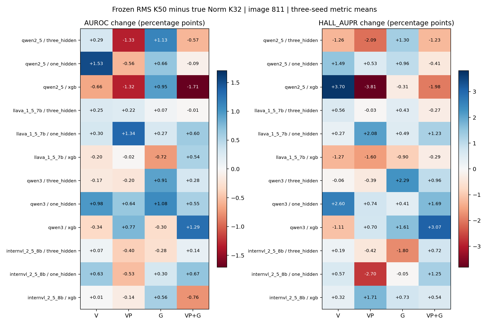

# 冻结RMS完整来源分解：区域AE＋gross的811对照

设置：图片3200训练/400验证/400测试；保留原3200训练，原800按seed20260912分半。全部mentions；seeds43/44/45。指标AUROC/HALL-AUPR为三seed指标均值，另存std与概率ensemble。
区域AE与真实Norm 811逐值相同；只将S替换为旧K50冻结端点RMS的全来源FFN积分gross。V=[AE_V,log1p(S_V)]；VP=[AE_VP,log1p(S_V+S_P)]；G=[AE_G,log1p(S_G)]；VP+G拼接完整后两块。残差/bias参与全分解，未额外进入这些检测特征。
归因定义差异：真实Norm是integral J_(FFN∘Norm)(z-A_all+alpha*A_all)a_j；冻结全分解是integral J_FFN(alpha*Norm(z))D(z)a_j。后者不仅冻结RMS，还将共同路径基线改为FFN的零输入，因此本比较不是仅删除RMS导数的单因素消融。
三层128/64/32、BN/dropout.3、Adam .001、wd1e-5、batch256/max100，验证loss选checkpoint/调度/早停；单层sklearn12候选、XGB18候选，seed43验证AUROC/AP选参。均只训练3200图片，不加标准化。
数值边界：K50纯积分诊断通过，来源重构/总闭合仍有原生精度误差，protocol逐模型保存；不使用B2 K4，也不宣称全部source闭合。复用历史capture；本次是缓存特征对照。旧800图曾被查看，无新bootstrap，不宣称显著性。

| 模型 | 分类器 | V | VP | G | VP+G |
|---|---|---:|---:|---:|---:|
| qwen2_5_vl_7b | three_hidden | 86.50 / 37.99 | 84.88 / 37.93 | 83.15 / 36.52 | 86.79 / 45.61 |
| qwen2_5_vl_7b | one_hidden | 83.58 / 33.74 | 81.23 / 33.55 | 81.31 / 30.05 | 83.66 / 36.56 |
| qwen2_5_vl_7b | xgb | 85.90 / 44.49 | 85.05 / 41.83 | 83.40 / 34.63 | 85.83 / 46.42 |
| llava_1_5_7b | three_hidden | 90.28 / 69.94 | 89.23 / 68.07 | 87.38 / 63.78 | 90.03 / 71.79 |
| llava_1_5_7b | one_hidden | 89.21 / 66.99 | 88.37 / 67.18 | 86.65 / 64.15 | 89.71 / 71.35 |
| llava_1_5_7b | xgb | 90.01 / 68.53 | 89.38 / 66.23 | 87.95 / 64.96 | 90.78 / 70.16 |
| qwen3_vl_8b | three_hidden | 89.95 / 66.45 | 89.68 / 65.99 | 89.03 / 62.86 | 92.57 / 70.99 |
| qwen3_vl_8b | one_hidden | 89.00 / 64.40 | 87.00 / 61.60 | 83.99 / 50.99 | 89.45 / 65.71 |
| qwen3_vl_8b | xgb | 89.97 / 65.04 | 92.22 / 71.14 | 87.84 / 61.08 | 93.22 / 73.85 |
| internvl_2_5_8b | three_hidden | 87.23 / 55.12 | 86.34 / 51.51 | 84.55 / 47.91 | 87.36 / 54.02 |
| internvl_2_5_8b | one_hidden | 86.40 / 56.97 | 82.22 / 45.90 | 82.45 / 44.76 | 85.07 / 51.77 |
| internvl_2_5_8b | xgb | 85.57 / 50.69 | 86.18 / 53.29 | 83.08 / 46.39 | 87.63 / 56.46 |

## 冻结RMS减真实Norm的差值

保持相同特征组、分类器、测试mentions及seed均值口径，单位百分点。

| 模型 | 组 | 分类器 | ΔAUROC | ΔHALL-AUPR |
|---|---|---|---:|---:|
| qwen2_5_vl_7b | visual | three_hidden | +0.29 | -1.26 |
| qwen2_5_vl_7b | visual | one_hidden | +1.53 | +1.49 |
| qwen2_5_vl_7b | visual | xgb | -0.66 | +3.70 |
| qwen2_5_vl_7b | visual_prompt_sum | three_hidden | -1.33 | -2.09 |
| qwen2_5_vl_7b | visual_prompt_sum | one_hidden | -0.56 | +0.53 |
| qwen2_5_vl_7b | visual_prompt_sum | xgb | -1.32 | -3.81 |
| qwen2_5_vl_7b | generation | three_hidden | +1.13 | +1.30 |
| qwen2_5_vl_7b | generation | one_hidden | +0.66 | +0.96 |
| qwen2_5_vl_7b | generation | xgb | +0.95 | -0.31 |
| qwen2_5_vl_7b | vp_generation | three_hidden | -0.57 | -1.23 |
| qwen2_5_vl_7b | vp_generation | one_hidden | -0.09 | -0.41 |
| qwen2_5_vl_7b | vp_generation | xgb | -1.71 | -1.98 |
| llava_1_5_7b | visual | three_hidden | +0.25 | +0.56 |
| llava_1_5_7b | visual | one_hidden | +0.30 | +0.27 |
| llava_1_5_7b | visual | xgb | -0.20 | -1.27 |
| llava_1_5_7b | visual_prompt_sum | three_hidden | +0.22 | -0.03 |
| llava_1_5_7b | visual_prompt_sum | one_hidden | +1.34 | +2.08 |
| llava_1_5_7b | visual_prompt_sum | xgb | -0.02 | -1.60 |
| llava_1_5_7b | generation | three_hidden | +0.07 | +0.43 |
| llava_1_5_7b | generation | one_hidden | +0.27 | +0.49 |
| llava_1_5_7b | generation | xgb | -0.72 | -0.90 |
| llava_1_5_7b | vp_generation | three_hidden | -0.01 | -0.27 |
| llava_1_5_7b | vp_generation | one_hidden | +0.60 | +1.23 |
| llava_1_5_7b | vp_generation | xgb | +0.54 | -0.29 |
| qwen3_vl_8b | visual | three_hidden | -0.17 | -0.06 |
| qwen3_vl_8b | visual | one_hidden | +0.98 | +2.60 |
| qwen3_vl_8b | visual | xgb | -0.34 | -1.11 |
| qwen3_vl_8b | visual_prompt_sum | three_hidden | -0.20 | -0.39 |
| qwen3_vl_8b | visual_prompt_sum | one_hidden | +0.64 | +0.74 |
| qwen3_vl_8b | visual_prompt_sum | xgb | +0.77 | +0.70 |
| qwen3_vl_8b | generation | three_hidden | +0.91 | +2.29 |
| qwen3_vl_8b | generation | one_hidden | +1.08 | +0.41 |
| qwen3_vl_8b | generation | xgb | -0.30 | +1.61 |
| qwen3_vl_8b | vp_generation | three_hidden | +0.28 | +0.96 |
| qwen3_vl_8b | vp_generation | one_hidden | +0.55 | +1.69 |
| qwen3_vl_8b | vp_generation | xgb | +1.29 | +3.07 |
| internvl_2_5_8b | visual | three_hidden | +0.07 | +0.19 |
| internvl_2_5_8b | visual | one_hidden | +0.63 | +0.57 |
| internvl_2_5_8b | visual | xgb | +0.01 | +0.32 |
| internvl_2_5_8b | visual_prompt_sum | three_hidden | -0.40 | -0.42 |
| internvl_2_5_8b | visual_prompt_sum | one_hidden | -0.53 | -2.70 |
| internvl_2_5_8b | visual_prompt_sum | xgb | -0.14 | +1.71 |
| internvl_2_5_8b | generation | three_hidden | -0.28 | -1.80 |
| internvl_2_5_8b | generation | one_hidden | +0.30 | -0.05 |
| internvl_2_5_8b | generation | xgb | +0.56 | +0.73 |
| internvl_2_5_8b | vp_generation | three_hidden | +0.14 | +0.72 |
| internvl_2_5_8b | vp_generation | one_hidden | +0.67 | +1.25 |
| internvl_2_5_8b | vp_generation | xgb | -0.76 | +0.54 |

差值热图：正值表示冻结版分数更高；色块不是显著性标记。

验证：144个头的保存概率重算均值/std、480候选和32选参、三层验证loss checkpoint均通过。200张训练图片的585targets/19020layers缓存分区和gross核对通过；详见cache_validation.json、detector_validation.json。单层/XGB对两套特征分别按同一验证协议选参，获选超参可能不同。
